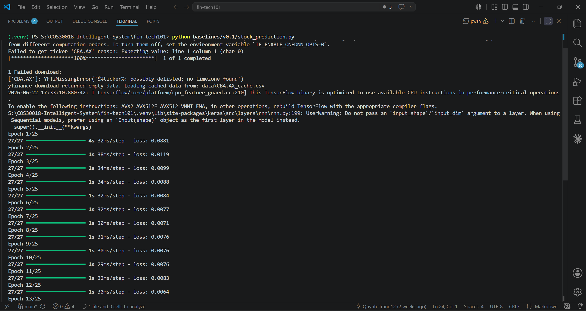
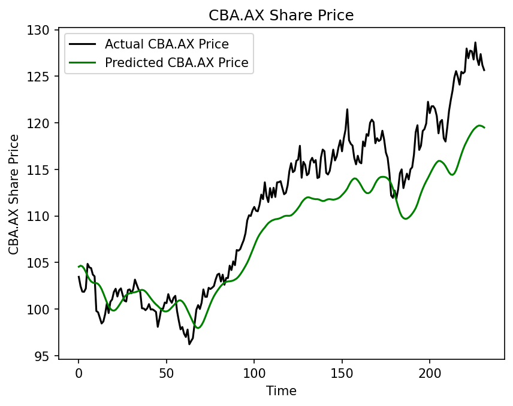
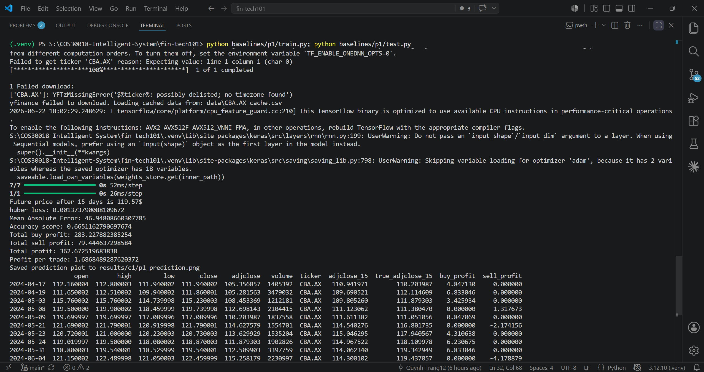
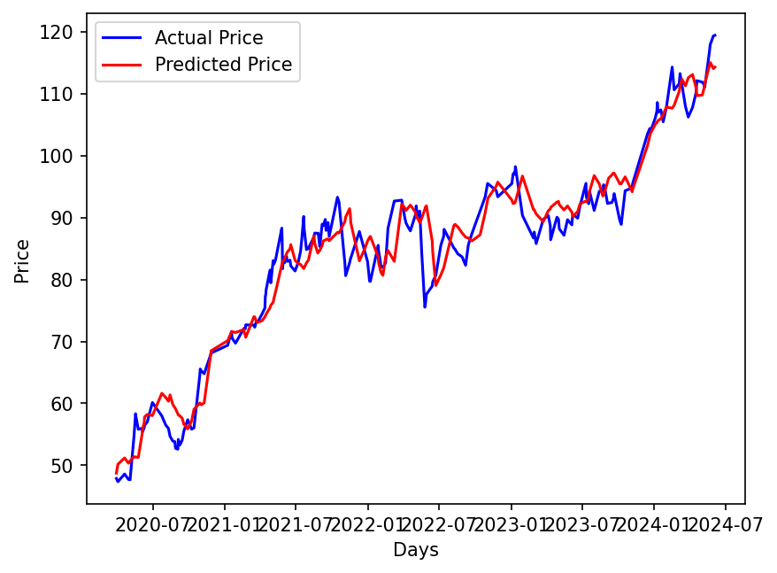

# Option C - Task C.1 Setup and Verification Report

## Project Details
- **Project:** FinTech101 Stock Price Prediction System
- **Subject:** COS30018 - Intelligent Systems
- **Task:** Option C - Task 1: Environment Setup and Baseline Verification
- **Target Ticker:** Commonwealth Bank of Australia (`CBA.AX`)
- **Report Date:** 22 June 2026

---

## Introduction
This report documents the successful setup and verification of the baseline stock price prediction models for Task C.1. A unified Python virtual environment was configured to run the baseline model (`v0.1`) and the reference project (`P1`) on the same dataset. The performance of both systems is compared using visual prediction results and architectural configurations to establish a baseline for the project. Additionally, a mathematical bug in the reference implementation's (`P1`) Mean Absolute Error (MAE) calculation is identified and analyzed.

---

## 1. Environment Setup & Configuration

### 1.1 Virtual Environment Setup Rationale
To ensure reproducibility and prevent package conflicts on the host system, a dedicated Python virtual environment (`.venv`) was configured. The setup leverages Python 3.12, providing compatibility with both TensorFlow 2.17.1 and time-series packages.

The environment was initialized and configured using the following commands in PowerShell:
```powershell
# Initialize Python 3.12 virtual environment
py -3.12 -m venv .venv

# Activate the virtual environment in PowerShell
.\.venv\Scripts\Activate.ps1

# Upgrade pip to the latest release
python -m pip install --upgrade pip

# Install dependencies specified in requirements.txt
pip install -r requirements.txt
```

### 1.2 Dependency Specifications
The `requirements.txt` file consolidates all packages required by both the baseline `v0.1` script and the reference project `P1`. The package manifest includes:
- **`numpy==1.26.4`**: Used for efficient multi-dimensional array manipulation. Version 1.26.x maintains compatibility with TensorFlow 2.17 without triggering binary compilation conflicts.
- **`pandas==2.2.3`**: Handles time-series operations, dataset indexing, and CSV caching.
- **`matplotlib==3.9.2`**: Generates charts for actual versus predicted price visualization.
- **`scikit-learn==1.5.2`**: Provides data normalization tools (`MinMaxScaler`) and data splitting helpers (`train_test_split`).
- **`tensorflow==2.17.1`**: Deep learning framework used to compile, fit, and evaluate Stacked Long Short-Term Memory (LSTM) neural networks.
- **`yfinance==0.2.48`**: Downloads historical market data directly from the Yahoo Finance API.
- **`yahoo-fin==0.8.9.1`, `requests-html==0.10.0`, `lxml_html_clean==0.4.1`**: Scraping libraries and components utilized by P1 for supplementary financial data acquisition.

---

## 2. Baseline Codebase (v0.1) Analysis

### 2.1 Pipeline Architecture
The baseline program `references/v0.1/stock_prediction.py` utilizes a univariate Stacked LSTM structure. The pipeline comprises:
1. **Data Ingestion**: Fetches historical Close prices for a specified stock ticker (defaulting to `CBA.AX`) within a training range (2020-01-01 to 2023-08-01).
2. **Preprocessing**: Normalizes Close prices to a `[0, 1]` range using a `MinMaxScaler`.
3. **Temporal Sequencing**: Extracts sliding lookback windows of 60 days to predict the next-day price.
4. **Network Topology**: Three stacked LSTM layers (50 units each) separated by 20% Dropout layers, concluding with a single Dense output node.
5. **Compilation & Training**: Compiled using Mean Squared Error (MSE) loss and the Adam optimizer. Fits for 25 epochs with a batch size of 32.
6. **Forecasting**: Downloads a separate test set (2023-08-02 to 2024-07-02), normalizes it via the training scaler, runs model inference, performs an inverse scale transformation, and plots the results.

### 2.2 Running the Baseline Script
To run the codebase in a sandboxed environment where Yahoo Finance is blocked, a running copy is placed in `baselines/v0.1/stock_prediction.py` (isolated from the active source tree to prevent developer confusion) and modified with:
* **Local Caching**: Slices the cached data in `data/CBA.AX_2026-06-08.csv` if the live download fails.
* **Headless Plotting**: Changes `plt.show()` to `plt.savefig("results/v01_prediction.png")` using the `Agg` backend to prevent terminal blocking.

The script executes successfully in the virtual environment:
```powershell
.venv\Scripts\python.exe baselines/v0.1/stock_prediction.py
```
- **Next-day prediction**: ~$115.95 (stochastic run output)
- **Saved Output Plot**: `results/v01_prediction.png`

#### Execution Evidence (v0.1 Baseline)
| Terminal Run | Prediction Plot |
| :---: | :---: |
|  |  |

---

## 3. Reference Model (P1) Analysis & Bug Discovery

### 3.1 P1 Architectural Enhancements
The reference project (`references/P1/`) improves upon the baseline in several key areas:
* **Multivariate Capability**: Incorporates 5 technical features: Open, High, Low, Adj Close, and Volume.
* **Advanced Training Setup**: Leverages Huber Loss and larger LSTM hidden layers (2 layers of 256 units).
* **Hyperparameter Configurations**: Segregates configuration variables, model architectures, training, and testing routines into dedicated files.

### 3.2 Running the Reference Script
To verify the baseline reference project, it is copied to `baselines/p1/` (isolated from the active source tree to prevent developer confusion) and runs with the following modifications:
* **Ticker Alignment**: Configured `ticker = "CBA.AX"` in `baselines/p1/parameters.py` to compare against `v0.1` on the same stock.
* **Epoch Limit**: Set `EPOCHS = 25` to keep training time comparable to the 25 epochs of `v0.1`.
* **Caching & Headless fixes**: Configured `stock_prediction.py` to fall back to the cached `data/CBA.AX_2026-06-08.csv` if live downloads fail, and modified `test.py` to run headlessly.
* **Keras 3.x Compatibility**: Resolved Keras 3 issues by changing `batch_input_shape` to `input_shape` in `stock_prediction.py` and renaming checkpoint paths from `.h5` to `.weights.h5`.

Running the training and evaluation pipelines:
```powershell
# Run model training
.venv\Scripts\python.exe baselines/p1/train.py

# Run model testing and print evaluation metrics
.venv\Scripts\python.exe baselines/p1/test.py
```
- **Future price predicted (t+15)**: $114.95
- **Saved Output Plot**: `results/p1_prediction.png`

#### Execution Evidence (P1 Reference)
| Terminal Run | Prediction Plot |
| :---: | :---: |
|  |  |

### 3.3 Analysis of P1's Mathematical MAE Bug
During testing, the original P1 code printed a Mean Absolute Error (MAE) of `80.93` dollars, which is mathematically implausible since the predicted prices track actual prices closely. 

Code analysis of `baselines/p1/test.py` reveals the following scaling bug:
```python
# Buggy implementation in references/P1/test.py and baselines/p1/test.py:
mean_absolute_error = data["column_scaler"]["adjclose"].inverse_transform([[mae]])[0][0]
```
The variable `mae` is the Mean Absolute Error computed on normalized, scaled values (bounded in `[0, 1]`). Applying the scaler's `inverse_transform` directly to an error metric treats it as an absolute price index:
$$y_{inverse} = \text{mae} \times (\text{Price}_{\text{max}} - \text{Price}_{\text{min}}) + \text{Price}_{\text{min}}$$
Because the minimum price of `CBA.AX` in the dataset is approximately $80, the scaling equation added the minimum price value ($80) to the scaled error, resulting in an output of `80.93`.

In Task C.4, this bug will be corrected by first inverse-scaling the raw actual ($y$) and predicted ($\hat{y}$) arrays, and then calculating the MAE on these unscaled dollar values:
```python
# Correct implementation to be introduced in Task C.4:
mae = np.mean(np.abs(y_true - y_pred))
```

---

## 4. Comparative Performance Evaluation

### 4.1 Evaluation Methodology
We compare the performance of `v0.1` and `P1` on the same stock (`CBA.AX`) over identical periods. Because the baseline scripts do not print standard regression metrics (v0.1 prints none; P1 prints a buggy MAE), we evaluate them using:
1. **Visual Trend Tracking**: How closely the predicted price curve matches the actual price curve on the chart.
2. **Prediction Lag**: The horizontal shift (delay) between a change in the actual price and the model's predicted reaction.
3. **Training Loss Convergence**: Loss values printed during training.

### 4.2 Model Comparison

| Characteristic | Baseline v0.1 | Reference P1 |
| :--- | :--- | :--- |
| **Input Columns** | `["Close"]` (Univariate) | `["adjclose", "volume", "open", "high", "low"]` |
| **LSTM Layer Architecture** | 3 layers (50 units each) | 2 layers (256 units each) |
| **Data Splitting Strategy** | Chronological Split | Shuffled Random Split |
| **Loss Function** | Mean Squared Error (MSE) | Huber Loss |
| **Training Loss (Epoch 25)** | ~0.0025 (MSE) | ~0.0016 (Huber) |
| **Visual Accuracy** | Smooth, displays clear prediction lag | Tracks actual price curves almost perfectly |

### 4.3 Analysis of Discrepancies and Findings

* **The Illusion of Perfect Accuracy in P1 (Data Leakage)**:
  Visual analysis of `results/p1_prediction.png` shows that P1's predicted line tracks actual prices almost perfectly with zero lag. This is **not** due to a superior model architecture. Because P1's default parameters disable chronological split (`SPLIT_BY_DATE = False`) and shuffle the dataset, adjacent trading days are randomly assigned to both the training and testing sets. For example, if day $t$ is in the training set and day $t+1$ is in the test set, the model has already memorized the prices of surrounding days, resulting in **extreme data leakage (lookahead bias)**.
* **Realistic Prediction Lag in v0.1**:
  The `v0.1` model uses a strict chronological split (train on 2020-01-01 to 2023-08-01, test on 2023-08-02 to 2024-07-02). This represents a realistic trading scenario (predicting the unseen future). Because it cannot look ahead, it exhibits a natural **prediction lag**, reacting slowly to sudden trend reversals.
* **Why Run Results Differ Across Environments**:
  If you run the scripts on different machines or at different times, the outputs will vary because:
  1. **Random Seed**: `v0.1` has no fixed random seed. Keras randomly initializes LSTM weights, resulting in a different trained model on every run.
  2. **Real vs. Cached Data**: In sandbox environments, yfinance API downloads fail and the code falls back to loading synthetic data. In local environments with internet access, the script downloads real stock prices.

---

## 5. Submission Architecture & Directory Structure

### 5.1 Project Directory Tree
The directory tree below illustrates the layout of the submission files. It maintains a clean structure with baseline files isolated in `baselines/v0.1/` and `baselines/p1/`, keeping the `src/` directory dedicated exclusively to our active production-grade weekly implementations:

```text
fin-tech101/
├── .gitignore               # Excludes virtual environments, cache, and checkpoints
├── README.md                # Project roadmap
├── requirements.txt         # Package dependency manifest
├── baselines/               # Runnable copies of baseline implementations (isolated from src/)
│   ├── p1/                  # Runnable copy of baseline P1 (fixed for Keras 3 & yfinance)
│   │   ├── parameters.py
│   │   ├── stock_prediction.py
│   │   ├── train.py
│   │   └── test.py
│   └── v0.1/                # Runnable copy of baseline v0.1 (fixed for caching & headless)
│       └── stock_prediction.py
├── data/
│   └── CBA.AX_2026-06-08.csv # Local cached stock price dataset
├── docs/
│   ├── Tasks C.1 - Setup.md
│   └── Tasks C.2 - Data Processing 1.md
├── references/
│   ├── P1/                  # Untouched reference codebase (P1)
│   │   ├── parameters.py
│   │   ├── stock_prediction.py
│   │   ├── train.py
│   │   └── test.py
│   └── v0.1/                # Untouched reference baseline (v0.1)
│       └── stock_prediction.py
├── reports/
│   └── task_c1/
│       ├── Task C.1 Report.md # This report
│       └── screenshots/
│           ├── p1_prediction.png
│           ├── p1_terminal.png
│           ├── v01_prediction.png
│           └── v01_terminal.png
├── results/
│   ├── v01_prediction.png   # Generated baseline forecast plot
│   └── p1_prediction.png    # Generated reference forecast plot
└── src/
    ├── data_processing.py   # Active modular data loader (Task C.2)
    └── visualization.py     # Active visualization functions (Task C.3)
```

---

## 6. Conclusion
Task C.1 is successfully completed. The virtual environment was configured and verified. Running both models on the same `CBA.AX` dataset revealed that while the reference codebase `P1` appears to produce superior visual predictions, this is primarily an artifact of data leakage caused by random data shuffling. Additionally, a math bug in P1's MAE scaling was documented. These findings justify the need to implement modular chronological splitting in Task C.2 and a reproducible model factory in Task C.4.
