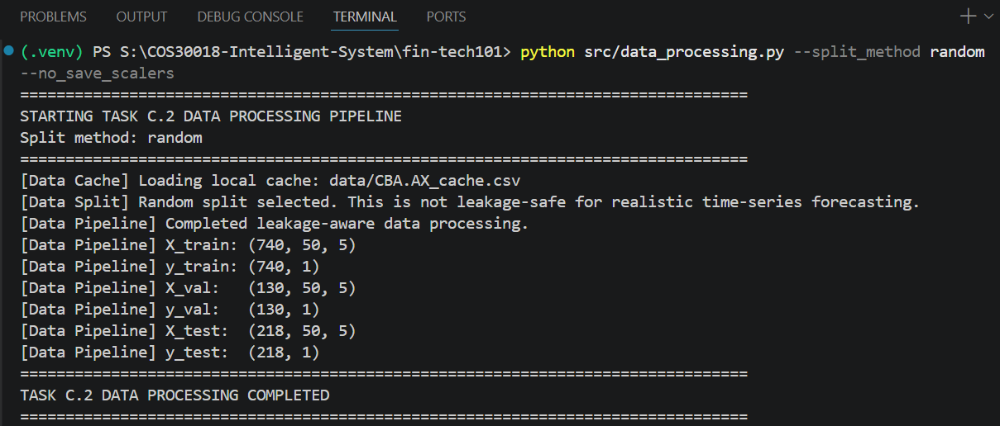

# Option C Weekly Report: Task C.2 - Data Processing (Phase 1)

## Project Details

* **Project:** FinTech101 Stock Price Prediction System
* **Subject:** COS30018 – Intelligent Systems
* **Task:** Option C – Task C.2: Data Processing (Phase 1)
* **Target Stock:** Commonwealth Bank of Australia (`CBA.AX`)
* **Report Due:** Week 4

---

# 1. Introduction

Task C.2 required a single data-processing function with five core abilities:

1. Accept configurable date ranges for different experiments.
2. Handle missing values in stock data (e.g., from holidays or outages).
3. Support multiple train/test split strategies (ratio, date, or random).
4. Cache downloaded data locally to avoid repeated network requests.
5. Scale features and save scalers for later use in inference.

This report demonstrates how `load_and_process_data()` in `src/data_processing.py` meets all five requirements and explains the eight code lines that required research to implement correctly.

---

# 2. Pipeline Overview

`load_and_process_data()` orchestrates seven phases in a fixed order. The phases are:

1. Load raw stock data, either from a local cache file or from a live download.
2. Clean the raw data into a standard column layout and fill in missing values.
3. Attach future price labels to each row, so the model has something to predict.
4. Build sliding-window sequences of historical prices from the labelled data.
5. Split the sequences into training and testing sets, then carve a validation set from the end of the training block.
6. Fit feature scalers on the training set only, then apply them to all three sets.
7. Package the arrays, the scalers, and the relevant dates into one result dictionary.

The order is critical: targets are attached before splitting, and scalers are fitted only after the split. This prevents the validation and test price ranges from influencing model training. Section 5 explains this principle in detail.

---

# 3. Requirement Coverage

The pipeline meets all five lettered requirements of Task C.2. Each is implemented as a separate responsibility in the data-processing module:

**3.1 Configurable Date Range**

`load_and_process_data()` accepts `start_date` and `end_date` parameters and passes them to `standardise_stock_dataframe()`, which slices the data to the requested range. This allows callers to experiment with different time windows without editing code. The project's default range is stored in `config.py` and passed as arguments, never hardcoded.

**3.2 Handling Missing Values**

Financial data often has gaps around holidays or outages. `standardise_stock_dataframe()` fills these gaps by applying forward-fill first, then backward-fill. Forward-fill assumes a missing trading day kept the last known price, which is the correct assumption for a price series and uses no future information. Backward-fill then covers a gap at the very start of the series, where forward-fill has no earlier value to copy. Both operations run in-place on the dataframe.

The `CBA.AX` dataset contains no missing values across its 1,138 rows, so neither fill changes a single price. They are a safeguard that keeps the function correct for other tickers or date ranges, where gaps do occur.

**3.3 Local Caching**

`load_raw_stock_data()` checks for a cached CSV file before making any network request. If the cache exists, it loads directly; if not, it downloads via `yfinance` and saves to `data/<ticker>_cache.csv`. Once the file exists it becomes the source of truth, so repeated experiments read from disk instead of the network. This keeps runs fast and reproducible: every experiment sees byte-identical input.

**3.4 Train/Test Split Strategies**

Three strategies are available, chosen by name through the `split_method` argument. The project default is stored in `config.py` as `SPLIT_METHOD = "date"`, so the strategy is configuration rather than a hardcoded branch.

1. **Date split** (`split_method="date"`) — a sample joins the test set when the date it predicts falls on or after `split_date`, by default `SPLIT_DATE = "2023-08-02"`. This preserves chronological order and is leakage-safe, and it is the project default. Requesting this strategy without supplying a `split_date` raises a `ValueError` rather than silently falling back to a ratio split.
2. **Ratio split** (`split_method="ratio"`) — the first fraction of samples, by default 80%, becomes training data. This also preserves chronological order and is leakage-safe, and it suits experiments with no fixed calendar boundary.
3. **Random split** (`split_method="random"`) — samples are shuffled across the whole period using scikit-learn's `train_test_split()` with a fixed random seed for reproducibility. This does not preserve chronological order and is not leakage-safe; it exists for experimental comparison only, and the pipeline prints a warning when it runs.

Section 5 explains why the first two strategies prevent data leakage and the third does not.

After the train/test split, `load_and_process_data()` carves a validation set from the end of the training block, using `VALIDATION_RATIO = 0.15`. Because this carve-out must respect date order, the train/test split runs unshuffled and only the final training subset is shuffled afterwards. The validation set therefore always sits chronologically between training and testing.

**3.5 Feature Scaling and Scaler Storage**

Scaling happens in two steps. First, `fit_training_scalers()` creates one `MinMaxScaler` per feature column and fits it using training samples only — validation and test samples are excluded, so neither can influence the learned minimum and maximum. The fitted scalers then transform all three sets.

Second, `save_scalers()` writes the scalers to `results/c2/CBA_AX_scalers.pkl`, keyed by column name so any single feature's scaler can be retrieved later. The file also stores a metadata dictionary recording the ticker, date range, split settings, window sizes, feature list, and the note that fitting used training samples only. A later inference run can read this metadata to confirm it is loading scalers built under matching configuration.

---

# 4. Less-Straightforward Code Explanation

Task C.2 asks for clear explanations of code lines that required research to write correctly. The eight explanations below cover less-straightforward lines that required external knowledge or non-trivial reasoning. Each is independently readable and does not assume familiarity with previous entries.

**1. Flattening MultiIndex columns**

```python
if isinstance(df.columns, pd.MultiIndex):
    df.columns = [str(col[0]).lower().strip() for col in df.columns]
```

When `yfinance` returns data with certain call signatures, it wraps column names in tuples (e.g., `("Close", "CBA.AX")` instead of `"close"`). The pipeline checks for this with `isinstance(df.columns, pd.MultiIndex)` and extracts only the first element of each tuple, converting to lowercase. This ensures downstream code always sees plain string column names.

**2. Converting to NumPy before the sliding-window loop**

```python
feature_values = df[feature_columns].to_numpy(dtype=np.float32)
```

Building sequences requires slicing the data thousands of times. Slicing a pandas dataframe inside a loop is slow because each slice re-validates index labels and dtypes. Converting to a NumPy array once, before the loop, avoids this overhead — subsequent slices are plain array operations. The `dtype=np.float32` argument casts the values from pandas' default float64 down to float32, matching the dtype the Keras model expects and halving the memory the sequences occupy.

**3. Checking both ends of the target-date range at the split boundary**

```python
first_target_dates = pd.to_datetime(target_dates[:, 0])
last_target_dates = pd.to_datetime(target_dates[:, -1])

train_mask = last_target_dates < split_timestamp
test_mask = first_target_dates >= split_timestamp
```

When the model predicts multiple days ahead, a single sample's target dates span a range (e.g., predicting days 10–12). If this range straddles the split boundary (e.g., day 11 before, day 12 after), the sample would leak information between train and test. The pipeline checks both the earliest and latest target date for every sample and discards any that cross the boundary. This ensures strict chronological separation.

**4. Combining historical and label values before fitting the price scaler**

```python
fit_values = np.vstack([historical_values, target_values])
```

The `adjclose` column appears in two places: historical input windows and the future value being predicted. If the scaler is fitted only on historical data, a label that exceeds all historical prices would fall outside the scaler's learned range, causing poor unscaling later. The pipeline stacks both historical and label values using `np.vstack()` before fitting, so the scaler's min/max bounds both uses of the column.

**5. Reshaping to two dimensions for scikit-learn, then back to three**

```python
X_scaled[:, :, feature_index] = scaler.transform(
    feature_slice.reshape(-1, 1)
).reshape(original_shape)
```

`MinMaxScaler.transform()` expects two-dimensional input (rows × columns). The pipeline's sequences are three-dimensional (samples × lookback_steps × features). For each feature, the code flattens the feature column to 2D with `.reshape(-1, 1)`, transforms it, then reshapes it back to 3D to fit into the original array. This adapter pattern lets a 2D scaler work with 3D data.

**6. Removing duplicate dates after selecting rows by label**

```python
test_df = df.loc[test_input_dates].copy()
test_df = test_df[~test_df.index.duplicated(keep="first")]
```

The test dataframe is rebuilt by looking up each test sample's input-end date in the cleaned dataframe. Because `test_input_dates` is a plain array of labels rather than a set, `.loc[]` returns one row for every entry it contains, so any date appearing more than once yields duplicate rows. The pipeline drops these extra copies with `~test_df.index.duplicated(keep="first")`, where the tilde inverts the boolean mask so that only first occurrences survive. This produces one row per calendar date, which is what `test.py` assumes when it reads `test_df["adjclose"]` as the day-*t* price for directional accuracy.

**7. Choosing the pickle protocol explicitly**

```python
pickle.dump({"scalers": scalers, "metadata": metadata}, file, protocol=pickle.HIGHEST_PROTOCOL)
```

`MinMaxScaler` objects cannot be saved as CSV or JSON without losing their fitted state. Pickle is Python's standard serializer for arbitrary objects. Passing `protocol=pickle.HIGHEST_PROTOCOL` tells pickle to use the most efficient binary format for the current Python version, rather than defaulting to an older, slower format kept for backward compatibility. This is a best practice for production serialization.

**8. Using a browser User-Agent header for direct API queries**

```python
req = urllib.request.Request(url, headers={"User-Agent": "Mozilla/5.0"})
```

Yahoo Finance's servers reject HTTP requests that don't appear to come from a browser, returning 401/403 errors. Setting a standard browser User-Agent header (e.g., `"Mozilla/5.0"`) is a documented workaround. This allows `src/data_downloader.py` to query Yahoo's Query2 API directly when the `yfinance` package is unavailable or blocked.

---

# 5. Why Chronological Splitting Matters

A stock forecasting model must predict prices it has never seen. In real trading, the test set should contain only information from after the training period — future prices are not available during training.

A random split does not enforce this boundary. It can place a sample from early 2024 in training and a different sample from late 2024 in testing. If these samples share overlapping dates, the model sees part of the test period during training. This inflates the test score: it reflects the model's ability to memorize seen data, not to generalize to unseen future prices.

The date-based and ratio-based splits prevent this leakage by keeping training samples strictly earlier than test samples, by target date. The validation set is carved the same way, from the end of the training block, so the decisions made while tuning the model never depend on data from beyond the split boundary either. The random split mode exists in the code only for comparison; it is labelled as "not leakage-safe" when run.

---

# 6. Verification

The pipeline's standalone entry point runs the full data-processing workflow. It accepts command-line flags whose defaults all come from `config.py`, so running it with no arguments reproduces the project's configured pipeline exactly.

**6.1 Default run (date split)**

```powershell
python src/data_processing.py
```


The output shows:
- **Caching works:** the pipeline loaded `data/CBA.AX_cache.csv` from disk instead of downloading, satisfying requirement (d).
- **Shapes are correct:** every sample is a window of shape `(50, 5)` — matching `LOOKBACK_STEPS = 50` and the five entries in `FEATURE_COLUMNS`. The run produces 728 training, 128 validation, and 232 test samples.
- **Split is applied:** the 728/128 division of the training block reflects `VALIDATION_RATIO = 0.15`, and the test set begins at the configured `SPLIT_DATE`.
- **Scalers are saved:** the file `results/c2/CBA_AX_scalers.pkl` is written and ready for later model inference steps.

**6.2 Random split run**

Requirement (c) asks for more than one splitting method, so the same script was run again with a different strategy. The `--no_save_scalers` flag prevents this comparison run from overwriting the scaler file produced by the default configuration.

```powershell
python src/data_processing.py --split_method random --no_save_scalers
```



Two differences from the default run confirm the strategy actually changed:

- **The warning fires:** the pipeline prints "Random split selected. This is not leakage-safe for realistic time-series forecasting," so the leakage-unsafe path is never taken silently.
- **The sample counts move:** 740 training, 130 validation, and 218 test samples, against 728/128/232 for the date split. Both runs divide the same 1,088 sequences; only the boundary differs. The random strategy holds out a fixed 20% of samples, giving 218 test samples, whereas the date strategy holds out every sample whose target falls on or after `SPLIT_DATE`, which happens to be 232.

Running the two strategies from the same command, with the same data and the same configuration, demonstrates that the split method is a genuine runtime choice rather than a fixed behaviour.

**6.3 Note on the lookback window**

The `LOOKBACK_STEPS = 50` value follows the reference project (P1) that Task C.2 directs us to learn from, which uses a 50-day window as its default (`N_STEPS = 50` in `references/P1/parameters.py`, and `n_steps=50` in its `load_data()` signature). The older v0.1 code base uses `PREDICTION_DAYS = 60`, but v0.1 is the flawed starting point the task asks us to improve on rather than a target to match.

---

# Conclusion

`load_and_process_data()` satisfies all five requirements of Task C.2. It accepts a configurable date range, cleans missing values with forward- and backward-fill, offers date, ratio, and random splitting selected by name through `split_method`, caches downloaded data locally, and fits per-column scalers on training samples alone before saving them for later reuse. The verification run above confirms the function executes correctly against the `CBA.AX` dataset and produces the shapes expected from its configuration. This module is the foundation of the stock forecasting system, since it establishes the clean, sequenced, and pre-scaled datasets and the leakage-prevention measures required for all downstream workflow.
