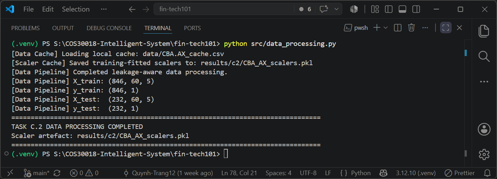

# Option C Weekly Report: Task C.2 - Data Processing (Phase 1)

## Project Details

* **Project:** FinTech101 Stock Price Prediction System
* **Subject:** COS30018 – Intelligent Systems
* **Task:** Option C – Task C.2: Data Processing (Phase 1)
* **Target Stock:** Commonwealth Bank of Australia (`CBA.AX`)
* **Report Due:** Week 4

---

# 1. Introduction

Task C.2 required a single data-processing function with five core abilities:

1. Accept configurable date ranges for different experiments.
2. Handle missing values in stock data (e.g., from holidays or outages).
3. Support multiple train/test split strategies (ratio, date, or random).
4. Cache downloaded data locally to avoid repeated network requests.
5. Scale features and save scalers for later use in inference.

This report demonstrates how `load_and_process_data()` in `src/data_processing.py` meets all five requirements and explains the eight code lines that required research to implement correctly.

---

# 2. Pipeline Overview

`load_and_process_data()` orchestrates seven phases in a fixed order. The phases are:

1. Load raw stock data, either from a local cache file or from a live download.
2. Clean the raw data into a standard column layout and fill in missing values.
3. Attach future price labels to each row, so the model has something to predict.
4. Build sliding-window sequences of historical prices from the labelled data.
5. Split the sequences into a training set and a testing set.
6. Fit feature scalers on the training set only, then scale both sets.
7. Package the arrays, the scalers, and the relevant dates into one result dictionary.

The order is critical: targets are attached before splitting, and scalers are fitted only after the split. This prevents the test set's price ranges from influencing model training. Section 5 explains this principle in detail.

---

# 3. Requirement Coverage

The pipeline meets all five lettered requirements of Task C.2. Each is implemented as a separate responsibility in the data-processing module:

**3.1 Configurable Date Range**

`load_and_process_data()` accepts `start_date` and `end_date` parameters and passes them to `standardise_stock_dataframe()`, which slices the data to the requested range. This allows callers to experiment with different time windows without editing code. The project's default range is stored in `config.py` and passed as arguments, never hardcoded.

**3.2 Handling Missing Values**

Financial data often has gaps around holidays or outages. `standardise_stock_dataframe()` fills these gaps by applying forward-fill first, then backward-fill. Forward-fill assumes a missing trading day kept the last known price; backward-fill catches the rare case of a missing value at the very start of the series. Both operations run in-place on the dataframe.

**3.3 Local Caching**

`load_raw_stock_data()` checks for a cached CSV file before making any network request. If the cache exists, it loads directly; if not, it downloads via `yfinance` and saves to `data/<ticker>_cache.csv`. A companion script, `src/data_downloader.py`, can also populate this cache using Yahoo Finance's Query2 API directly, which helps when the `yfinance` package is blocked. Both paths write to the same cache file, so the pipeline does not need to know which download method was used.

**3.4 Train/Test Split Strategies**

Three split strategies are available, selected via `split_sequences()`:

1. **Ratio split** — takes the first fraction of samples (default 80%) as training data, preserving chronological order.
2. **Date split** — compares each sample's target date to a split threshold (default `SPLIT_DATE = "2023-08-02"`), assigning earlier targets to training and later targets to testing.
3. **Random split** — shuffles samples uniformly using scikit-learn's `train_test_split()` with a fixed random seed for reproducibility.

The date and ratio splits preserve chronological order and prevent data leakage (see Section 5). Random split is also available as an option, though it does not maintain temporal separation and serves for experimental comparison only.

**3.5 Feature Scaling and Scaler Storage**

Scaling happens in two steps. First, `fit_training_scalers()` creates one `MinMaxScaler` per feature column and fits it using only training samples. Then, the fitted scalers are saved to `results/c2/CBA_AX_scalers.pkl` by `save_scalers()` as a pickled file. This file preserves each scaler for later retrieval by feature by keying scalers to their column names.

---

# 4. Less-Straightforward Code Explanation

Task C.2 asks for clear explanations of code lines that required research to write correctly. The eight explanations below cover less-straightforward lines that required external knowledge or non-trivial reasoning. Each is independently readable and does not assume familiarity with previous entries.

**1. Flattening MultiIndex columns**

```python
if isinstance(df.columns, pd.MultiIndex):
    df.columns = [str(col[0]).lower().strip() for col in df.columns]
```

When `yfinance` returns data with certain call signatures, it wraps column names in tuples (e.g., `("Close", "CBA.AX")` instead of `"close"`). The pipeline checks for this with `isinstance(df.columns, pd.MultiIndex)` and extracts only the first element of each tuple, converting to lowercase. This ensures downstream code always sees plain string column names.

**2. Converting to NumPy before the sliding-window loop**

```python
feature_values = df[feature_columns].to_numpy(dtype=np.float32)
```

Building sequences requires slicing the data thousands of times. Slicing a pandas dataframe inside a loop is slow because each slice re-validates index labels and dtypes. Converting to a NumPy array once, before the loop, avoids this overhead — subsequent slices are plain array operations. The conversion preserves float32 precision, matching the downstream model's input dtype.

**3. Checking both ends of the target-date range at the split boundary**

```python
first_target_dates = pd.to_datetime(target_dates[:, 0])
last_target_dates = pd.to_datetime(target_dates[:, -1])

train_mask = last_target_dates < split_timestamp
test_mask = first_target_dates >= split_timestamp
```

When the model predicts multiple days ahead, a single sample's target dates span a range (e.g., predicting days 10–12). If this range straddles the split boundary (e.g., day 11 before, day 12 after), the sample would leak information between train and test. The pipeline checks both the earliest and latest target date for every sample and discards any that cross the boundary. This ensures strict chronological separation.

**4. Combining historical and label values before fitting the price scaler**

```python
fit_values = np.vstack([historical_values, target_values])
```

The `adjclose` column appears in two places: historical input windows and the future value being predicted. If the scaler is fitted only on historical data, a label that exceeds all historical prices would fall outside the scaler's learned range, causing poor unscaling later. The pipeline stacks both historical and label values using `np.vstack()` before fitting, so the scaler's min/max bounds both uses of the column.

**5. Reshaping to two dimensions for scikit-learn, then back to three**

```python
X_scaled[:, :, feature_index] = scaler.transform(
    feature_slice.reshape(-1, 1)
).reshape(original_shape)
```

`MinMaxScaler.transform()` expects two-dimensional input (rows × columns). The pipeline's sequences are three-dimensional (samples × lookback_steps × features). For each feature, the code flattens the feature column to 2D with `.reshape(-1, 1)`, transforms it, then reshapes it back to 3D to fit into the original array. This adapter pattern lets a 2D scaler work with 3D data.

**6. Removing duplicate dates after selecting rows by label**

```python
test_df = df.loc[split_data["test_input_dates"]].copy()
test_df = test_df[~test_df.index.duplicated(keep="first")]
```

With multi-step forecasting, multiple overlapping sequences can end on the same day. When retrieving test data by target date using `.loc[]`, duplicate dates in the index list return duplicate rows. The pipeline removes these extra copies using `~test_df.index.duplicated(keep="first")`, keeping only the first occurrence. This produces one row per calendar date, as expected by the test metrics.

**7. Choosing the pickle protocol explicitly**

```python
pickle.dump({"scalers": scalers, "metadata": metadata}, file, protocol=pickle.HIGHEST_PROTOCOL)
```

`MinMaxScaler` objects cannot be saved as CSV or JSON without losing their fitted state. Pickle is Python's standard serializer for arbitrary objects. Passing `protocol=pickle.HIGHEST_PROTOCOL` tells pickle to use the most efficient binary format for the current Python version, rather than defaulting to an older, slower format kept for backward compatibility. This is a best practice for production serialization.

**8. Using a browser User-Agent header for direct API queries**

```python
req = urllib.request.Request(url, headers={"User-Agent": "Mozilla/5.0"})
```

Yahoo Finance's servers reject HTTP requests that don't appear to come from a browser, returning 401/403 errors. Setting a standard browser User-Agent header (e.g., `"Mozilla/5.0"`) is a documented workaround. This allows `src/data_downloader.py` to query Yahoo's Query2 API directly when the `yfinance` package is unavailable or blocked.

---

# 5. Why Chronological Splitting Matters

A stock forecasting model must predict prices it has never seen. In real trading, the test set should contain only information from after the training period — future prices are not available during training.

A random split does not enforce this boundary. It can place a sample from early 2024 in training and a different sample from late 2024 in testing. If these samples share overlapping dates, the model sees part of the test period during training. This inflates the test score: it reflects the model's ability to memorize seen data, not to generalize to unseen future prices.

The date-based and ratio-based splits prevent this leakage by keeping training samples strictly earlier than test samples, by target date. The random split mode exists in the code only for comparison; it is labeled as "not leakage-safe" when run.

---

# 6. Verification

The pipeline's standalone entry point runs the full data-processing workflow:

```powershell
python src/data_processing.py
```

The output confirms all five requirements are met:



The output shows:
- **Caching works:** the pipeline loaded the cached file instead of downloading.
- **Shapes are correct:** training and test samples have shape `(60, 5)` — matching `LOOKBACK_STEPS = 60` in config and 5 features — with 846 training and 232 test samples.
- **Split is applied:** samples are split by target date (via the configured `SPLIT_DATE`).
- **Scalers are saved:** the file `results/c2/CBA_AX_scalers.pkl` is written and ready for later model inference steps.

The `LOOKBACK_STEPS = 60` value is justified against the baseline: `references/v0.1/stock_prediction.py` uses `PREDICTION_DAYS = 60`. Matching this value ensures consistency with the provided reference implementation.

---

# 7. Conclusion

`load_and_process_data()` satisfies all five requirements of Task C.2. It accepts a configurable date range, cleans missing values with forward- and backward-fill, supports ratio, date, and random train/test splitting, caches downloaded data locally, and fits per-column scalers that are saved for later reuse. The verification run above confirms the function executes correctly against the `CBA.AX` dataset and produces the shapes expected from its configuration. This module is the foundation of the stock forecasting system, since it establishes clean, sequenced, and pre-scaled datasets and leakage-prevention measures required for all downstream workflow.
