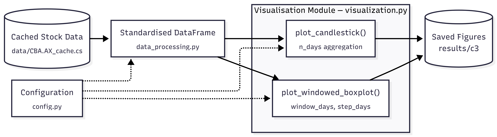
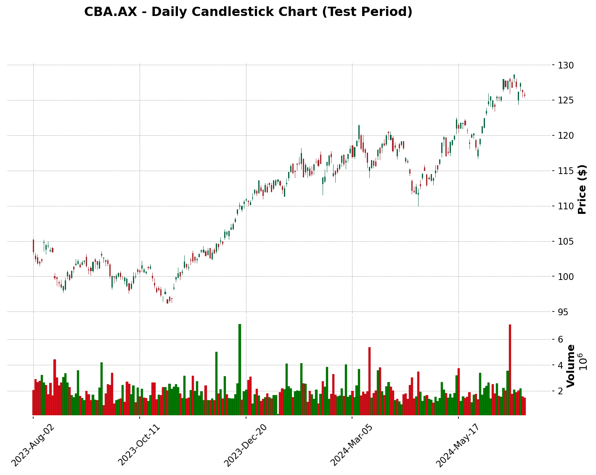
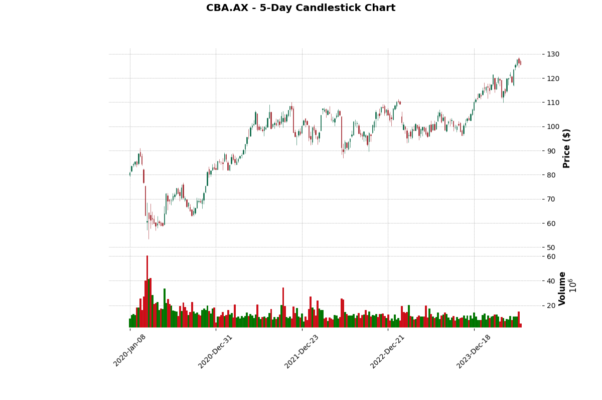
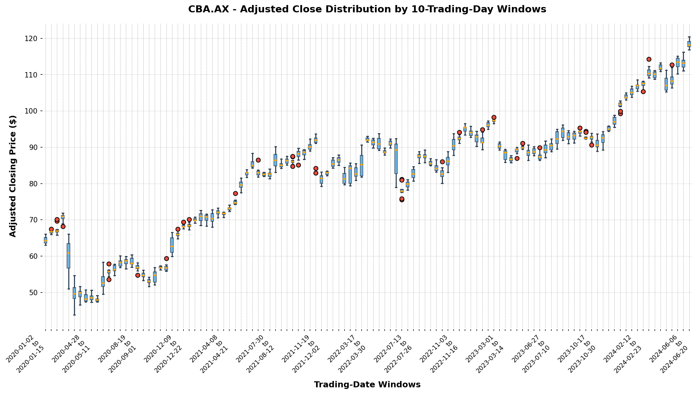
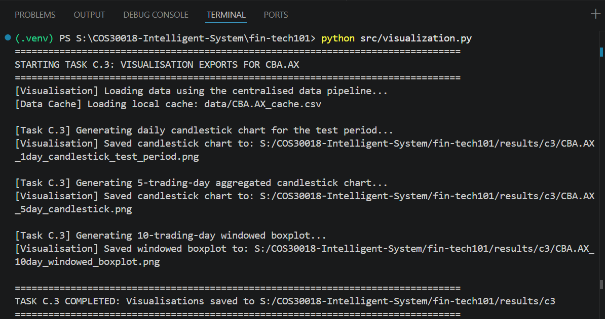

# Option C Weekly Report: Task C.3 - Data Processing (Phase 2)

## Project Details

* **Project:** FinTech101 Stock Price Prediction System
* **Subject:** COS30018 – Intelligent Systems
* **Task:** Option C – Task C.3: Data Processing 2 (Candlestick and Boxplot Visualisation)
* **Target Stock:** Commonwealth Bank of Australia (`CBA.AX`)
* **Report Due:** Week 5

---

# 1. Introduction

Task C.3 moves the project to version v0.2 by adding financial visualisation to the pipeline built in Task C.2. The task required two functions:

1. A function that displays stock market data as a **candlestick chart**, with an option allowing each candle to represent *n* trading days (*n* ≥ 1).
2. A function that displays stock market data as a **boxplot chart**, suitable for showing data across a moving window of *n* consecutive trading days.

Both functions are implemented in `src/visualization.py` and consume the cleaned dataframe produced by the Task C.2 pipeline, so no data-loading logic is duplicated.

This report explains how the two functions meet those requirements, documents the lines of code that required research to write correctly, and outlines the main challenges encountered. Section 3 is the core of the report: it explains the less-straightforward code and cites the online resources used.

---

# 2. Visualisation Pipeline

The visualisation module does not download or clean data itself. It reuses `load_raw_stock_data()` and `standardise_stock_dataframe()` from `src/data_processing.py`, so the charts are drawn from exactly the same cleaned dataframe that later feeds the forecasting models.

<div align="center">



</div>

Both functions take a dataframe, a size parameter, and an output path, then write a PNG file. Neither returns a figure object or opens a window, which keeps them usable from scripts that run without a display.

---

## 2.1 Candlestick Charts

**`plot_candlestick()` satisfies the brief's candlestick requirement, including the configurable *n*-trading-day option.** It uses `mplfinance`, drawing the price and volume panels together, and validates input first — rejecting an empty dataframe, `n_days` below 1, or missing required columns, with a clear message naming the problem.

A candlestick summarises one trading period using four prices: open, high, low, and close. The body spans the open and close; the thin line above and below marks the highest and lowest prices reached. A green body means the close was above the open, red means below. Aggregating a group of days into one candle needs a different rule per column:

| Price Component | Aggregation Rule |
| :-------------- | :--------------- |
| Open | First opening price in the group |
| High | Maximum high price in the group |
| Low | Minimum low price in the group |
| Close | Final closing price in the group |
| Volume | Sum of trading volume in the group |

These are the standard financial convention — the group's open is where trading started and its close is where trading ended, so `first`/`last` are the only correct choices; volume is a count of shares traded, so it sums.

**The `n_days` parameter controls candle width (*n* ≥ 1)**, demonstrated in this report by calling the same function with `n_days=1` (Section 4.1) and `n_days=5` (Section 4.2) — only the argument changes. Grouping is done by **integer row position, not calendar date**: calendar grouping would let a weekend or holiday shrink a "five-day" candle to three or four real sessions, while row-position grouping guarantees exactly `n_days` trading sessions regardless of the calendar (code in Section 3, entry 2). The `drop_incomplete` parameter removes any leftover rows that don't fill a complete final candle.

---

## 2.2 Windowed Boxplots

**`plot_windowed_boxplot()` satisfies the brief's boxplot requirement, including the moving-window option**, via two independent size parameters:

| Parameter | Meaning |
| :--- | :--- |
| `window_days` | How many consecutive trading days each box summarises |
| `step_days` | How far the window advances before the next box is taken |

Setting `step_days=1` gives a **true moving window** (consecutive boxes overlap in all but one observation); `step_days=window_days` gives non-overlapping windows; anything between gives partial overlap. The figure in Section 4.3 uses non-overlapping ten-day windows for readability — a true moving window over 1,138 rows would draw 1,129 overlapping boxes — but the capability exists either way, selected by argument. The function also accepts either `adjclose` or `close`, preferring `adjclose` when both exist, and labels the y-axis to match.

A boxplot summarises a *distribution*, not a movement: the box spans the interquartile range, the line inside marks the median, whiskers show the spread, and points beyond the whiskers are potential outliers (colours set via `patch_artist`, `medianprops`, `whiskerprops`, `capprops`, `flierprops` — Matplotlib Development Team, 2024a). A widening box means prices grew more dispersed within that window; a rising median means the price level moved up.

---

# 3. Less-Straightforward Code Explanation

The task asks for an explanation of the code lines that were not obvious to write, especially those that required research. The six entries below each quote the real line from `src/visualization.py` and explain it independently, so they can be read in any order. Sources consulted while writing the module are cited in text and listed in Section 8.

**1. Forcing a non-interactive plotting backend**

```python
import matplotlib
matplotlib.use("Agg")
import matplotlib.pyplot as plt
```

Matplotlib draws through a "backend", and its default one tries to open an interactive window. The script runs from a terminal with no display attached, where that attempt either fails or hangs. `"Agg"` is a backend that renders straight to an image file instead of a screen (Matplotlib Development Team, 2024b).

The ordering is the part that required research. `matplotlib.use()` must be called **before** `matplotlib.pyplot` is imported, because pyplot selects and locks in a backend at import time. Placing the call after the import silently has no effect — no error is raised, and the wrong backend is used. This is why a plain statement sits in the middle of the import block, where a linter would normally expect only imports.

**2. Integer-division row grouping instead of calendar resampling**

```python
group_idx = np.arange(len(df_copy)) // n_days
```

This is the key research finding of the task. The obvious approach for grouping time-series rows is pandas' `resample("5D")`, which is the pattern the candlestick tutorials demonstrate (Solanki, 2022). It is wrong here. `resample` groups by **calendar** days, so a five-day bucket that spans a weekend contains only three trading rows, and one spanning a public holiday contains four. The resulting candles would each represent a different number of trading sessions, which is exactly what the task's "*n* trading days" requirement forbids.

The line above sidesteps the calendar entirely. `np.arange(len(df_copy))` numbers the rows 0, 1, 2, … and integer division by `n_days` maps rows 0–4 to group 0, rows 5–9 to group 1, and so on. Because the dataframe only contains trading days to begin with, every group holds exactly `n_days` real trading sessions regardless of the dates involved.

**3. A different aggregation rule per column**

```python
aggregation_rules = {
    "open": "first",
    "high": "max",
    "low": "min",
    "close": "last",
    "volume": "sum",
}
grouped = df_copy.groupby(group_idx, sort=False).agg(aggregation_rules)
```

Passing a dictionary to `.agg()` applies a different reduction to each column in one pass. The pandas documentation describes this form of the `func` argument as a "dict of axis labels -> functions, function names or list of such" (Pandas Development Team, 2024, Parameters section). This is necessary because averaging the five columns, the default intuition, would be meaningless: the open of a five-day candle is the price at which the *first* day opened, not the average of five opens.

`sort=False` keeps the groups in the order they appear. The groups are already chronological because they came from row position, and re-sorting them by group key would be wasted work.

**4. Dropping the incomplete trailing group**

```python
complete_rows = (len(df_copy) // n_days) * n_days
df_copy = df_copy.iloc[:complete_rows]
```

When the row count does not divide evenly by `n_days`, the final group is short. Its candle would be drawn the same size as the others while representing fewer trading days, which misleads the reader.

Integer division followed by multiplication rounds the row count *down* to the nearest multiple of `n_days`. With 1,138 rows and `n_days=5`, `1138 // 5` is 227 and `227 * 5` is 1,135, so the final three rows are dropped and 227 complete candles remain.

**5. The meaning of each `mpf.plot()` argument**

```python
mpf.plot(
    grouped,
    type="candle",
    style="charles",
    title=title,
    ylabel="Price ($)",
    ylabel_lower="Volume",
    volume=True,
    savefig=dict(fname=str(output_path), dpi=150, bbox_inches="tight"),
    figsize=(12, 8),
)
```

| Argument | Meaning |
| :--- | :--- |
| `type="candle"` | Draws candlesticks. `mplfinance` also supports `"line"`, `"ohlc"`, and `"renko"`. |
| `style="charles"` | A built-in colour scheme that renders rising candles green and falling candles red. |
| `title` | The heading printed above the chart. |
| `ylabel` / `ylabel_lower` | Axis labels for the price panel and the volume panel respectively. |
| `volume=True` | Adds the second panel beneath the price chart showing volume bars. |
| `savefig` | Writes the figure to a file instead of displaying it. `dpi=150` sets the output resolution, and `bbox_inches="tight"` trims the surrounding whitespace so the chart fills the image. |
| `figsize=(12, 8)` | Figure width and height in inches, which together with `dpi` determines the pixel dimensions. |

The argument list and the available styles were taken from the tutorial named in the task brief (Solanki, 2022) and from the library's own documentation.

One input requirement is strict. Goldfarb (2024) states that the typical call requires a dataframe "containing Open, High, Low and Close data, with a Pandas `DatetimeIndex`". The index requirement is enforced: passing an index of date-like strings raises `TypeError: Expect data.index as DatetimeIndex`, which is why the function converts the index before plotting.

```python
if not isinstance(df_copy.index, pd.DatetimeIndex):
    df_copy.index = pd.to_datetime(df_copy.index)
```

The column names are a different case. Every example in the documentation uses capitalised `Open`/`High`/`Low`/`Close`/`Volume`, so the capitalised form was adopted on the assumption that it was required. Testing afterwards showed that `mplfinance` in fact accepts lowercase column names as well, so the column rename applied just before the plotting call is a convention that matches the documentation rather than a constraint the library imposes. It is kept because it makes the plotting call read the same way as the published examples.

**6. Thinning the x-axis tick labels**

```python
max_visible_ticks = 15
if len(labels) > max_visible_ticks:
    step = max(1, int(np.ceil(len(labels) / max_visible_ticks)))

    for index, text in enumerate(ax.get_xticklabels()):
        if index % step != 0:
            text.set_visible(False)
```

The boxplot produces 113 windows from the `CBA.AX` dataset, and each label carries a start date and an end date. Drawn in full, the labels overlap into an unreadable black band along the bottom of the figure.

This loop divides the label count by the maximum that fits, then hides every label whose position is not a multiple of that step. `set_visible(False)` hides the label text only — the tick mark stays, and, more importantly, **every box is still plotted**. No data is removed; only some of the labels are suppressed. `np.ceil` rounds the step up so the surviving count never exceeds the limit, and `max(1, ...)` guards against a step of zero.

---

# 4. Visualisation Results

The module was run against the `CBA.AX` dataset covering 1 January 2020 to 2 July 2024, which contains 1,138 trading rows. Three figures were produced.

---

## 4.1 Daily Candlestick Chart (Test Period)

<div align="center">

**Figure 1.** Daily candlestick chart of `CBA.AX` during the testing period.



</div>

This chart calls `plot_candlestick()` with `n_days=1`, so each candle is one trading day. It is restricted to the test period, from the configured split date of 2 August 2023 to the end of the dataset, because daily candles across the full four-and-a-half years are too dense to read.

The price starts near \$105, falls to roughly \$97 by late October 2023, then climbs steadily to about \$127 by July 2024. The rise is not smooth: a pullback in April 2024 takes the price from around \$122 back to roughly \$113 before the upward trend resumes, and a smaller dip appears at the very end of the period. The volume panel shows occasional spikes well above the typical daily level, generally coinciding with the larger price moves.

## 4.2 Five-Trading-Day Candlestick Chart

<div align="center">

**Figure 2.** Five-trading-day aggregated candlestick chart of `CBA.AX`.



</div>

This chart calls the same function with `n_days=5`, producing 227 candles from the 1,138 rows. Only the argument changed; the function did not.

Aggregation makes the full history readable. The COVID-19 crash of early 2020 is unmistakable: the price falls from around \$90 to roughly \$54 within weeks, and the volume panel shows by far the largest spike in the dataset at that moment. Recovery through late 2020 and 2021 lifts the price back above \$100, followed by a long sideways stretch through 2022 and into 2023 where the price oscillates between roughly \$90 and \$110. A sustained climb begins in late 2023 and carries the price to its dataset high near \$128.

Comparing the two candlestick figures shows the trade-off the `n_days` parameter controls. The daily chart preserves every session but only over a short window; the five-day chart covers the whole history at the cost of within-week detail.

## 4.3 Ten-Trading-Day Windowed Boxplot

<div align="center">

**Figure 3.** Adjusted closing price distribution across consecutive ten-trading-day windows.



</div>

This chart calls `plot_windowed_boxplot()` with `window_days=10` and `step_days=10`, giving 113 non-overlapping boxes.

The clearest signal is the median. It rises from the mid-\$60s at the start of 2020 to nearly \$120 in the final windows, tracing the same long-term appreciation the candlestick charts show, but as a sequence of distributions rather than a price line.

The box widths tell a second story. The widest boxes appear in the first months of 2020, where a single ten-day window spans a large price range — the COVID crash compressed a very large move into a very short time. Later windows are generally narrower, but they do **not** shrink steadily: several windows in 2022 and 2023 are as wide as or wider than those in 2021, and the final 2024 windows widen again as the price climbs quickly. The dataset therefore shows episodic volatility that rises and falls, rather than a monotonic decline.

Red points beyond the whiskers mark windows containing a day whose price sat well outside the rest of that window's range, usually where a sharp move began partway through the ten days.

---

# 5. Challenges Faced

**Calendar aggregation produced uneven candles.** The first version used `df.resample("5D")`, the common tutorial pattern — but a bucket spanning a weekend or holiday held only three or four trading rows instead of five, which violates the task's *n*-trading-days requirement. Fixed by the row-position grouping in Section 3, entry 2.

**`mplfinance` rejected the dataframe with an unexplained error.** The cause: the library requires a genuine `DatetimeIndex` and raises `TypeError: Expect data.index as DatetimeIndex` for date-like strings. See Section 3, entry 5, for the index conversion and the related lowercase-column finding.

**The boxplot x-axis was unreadable.** Ten-day windows over 1,138 rows produce 113 boxes, and each label holds two dates. Drawn in full, the labels collapsed into a solid band of overlapping text. Reducing the window count would have discarded information, so the labels were thinned instead, keeping every box while showing roughly fifteen readable dates.

**Chart density had to be balanced against detail.** A daily candlestick chart over the full 2020–2024 range packs more than a thousand candles into the figure width and shows nothing useful. Rather than choosing one aggregation level, the daily chart was scoped to the test period and the full history was drawn with five-day candles. This is also what demonstrates the `n_days` requirement in practice: the same function serves both figures.

---

# 6. Verification

The module runs as a standalone script. All parameters come from `config.py`, so running it with no arguments reproduces the configured pipeline exactly. It is run from the project root, because the cached dataset path in `config.py` is relative to that directory.

```powershell
python src/visualization.py
```



The output confirms:

- **The cached dataset was reused.** The run loads `data/CBA.AX_cache.csv` from disk rather than downloading, so the figures are drawn from the same data as every other task.
- **All three figures were written** to `results/c3/`, under the file names referenced in Section 4.
- **Parameters come from configuration.** The trading-day counts in the console messages and the file names are generated from `C3_CANDLE_DAYS`, `C3_BOXPLOT_WINDOW`, and `C3_BOXPLOT_STEP` in `config.py`, and the test period is derived from `SPLIT_DATE` and `END_DATE` rather than written into the script.

---

# Conclusion

Task C.3 is complete. `plot_candlestick()` displays the data as a candlestick chart and accepts an `n_days` parameter that makes each candle represent any number of trading days from one upward, aggregating by row position so no candle is distorted by a weekend or public holiday. `plot_windowed_boxplot()` displays the data as a boxplot chart and separates `window_days` from `step_days`, which lets it produce a true moving window, non-overlapping windows, or any overlap in between.

Three figures were generated from the `CBA.AX` dataset. The daily candlestick chart shows the test period in full session-level detail; the five-day chart covers the whole history and makes the COVID-19 crash, the recovery, and the 2023–2024 climb clearly visible; the ten-day boxplots show the median price rising across the period while the spread widens and narrows episodically rather than steadily declining.

The work that needed research is documented in Section 3 with the sources used, and the main difficulties are set out in Section 5. The most valuable of these was discovering that the standard `resample()` approach silently violates the "*n* trading days" requirement, which is the kind of error that produces a plausible-looking chart while being wrong.

The module reuses the Task C.2 loading and cleaning functions rather than duplicating them, so these visualisations describe exactly the data the forecasting models in the later tasks consume.

---

# References

Goldfarb, D. (2024). *mplfinance: Financial markets data visualization using Matplotlib* [Computer software]. GitHub. https://github.com/matplotlib/mplfinance

Matplotlib Development Team. (2024a). *matplotlib.axes.Axes.boxplot*. Matplotlib 3.9.2 documentation. https://matplotlib.org/stable/api/_as_gen/matplotlib.axes.Axes.boxplot.html

Matplotlib Development Team. (2024b). *Backends*. Matplotlib 3.9.2 documentation. https://matplotlib.org/stable/users/explain/figure/backends.html

Pandas Development Team. (2024). *pandas.DataFrame.agg*. Pandas documentation. https://pandas.pydata.org/docs/reference/api/pandas.DataFrame.agg.html

Solanki, S. (2022, October 1). *Candlestick chart in Python (mplfinance, plotly, bokeh, bqplot & cufflinks)*. CoderzColumn. https://coderzcolumn.com/tutorials/data-science/candlestick-chart-in-python-mplfinance-plotly-bokeh
