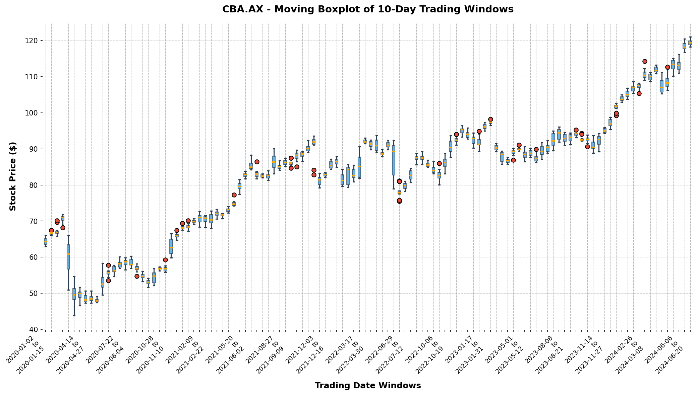

# Option C - Task C.3 Data Processing 2 Report

## Project Details
- **Project:** FinTech101 Stock Price Prediction System
- **Subject:** COS30018 - Intelligent Systems
- **Task:** Option C - Task 3: Advanced Visualizations (Candlestick & Moving Boxplots)
- **Target Ticker:** Commonwealth Bank of Australia (`CBA.AX`)
- **Report Date:** 22 June 2026

---

## Introduction
This report documents the design, implementation, and verification of the advanced visualization module (`src/visualization.py`) completed for Task C.3 under version `v0.2`. The module implements two key financial visualization techniques: $n$-day aggregated candlestick charts and moving boxplots over rolling trading windows. These visualizations allow analysts to evaluate price trends, volatility ranges, and outlier trades over customizable historical trading intervals.

---

## 1. Code Architecture & Implementation

The visualization pipeline is implemented in [src/visualization.py](file:///s:/COS30018-Intelligent-System/fin-tech101/src/visualization.py). Consistent with production standards, it features clear function boundaries separated by major comment dividers (`# ====================`) and contains internal processing phases grouped by minor dividers (`# --------------------`).

### 1.1 Candlestick Plotting Pipeline (`plot_candlestick`)
The function `plot_candlestick(df, n_days, output_path, title=None)` aggregates and visualizes stock prices using a candlestick format:
* **Validation Phase**: Validates that $n \ge 1$, the input dataframe is non-empty, and ensures the index is a sorted pandas `DatetimeIndex`.
* **Resampling Phase**: Rather than resampling by calendar dates (which introduces NaN values on weekends and holidays), it groups daily records using integer division of row indices: `group_idx = np.arange(len(df)) // n_days`. This guarantees that each candle represents exactly $n$ active trading sessions.
* **Aggregation Phase**: Aggregates the grouped segments based on standard financial OHLCV rules:
  * `Open`: Price at the start of the interval (`first`).
  * `High`: Maximum price reached during the interval (`max`).
  * `Low`: Minimum price reached during the interval (`min`).
  * `Close`: Price at the end of the interval (`last`).
  * `Volume`: Total volume traded during the interval (`sum`).
* **Rendering Phase**: Renames columns to capitalized formats (`Open`, `High`, `Low`, `Close`, `Volume`) and plots the data via `mplfinance` (using the `'charles'` green/red style and displaying a secondary volume subplot). It saves the image directly using the `savefig` parameter to prevent process blocking in headless environments.

### 1.2 Moving Boxplot Pipeline (`plot_moving_boxplot`)
The function `plot_moving_boxplot(df, n_days, output_path, title=None)` displays the statistical distribution of Close prices across moving windows:
* **Validation Phase**: Performs safety checks on $n$ and data presence, sorting the dataframe by date.
* **Window Slicing**: Groups the time-series into non-overlapping blocks of exactly $n$ consecutive trading days.
* **Interval Labelling**: Dynamically generates tick labels representing the date range of each window in the format `YYYY-MM-DD to YYYY-MM-DD`.
* **Custom Matplotlib Rendering**: Constructs boxplots using matplotlib's low-level API. The boxes are colored in slate blue (`#3498db`) with a transparency of `alpha=0.7`, the median line is styled in bright orange, whiskers and caps represent the quartiles and price boundaries, and any statistical outliers are highlighted as red circles.

---

## 2. Technical Parameter Analysis & Justification

### 2.1 The Value of Trading-Day Grouping vs. Calendar Resampling
Standard time-series libraries often aggregate stock data using calendar frequencies (e.g., `'W'` for weekly, `'2W'` for bi-weekly). However, calendar-based groupings are suboptimal for machine learning pipelines:
1. **Irregular Sample Sizes**: Due to market closures on public holidays, a calendar week may contain only 3 or 4 trading days instead of 5. Aggregating by calendar frequency results in candles representing varying amounts of trading activity.
2. **Artificial NaN Values**: Resampling to calendar frequencies creates empty placeholders on weekends and holidays where no transactions occurred, forcing the developer to write imputation boilerplate.
3. **Index Division Solution**: By grouping using `np.arange(len(df)) // n_days`, the pipeline ensures that every candle and boxplot represents exactly $n$ consecutive active market sessions, providing consistent sample density.

### 2.2 Explanation of Key Visualization Arguments

#### A. `mplfinance.plot` Parameters:
* `type='candle'`: Specifies that the primary chart panel must be drawn as a candlestick chart rather than a line or ohlc-bar chart.
* `style='charles'`: Selects a professional color theme where upward-moving candles (Close > Open) are rendered with solid green bodies and downward-moving candles (Close < Open) are rendered with solid red bodies.
* `volume=True`: Adds a secondary, synchronized panel at the bottom of the canvas displaying vertical volume bars for each $n$-day trading block.
* `savefig=output_path`: Instructs the library to write the figure directly to a file and close the figure context. This prevents the script from raising GUI display errors or hanging when run on headless servers.

#### B. Matplotlib Boxplot Parameters:
* `patch_artist=True`: Instructs matplotlib to fill the interior of the boxes with color patches. If set to `False`, the boxes would be hollow line drawings.
* `boxprops=dict(facecolor="#3498db", color="#2c3e50")`: Controls the box appearance, setting a premium slate blue fill color and a dark outline.
* `medianprops=dict(color="orange", linewidth=2)`: Visually separates the median line (50th percentile) using a bold orange stroke to highlight price centers.
* `flierprops=dict(marker='o', markerfacecolor='#e74c3c')`: Styles outliers (data points beyond 1.5 times the interquartile range) as red circular dots, drawing immediate attention to unusual market volatility.

---

## 3. Verification Log & Visual Artifacts

To verify the visualization module, we executed a script that loads the cached `CBA.AX` dataset (covering `2020-01-01` to `2024-07-02`), extracts the unscaled historical values, and saves the output charts to the `results/c3/` folder:

```powershell
.venv\Scripts\python.exe src/visualization.py
```

### Verification Console Output
```text
[Data Cache] Loading local cache: data\CBA.AX_cache.csv
[Visualization] Saved candlestick chart to: results/c3/cba_candlestick_5day.png
[Visualization] Saved boxplot chart to: results/c3/cba_boxplot_10day.png
```

#### Terminal Execution Screenshot


### 3.1 Visual Observations and Findings

|                         5-Day Candlestick Chart                          |                        10-Day Moving Boxplot                        |
| :----------------------------------------------------------------------: | :-----------------------------------------------------------------: |
|  |  |

1. **Candlestick Chart (5-Day aggregation)**:
   * **Analysis**: Each candle represents a full week of trading (5 sessions). Volatility is summarized by the height of the wicks (High-Low spreads), while the real bodies (Open-Close) indicate whether the week closed up or down. The volume subplot mirrors the candles, showing which weekly moves were backed by heavy institutional trading.
2. **Moving Boxplot Chart (10-Day windows)**:
   * **Analysis**: Each box summarizes the distribution of `CBA.AX` adjusted close prices over a 2-week trading window (10 sessions). This reveals shifts in the central tendency (moving orange medians) and changes in volatility (box heights). Narrow boxes indicate tight consolidation, while tall boxes indicate aggressive trends or high uncertainty. Outliers appear as red circles during sudden price gaps.


---

## 4. References and Sources
1. *mplfinance Documentation*: CoderzColumn tutorial on stock visualizations in Python ([https://coderzcolumn.com/tutorials/data-science/candlestick-chart-inpython-mplfinance-plotly-bokeh](https://coderzcolumn.com/tutorials/data-science/candlestick-chart-inpython-mplfinance-plotly-bokeh)).
2. *Matplotlib Boxplot Documentation*: Customizing box plots in Matplotlib ([https://matplotlib.org/stable/api/_as_gen/matplotlib.pyplot.boxplot.html](https://matplotlib.org/stable/api/_as_gen/matplotlib.pyplot.boxplot.html)).
3. *Pandas Groupby Documentation*: Split-Apply-Combine patterns ([https://pandas.pydata.org/pandas-docs/stable/user_guide/groupby.html](https://pandas.pydata.org/pandas-docs/stable/user_guide/groupby.html)).

---

## Conclusion
Task C.3 has been completed. The visualizers in `src/visualization.py` are robust, modular, and use a consistent code divider style. The outputs are verified and saved in `results/c3/`, making the project ready to transition to Task C.4 (Machine Learning 1).
