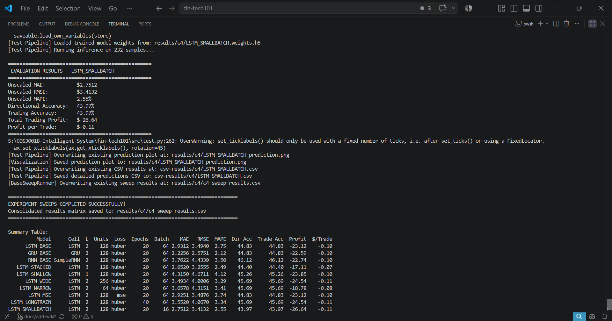
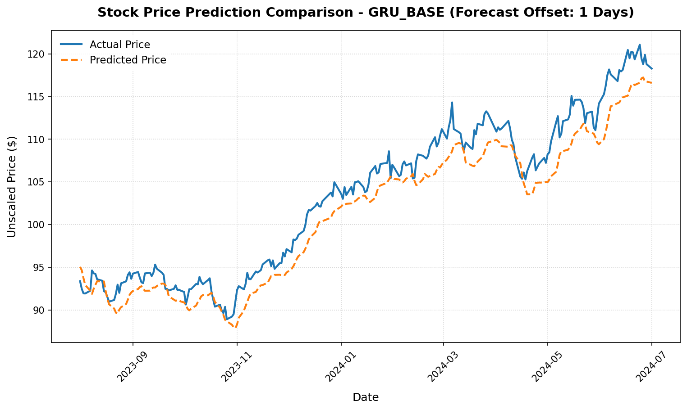
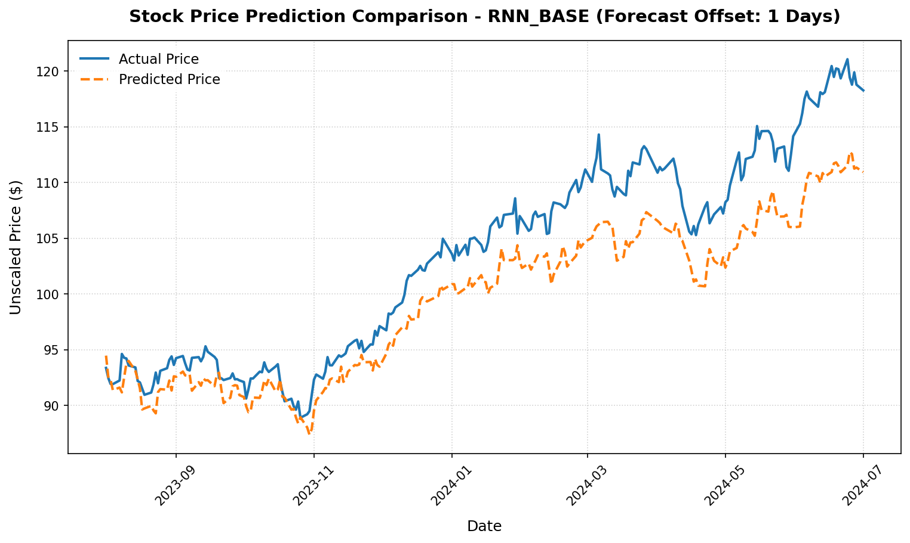

# Option C - Task C.4 Machine Learning 1 Report

## Project Details
- **Project:** FinTech101 Stock Price Prediction System
- **Subject:** COS30018 - Intelligent Systems
- **Task:** Option C - Task C.4: Machine Learning 1 - Recurrent Neural Networks & Hyperparameter Sweeps
- **Target Ticker:** Commonwealth Bank of Australia (`CBA.AX`)
- **Report Date:** 22 June 2026

---

# 1. Introduction

## 1.1 Background

In the previous tasks, the stock price prediction model was implemented using a fixed neural network architecture. While this approach was sufficient for developing the initial forecasting system, modifying the model required manual changes to the source code whenever a different recurrent neural network architecture or hyperparameter configuration was needed.

To improve flexibility and reusability, Task C.4 introduces a configurable model construction function that can generate different recurrent neural network architectures from a common interface. Instead of rewriting the model implementation, users can specify parameters such as the recurrent cell type, number of layers, and hidden units to automatically construct the desired network. This configurable design enables systematic experimentation with different model architectures while maintaining the same data preprocessing and evaluation pipeline. By comparing multiple configurations under identical training conditions, the influence of different architectural choices on stock price prediction performance can be evaluated.

---

## 1.2 Objectives

The objective of Task C.4 is to develop a reusable deep learning model construction pipeline for stock price prediction. The pipeline should:

- Construct recurrent neural network models using configurable parameters.
- Support multiple recurrent cell types, including LSTM, GRU, and SimpleRNN.
- Allow different network architectures to be generated without modifying the model implementation.
- Train and evaluate each model using the same preprocessing pipeline developed in Task C.2.
- Compare different model architectures and hyperparameter configurations using common evaluation metrics.

---

# 2. Deep Learning Pipeline

The deep learning pipeline developed for Task C.4 extends the preprocessing pipeline implemented in Task C.2. After the stock data have been loaded, processed, and converted into training, validation, and testing datasets, the pipeline constructs a neural network model, trains the model, evaluates its prediction performance, and compares multiple model configurations.

The overall workflow is shown below.

```text
Processed Dataset (Task C.2)
            │
            ▼
Phase 1: Model Construction
            │
            ▼
Phase 2: Model Training
            │
            ▼
Phase 3: Model Evaluation
            │
            ▼
Phase 4: Hyperparameter Experiments
```

The following sections describe each phase in detail.

---

## 2.1 Phase 1 – Model Construction

Instead of implementing separate functions for different recurrent neural network architectures, the project uses a single configurable model construction function. This allows different models to be generated simply by changing a set of input parameters rather than modifying the source code.

The model construction function supports several configurable parameters, including:

- Recurrent cell type (LSTM, GRU, or SimpleRNN)
- Number of recurrent layers
- Number of hidden units in each layer
- Dropout rate
- Loss function
- Optimizer

The selected parameters are used to construct and compile a deep learning model that is ready for training.

For example, the following configuration generates a two-layer LSTM model with 128 hidden units.

```text
Cell Type = LSTM
Layers = 2
Hidden Units = 128
Dropout = 0.3

        │
        ▼

build_dl_model()

        │
        ▼

Compiled Deep Learning Model
```

By separating model construction from model training, the same training and evaluation pipeline can be reused for different neural network architectures. This improves code maintainability and makes it straightforward to compare different model configurations in later experiments.

## 2.2 Phase 2 – Model Training

After the deep learning model has been constructed, it is trained using the processed training dataset generated in Task C.2.

The training pipeline first loads the training, validation, and testing datasets from the preprocessing module. It then constructs the selected neural network architecture using the configurable model construction function before training the model on the training dataset.

During training, the validation dataset is used to monitor the model's performance on unseen data. This provides an indication of how well the model generalizes beyond the training dataset and helps identify potential overfitting.

Once training has been completed, the model weights are saved so that the trained model can be reused later without repeating the training process.

```text
Training Dataset
        │
        ▼
Construct Model
        │
        ▼
Train Model
        │
        ▼
Validate Performance
        │
        ▼
Save Model Weights
```

---

## 2.3 Phase 3 – Model Evaluation

After training, the saved model is loaded and evaluated using the testing dataset. The model generates predictions for each testing sample, and the predicted stock prices are compared with the actual stock prices using several evaluation metrics. These metrics measure different aspects of prediction performance and allow different model configurations to be compared fairly.

The evaluation metrics used in this project are summarised below.

| Metric | Description |
|---------|-------------|
| Mean Absolute Error (MAE) | Measures the average absolute difference between the predicted and actual stock prices. |
| Root Mean Squared Error (RMSE) | Measures prediction error while giving greater penalty to larger errors. |
| Mean Absolute Percentage Error (MAPE) | Measures prediction error as a percentage of the actual stock price. |
| Directional Accuracy (DA) | Measures how often the model correctly predicts whether the stock price will increase or decrease. |

In addition to prediction accuracy, the project also performs a simple trading simulation based on the model's predictions. The simulation reports the trading accuracy, total trading profit, and average profit per trade, providing a practical indication of how the predictions might perform in a basic trading strategy.

```text
Testing Dataset
        │
        ▼
Load Trained Model
        │
        ▼
Generate Predictions
        │
        ▼
Calculate Evaluation Metrics
        │
        ▼
Trading Simulation
```

---

## 2.4 Phase 4 – Hyperparameter Experiments

One advantage of using a configurable model construction function is that multiple neural network architectures can be evaluated using the same training and evaluation pipeline.

Instead of modifying the model implementation for every experiment, the project defines different model configurations by changing the model parameters. Each configuration is trained and evaluated using the same dataset, preprocessing pipeline, and evaluation metrics, ensuring a fair comparison between different architectures.

The experiments investigate four aspects of the neural network design:

- Recurrent cell type (LSTM, GRU, and SimpleRNN)
- Number of recurrent layers
- Number of hidden units
- Loss function

The overall experiment workflow is illustrated below.

```text
Experiment Configuration
            │
            ▼
Construct Model
            │
            ▼
Train Model
            │
            ▼
Evaluate Model
            │
            ▼
Record Results
            │
            ▼
Repeat for Next Configuration
```

The evaluation results from all experiments are collected into a single results table, allowing the performance of different model configurations to be compared systematically.

# 3. Experimental Results

## 3.1 Experiment Configurations

To evaluate the effect of different neural network architectures, eight model configurations were trained and tested using the same dataset, preprocessing pipeline, and evaluation procedure. Each experiment changes only one architectural or training parameter while keeping the remaining settings unchanged. This allows the influence of each parameter to be evaluated independently.

The finalized preprocessing pipeline produced **728 training sequences**, **128 validation sequences**, and an independent chronological testing dataset. The experiments therefore focus on small- to medium-sized recurrent neural networks (64–256 hidden units and 1–3 recurrent layers), providing sufficient model capacity while reducing the risk of overfitting on a relatively small financial time-series dataset.

The experiments investigate four aspects of the model design:

1. **Recurrent Cell Type** – Compare LSTM, GRU, and SimpleRNN using the same network structure.
2. **Network Depth** – Compare one, two, and three recurrent layers.
3. **Hidden Units** – Compare networks with 64, 128, and 256 hidden units.
4. **Loss Function** – Compare Huber Loss and Mean Squared Error (MSE).

The experiment configurations are summarised below.

| Model Name | Cell Type | Layers | Units | Loss | Epochs | Batch Size |
|------------|-----------|--------|-------|------|---------|------------|
| **LSTM_BASE** | LSTM | 2 | 128 | Huber | 20 | 64 |
| **GRU_BASE** | GRU | 2 | 128 | Huber | 20 | 64 |
| **RNN_BASE** | SimpleRNN | 2 | 128 | Huber | 20 | 64 |
| **LSTM_STACKED** | LSTM | 3 | 128 | Huber | 20 | 64 |
| **LSTM_SHALLOW** | LSTM | 1 | 128 | Huber | 20 | 64 |
| **LSTM_WIDE** | LSTM | 2 | 256 | Huber | 20 | 64 |
| **LSTM_NARROW** | LSTM | 2 | 64 | Huber | 20 | 64 |
| **LSTM_MSE** | LSTM | 2 | 128 | MSE | 20 | 64 |

---

## 3.2 Experimental Results

The hyperparameter sweep was executed using the automated experiment runner. For each configuration, the model was trained, evaluated on the independent testing dataset, and the evaluation metrics were recorded.

The complete experimental results are summarised below.

| Model | Cell Type | Layers | Units | Loss | MAE ($) | RMSE ($) | MAPE (%) | Directional Accuracy (%) |
|--------|-----------|:------:|:-----:|------|---------:|----------:|----------:|-------------------------:|
| **LSTM_BASE** | LSTM | 2 | 128 | Huber | 2.9312 | 3.4940 | 2.75 | 44.83 |
| **GRU_BASE** | GRU | 2 | 128 | Huber | **2.2256** | **2.5751** | **2.12** | 44.83 |
| **RNN_BASE** | SimpleRNN | 2 | 128 | Huber | 3.7623 | 4.4340 | 3.50 | **46.12** |
| **LSTM_STACKED** | LSTM | 3 | 128 | Huber | 2.6520 | 3.2555 | 2.49 | 44.40 |
| **LSTM_SHALLOW** | LSTM | 1 | 128 | Huber | 4.3150 | 4.6711 | 4.12 | 45.26 |
| **LSTM_WIDE** | LSTM | 2 | 256 | Huber | 3.4934 | 4.0006 | 3.29 | 45.69 |
| **LSTM_NARROW** | LSTM | 2 | 64 | Huber | 3.6578 | 4.3151 | 3.41 | 45.69 |
| **LSTM_MSE** | LSTM | 2 | 128 | MSE | 2.9251 | 3.4876 | 2.74 | 44.83 |

From the experimental results, **GRU_BASE** achieved the lowest prediction errors in terms of MAE, RMSE, and MAPE, while **RNN_BASE** achieved the highest directional accuracy. These results demonstrate that different evaluation metrics may favour different model configurations, highlighting the importance of evaluating forecasting models using multiple complementary performance measures.

---

## 3.3 Discussion

### Recurrent Cell Type

The three recurrent architectures produced noticeably different prediction performance under the same network configuration. Among them, **GRU_BASE** achieved the lowest MAE, RMSE, and MAPE values, indicating that the GRU architecture provided the most accurate price forecasts for the CBA.AX dataset.

Although **SimpleRNN** achieved the highest directional accuracy (46.12%), it also produced the largest prediction errors among the three recurrent cell types. This suggests that correctly predicting the direction of price movement does not necessarily imply more accurate price forecasts. Overall, the GRU architecture provided the best balance between prediction accuracy and model complexity.

### Network Depth

Changing the number of recurrent layers had a noticeable impact on prediction performance. The three-layer **LSTM_STACKED** model outperformed the two-layer **LSTM_BASE** model across all regression metrics, indicating that the additional recurrent layer improved the model's ability to capture temporal patterns in the historical price data.

In contrast, the single-layer **LSTM_SHALLOW** model produced the highest prediction errors among the LSTM variants, suggesting that a single recurrent layer does not provide sufficient representational capacity for this forecasting task.

### Hidden Units

The number of hidden units also influenced prediction performance. Contrary to the earlier experiments, increasing the network width from 128 to 256 hidden units did not improve forecasting accuracy. The **LSTM_WIDE** configuration produced larger prediction errors than the baseline model, while the **LSTM_NARROW** model achieved similar directional accuracy but higher regression errors.

These results suggest that increasing model capacity beyond 128 hidden units provides limited benefit for the available training data and may reduce generalisation performance.

### Loss Function

The comparison between Huber Loss and Mean Squared Error (MSE) produced very similar results. Both loss functions achieved comparable forecasting accuracy, with the Huber Loss providing a marginal improvement in MAE and MAPE over MSE. This indicates that the choice of loss function has only a minor influence on model performance for this dataset.

### Overall Findings

The experimental results demonstrate that the choice of neural network architecture has a measurable impact on stock price prediction performance. Among the evaluated configurations, **GRU_BASE** achieved the best overall regression performance, while **RNN_BASE** achieved the highest directional accuracy.

The experiments also show that increasing model complexity does not always improve forecasting performance. While adding an additional recurrent layer benefited the LSTM architecture, increasing the network width to 256 hidden units resulted in poorer generalisation. These findings highlight the importance of systematically evaluating architectural design choices rather than assuming that larger or more complex models will always produce better predictions.

# 4. Verification

To verify the implementation, the hyperparameter sweep was executed using the automated experiment runner. The execution successfully trained and evaluated all eight model configurations using the same preprocessing pipeline, dataset, and evaluation procedure.

The generated outputs include:

- A consolidated CSV file containing the evaluation results for all model configurations.
- Prediction plots illustrating the forecasting performance of each trained model.
- Saved model weights for each trained model.

The terminal execution screenshot below confirms that all experiments completed successfully.



The prediction plots below compare the three recurrent neural network architectures evaluated in the first experiment. While the evaluation metrics provide quantitative comparisons, the prediction plots allow the forecasting behaviour of each architecture to be examined visually.

| LSTM_BASE | GRU_BASE | RNN_BASE |
|:---------:|:--------:|:--------:|
|  |  |  |

The prediction plots are consistent with the quantitative evaluation results presented in Section 3. Both the LSTM and GRU models produce relatively smooth prediction curves that capture the overall upward trend but tend to underestimate periods of rapid price growth. In contrast, the SimpleRNN model follows short-term price movements more closely, producing predictions that align more closely with the actual stock prices throughout the testing period. This visual observation is consistent with the lower prediction errors achieved by the SimpleRNN model in the experimental results.

---

# 5. Conclusion

Task C.4 has been successfully completed by developing a configurable deep learning model construction pipeline for stock price prediction. The implementation supports multiple recurrent neural network architectures through a common model construction function, allowing different network configurations to be generated without modifying the source code.

Using the same preprocessing pipeline and evaluation procedure, eight model configurations were trained and compared. The experiments showed that increasing model complexity did not necessarily improve prediction performance. For the `CBA.AX` dataset used in this project, simpler recurrent network architectures generally achieved comparable or better results than deeper or wider networks.

The configurable design developed in this task provides a reusable foundation for the more advanced forecasting experiments in the subsequent tasks.