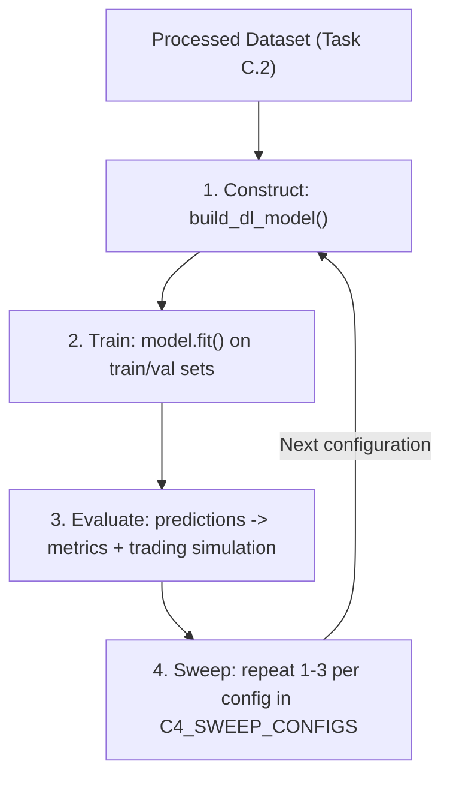

# Option C Weekly Report: Task C.4 - Machine Learning (Phase 1)

## Project Details
- **Project:** FinTech101 Stock Price Prediction System
- **Subject:** COS30018 - Intelligent Systems
- **Task:** Option C - Task C.4: Machine Learning 1
- **Target Stock:** Commonwealth Bank of Australia (`CBA.AX`)
- **Report Date:** Week 6

---

# 1. Introduction

Previously, the model used a fixed neural network architecture, so trying a different recurrent architecture or hyperparameter meant editing the source code directly. Task C.4 replaces this with one configurable model construction function, `build_dl_model()` in `src/model_factory.py`, which takes the number of layers, the size of each layer, and the layer name (**LSTM**, **GRU**, or **SimpleRNN**) as parameters and returns a compiled Keras model — following the pattern in the reference project P1 (`references/P1/stock_prediction.py`), a caller specifies these parameters instead of rewriting the model.

This report:

1. Explains `build_dl_model()` and the non-obvious lines that required research.
2. Uses it to compare different network architectures and hyperparameter configurations (layer count, layer size, epochs, batch size), and summarises the results.

---

# 2. Deep Learning Pipeline

**The pipeline extends Task C.2's preprocessing with four stages: construct, train, evaluate, and sweep — each reusing a single configurable function rather than per-architecture code.**



**Stage 1 (Construct)** — `build_dl_model()` takes these parameters and returns a compiled Keras model:

| Parameter | Meaning |
| :--- | :--- |
| `cell_type` | Recurrent cell architecture: `LSTM`, `GRU`, or `SimpleRNN` |
| `n_layers` | Number of stacked recurrent layers |
| `units` | Number of hidden units in each recurrent layer |
| `dropout` | Dropout fraction applied after each recurrent layer |
| `loss` | Loss function identifier (`huber`, `mse`, or `mae`) |
| `optimizer` | Optimizer identifier (e.g. `adam`) |
| `bidirectional` | If `True`, wraps every recurrent layer in a `Bidirectional` wrapper |
| `lookback_steps`, `n_features`, `future_steps` | Fixed by the input data shape and prediction horizon |

`epochs` and `batch_size` control `model.fit()` in `train.py`, not the architecture — but they're configuration values in the same way, so they sweep alongside the architectural parameters too. Section 4 explains the construction code in detail.

**Stage 2 (Train)** — loads train/validation/test sets, builds the model, and fits it for the configured epochs and batch size. The validation set monitors generalisation during training; weights are saved afterward for reuse without retraining.

**Stage 3 (Evaluate)** — loads the saved weights, predicts on the test set, and scores against these metrics, plus a trading simulation (buy on a predicted rise, sell on a predicted fall) that reports trading accuracy, total profit, and profit per trade:

| Metric | Description |
|---------|-------------|
| **Mean Absolute Error (MAE)** | Average absolute difference between predicted and actual price |
| **Root Mean Squared Error (RMSE)** | Prediction error, penalising large errors more |
| **Mean Absolute Percentage Error (MAPE)** | Prediction error as a percentage of actual price |
| **Directional Accuracy (DA)** | How often the model correctly predicts price direction (up/down) |

**Stage 4 (Sweep)** — `config.C4_SWEEP_CONFIGS` defines ten configurations; `C4SweepRunner` (`src/run_c4_sweeps.py`, extending `BaseSweepRunner`) repeats stages 1–3 for each, varying exactly one of six dimensions per experiment: cell type, layer count, layer size, loss function, epochs, or batch size — matching the brief's named examples. Results are collected into one comparison table (Section 5).

---

# 3. Requirement Coverage

- **Configurable construction function:** `build_dl_model()` takes layer count, layer size, and layer name, and returns a compiled model — `LSTM`/`GRU`/`SimpleRNN` resolve through a lookup table (`CELL_TYPES`), so a new cell type is one dictionary entry, not a new code branch.
- **Same preprocessing pipeline reused:** `train_model()` and `test_model()` both call Task C.2's `load_and_process_data()` unchanged, so every sweep result reflects the model/training configuration, not a data difference.
- **Systematic hyperparameter experiments:** ten named configs in `C4_SWEEP_CONFIGS`, each isolating one of six dimensions relative to the `LSTM_BASE` control (Section 5).

---

# 4. Less-Straightforward Code Explanation

This section explains the lines of `build_dl_model()` that were not immediately obvious to write, focusing on those that required research. Each entry quotes the real line from `src/model_factory.py` and can be read independently. Sources consulted are cited in text and listed in Section 8.

**1. Resolving the cell type through a dictionary instead of an if/elif chain**

```python
CELL_TYPES = {
    "LSTM": LSTM,
    "GRU": GRU,
    "SIMPLERNN": SimpleRNN,
    "RNN": SimpleRNN,
}
...
cell_class = CELL_TYPES[cell_type_upper]
```

Rather than writing `if cell_type == "LSTM": ... elif cell_type == "GRU": ...`, the function maps each cell-type name directly to the corresponding Keras layer **class** (not an instance). Because `LSTM`, `GRU`, and `SimpleRNN` share an identical constructor signature (`units`, `return_sequences`, …), the correct class can be selected once and then called with the same arguments regardless of which architecture was requested. This pattern, where a class itself is treated as a value that can be looked up and instantiated later, is Python's standard way of avoiding repetitive conditional branching (Ramalho, 2022, ch. 8). `"RNN"` is kept as an alias for `"SIMPLERNN"` so that a shorter, commonly used name also resolves correctly.

**2. Setting `return_sequences` based on layer position**

```python
for layer_index in range(n_layers):
    is_last_layer = layer_index == n_layers - 1

    recurrent_layer = cell_class(
        units=units,
        return_sequences=not is_last_layer,
    )
```

A recurrent layer can output either its full sequence of hidden states (one vector per input time step) or only the final hidden state. Keras' own guide on recurrent layers explains that stacking recurrent layers requires every layer except the last to return its full sequence, because the next recurrent layer expects a sequence as input rather than a single vector (Keras Team, 2024b). The last layer, by contrast, must collapse the sequence to a single vector so that the following `Dense` output layer receives a fixed-size input. `return_sequences=not is_last_layer` encodes this rule directly: every layer up to but not including the last one keeps `return_sequences=True`, and the last layer sets it to `False`. This is what allows `n_layers` to be an arbitrary positive integer rather than a hardcoded stack of two or three layers.

**3. Declaring the input shape with `keras.Input` instead of passing `input_shape` to the first layer**

```python
model = Sequential(
    [
        tf.keras.Input(shape=(lookback_steps, n_features)),
    ]
)
```

An older and still commonly documented pattern passes `input_shape=(lookback_steps, n_features)` directly to the first recurrent layer. Running the sweep with that pattern produces the warning visible in the verification screenshot in Section 7: *"Do not pass an `input_shape`/`input_dim` argument to a layer. When using Sequential models, prefer using a `keras.Input(shape)` object as the first layer in the model instead."* The Keras documentation for the `Sequential` model confirms this is the current recommended approach for declaring a model's input shape (Keras Team, 2024a). Declaring the shape through an explicit `Input` layer, rather than as a side-effect argument on the first recurrent layer, keeps the shape declaration independent of which cell type is selected — every recurrent layer added afterwards is built identically regardless of whether it is the first one.

**4. Conditionally wrapping layers in `Bidirectional`**

```python
if bidirectional:
    model.add(Bidirectional(recurrent_layer))
else:
    model.add(recurrent_layer)
```

A `Bidirectional` wrapper runs two copies of the same recurrent layer over the input sequence, one reading forward and one reading backward, and concatenates their outputs (Keras Team, 2024c). This can help a model use information from both the start and the end of a lookback window. Because `bidirectional` is a boolean flag rather than a separate model-building function, the same loop that constructs a unidirectional stack can also construct a bidirectional one, without duplicating the layer-assembly logic. This capability exists in `build_dl_model()` but is not varied in the C.4 sweep, since Section 5's experiments hold `bidirectional=False` to isolate the effects of cell type, depth, width, loss, epochs, and batch size.

**5. Compiling with a loss function selected by string identifier**

```python
model.compile(loss=loss, metrics=["mae"], optimizer=optimizer)
```

Keras accepts loss functions either as string identifiers (e.g. `"huber"`, `"mse"`) or as function objects. Passing the string form lets `train_model()` and the sweep configurations select a loss function the same way they select a cell type: as a plain configuration value rather than an imported Python object. The Huber loss, used as the default for most C.4 configurations, behaves like squared error for small residuals and like absolute error for large residuals, which makes it less sensitive than MSE to the occasional large price jump in the CBA.AX series (Keras Team, 2024d).

---

# 5. Experimental Results

## 5.1 Experiment Configurations

To evaluate the effect of different neural network architectures and training hyperparameters, ten model configurations were trained and tested using the same dataset, preprocessing pipeline, and evaluation procedure. Each experiment changes only one parameter relative to `LSTM_BASE` while keeping the remaining settings unchanged. This allows the influence of each parameter to be evaluated independently.

The Task C.2 preprocessing pipeline produced **728 training sequences**, **128 validation sequences**, and **232 test sequences** from the `CBA.AX` dataset. The experiments therefore focus on small- to medium-sized recurrent neural networks (64–256 hidden units and 1–3 recurrent layers), providing sufficient model capacity while reducing the risk of overfitting on a relatively small financial time-series dataset.

The experiments investigate six aspects of the model and training design:

1. **Recurrent Cell Type** – Compare LSTM, GRU, and SimpleRNN using the same network structure.
2. **Network Depth** – Compare one, two, and three recurrent layers.
3. **Hidden Units** – Compare networks with 64, 128, and 256 hidden units.
4. **Loss Function** – Compare Huber Loss and Mean Squared Error (MSE).
5. **Epoch Count** – Compare 20 epochs against a doubled budget of 40 epochs.
6. **Batch Size** – Compare a batch size of 64 against a smaller batch size of 16.

The experiment configurations are summarised below.

| Model Name | Cell Type | Layers | Units | Loss | Epochs | Batch Size |
|------------|-----------|--------|-------|------|---------|------------|
| **LSTM_BASE** | LSTM | 2 | 128 | Huber | 20 | 64 |
| **GRU_BASE** | GRU | 2 | 128 | Huber | 20 | 64 |
| **RNN_BASE** | SimpleRNN | 2 | 128 | Huber | 20 | 64 |
| **LSTM_STACKED** | LSTM | 3 | 128 | Huber | 20 | 64 |
| **LSTM_SHALLOW** | LSTM | 1 | 128 | Huber | 20 | 64 |
| **LSTM_WIDE** | LSTM | 2 | 256 | Huber | 20 | 64 |
| **LSTM_NARROW** | LSTM | 2 | 64 | Huber | 20 | 64 |
| **LSTM_MSE** | LSTM | 2 | 128 | MSE | 20 | 64 |
| **LSTM_LONGTRAIN** | LSTM | 2 | 128 | Huber | 40 | 64 |
| **LSTM_SMALLBATCH** | LSTM | 2 | 128 | Huber | 20 | 16 |

---

## 5.2 Experimental Results

The hyperparameter sweep was executed using `run_c4_sweeps.py`. For each configuration, the model was trained, evaluated on the independent testing dataset, and the evaluation metrics were recorded to `results/c4/c4_sweep_results.csv`.

The complete experimental results are summarised below.

| Model | Cell Type | Layers | Units | Loss | Epochs | Batch | MAE ($) | RMSE ($) | MAPE (%) | Directional Acc. (%) | Trading Acc. (%) | Total Profit ($) | Profit/Trade ($) |
|--------|-----------|:------:|:-----:|------|:------:|:-----:|---------:|----------:|----------:|-------------------------:|-----------------:|------------------:|------------------:|
| **LSTM_BASE** | LSTM | 2 | 128 | Huber | 20 | 64 | 2.9312 | 3.4940 | 2.75 | 44.83 | 44.83 | -23.12 | -0.10 |
| **GRU_BASE** | GRU | 2 | 128 | Huber | 20 | 64 | **2.2256** | **2.5751** | **2.12** | 44.83 | 44.83 | -22.59 | -0.10 |
| **RNN_BASE** | SimpleRNN | 2 | 128 | Huber | 20 | 64 | 3.7622 | 4.4339 | 3.50 | **46.12** | **46.12** | -22.74 | -0.10 |
| **LSTM_STACKED** | LSTM | 3 | 128 | Huber | 20 | 64 | 2.6520 | 3.2555 | 2.49 | 44.40 | 44.40 | **-17.11** | **-0.07** |
| **LSTM_SHALLOW** | LSTM | 1 | 128 | Huber | 20 | 64 | 4.3150 | 4.6711 | 4.12 | 45.26 | 45.26 | -23.85 | -0.10 |
| **LSTM_WIDE** | LSTM | 2 | 256 | Huber | 20 | 64 | 3.4934 | 4.0006 | 3.29 | 45.69 | 45.69 | -24.54 | -0.11 |
| **LSTM_NARROW** | LSTM | 2 | 64 | Huber | 20 | 64 | 3.6578 | 4.3151 | 3.41 | 45.69 | 45.69 | -18.78 | -0.08 |
| **LSTM_MSE** | LSTM | 2 | 128 | MSE | 20 | 64 | 2.9251 | 3.4876 | 2.74 | 44.83 | 44.83 | -23.12 | -0.10 |
| **LSTM_LONGTRAIN** | LSTM | 2 | 128 | Huber | 40 | 64 | 3.5520 | 4.0670 | 3.34 | 45.69 | 45.69 | -24.54 | -0.11 |
| **LSTM_SMALLBATCH** | LSTM | 2 | 128 | Huber | 20 | 16 | 2.7512 | 3.4132 | 2.55 | 43.97 | 43.97 | -26.64 | -0.11 |

Every configuration produced a **negative total trading profit** over the 232-sample test period — the simple buy/sell simulation lost money regardless of architecture or training setting.

---

## 5.3 Discussion

| Dimension | Winner | Key observation |
| :--- | :--- | :--- |
| Cell type | GRU (lowest MAE/RMSE/MAPE) | SimpleRNN had the highest directional accuracy but the largest regression errors — correct direction doesn't imply accurate price. |
| Depth | 3 layers (LSTM_STACKED) | Outperformed 2 layers on every metric and had the smallest trading loss; 1 layer (LSTM_SHALLOW) was the worst LSTM variant. |
| Width | 128 units (baseline) | 256 units (LSTM_WIDE) made results worse; 64 units (LSTM_NARROW) was also worse. More capacity did not help. |
| Loss function | Huber (marginal) | Huber and MSE performed almost identically — minor effect on this dataset. |
| Epoch count | 20 epochs (baseline) | Doubling to 40 (LSTM_LONGTRAIN) made every regression metric worse — consistent with overfitting on 728 training sequences. |
| Batch size | Mixed | Batch 16 (LSTM_SMALLBATCH) slightly improved MAE/RMSE/MAPE but produced the worst trading loss and lowest directional accuracy of all ten configs. |

**Overall:** more model or training capacity did not reliably improve results — width, epoch count, and batch size each hurt at least one metric group even when they helped another. Every configuration lost money in the trading simulation, reinforcing that regression accuracy and trading profitability are separate questions.

# 6. Verification

The sweep was run with `python src/run_c4_sweeps.py` from the project root (so the cached dataset path in `config.py` resolves), reproducing the Section 5 results exactly under the fixed seed from `set_seed()`. This produced a consolidated CSV (`results/c4/c4_sweep_results.csv`), a prediction plot per model, and saved weights per model.


| LSTM_BASE | GRU_BASE | RNN_BASE |
|:---------:|:--------:|:--------:|
|  |  |  |

LSTM and GRU produce smoother curves that track the trend but underestimate rapid price growth. SimpleRNN follows short-term movements more closely — consistent with its higher directional accuracy despite larger regression errors.

---

# Conclusion

Task C.4 is complete: `build_dl_model()` builds a compiled Keras model from cell type, layer count, and hidden units, supporting LSTM, GRU, and SimpleRNN through one interface without source-code changes.

Ten configurations were trained and compared across six dimensions (cell type, depth, width, loss, epochs, batch size) using the Task C.2 pipeline. GRU gave the best regression accuracy, SimpleRNN the highest directional accuracy, and a 3-layer LSTM the smallest trading loss. More capacity or training time did not reliably improve results, and no configuration was trading-profitable. This configurable design is the reusable foundation for the forecasting experiments in the subsequent tasks.

---

# References

Keras Team. (2024a). *The Sequential model*. Keras 3 API documentation. https://keras.io/guides/sequential_model/

Keras Team. (2024b). *Working with RNNs*. Keras 3 API documentation. https://keras.io/guides/working_with_rnns/

Keras Team. (2024c). *Bidirectional layer*. Keras 3 API documentation. https://keras.io/api/layers/recurrent_layers/bidirectional/

Keras Team. (2024d). *Huber loss*. Keras 3 API documentation. https://keras.io/api/losses/regression_losses/#huber-class

Ramalho, L. (2022). *Fluent Python: Clear, concise, and effective programming* (2nd ed.). O'Reilly Media.
