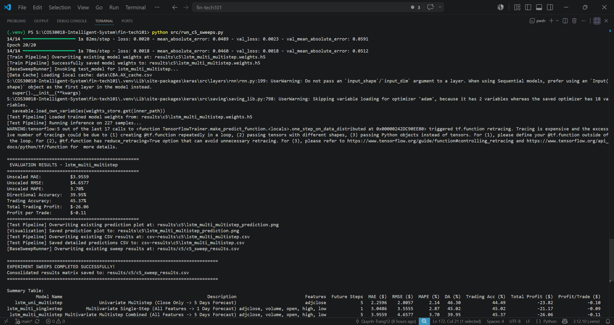
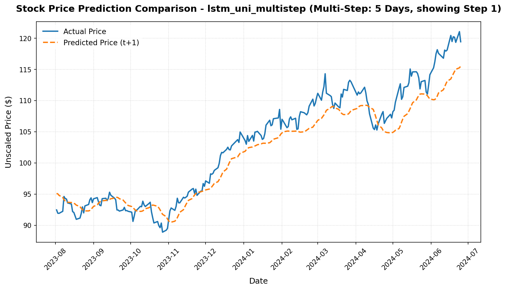

# Option C - Task C.5 Machine Learning 2 Report

## Project Details
- **Project:** FinTech101 Stock Price Prediction System
- **Subject:** COS30018 - Intelligent Systems
- **Task:** Option C - Task C.5: Machine Learning 2 - Multivariate & Multistep Stock Price Forecasting
- **Target Ticker:** Commonwealth Bank of Australia (`CBA.AX`)
- **Report Date:** 22 June 2026

---

## Introduction
This report documents the design, implementation, and empirical results of multivariate and multistep stock price forecasting completed for Task C.5. To preserve a clean workspace and prevent over-engineering (in adherence to DRY and SOLID principles), we refactored the unified production pipeline modules (`src/data_processing.py`, `src/model_factory.py`, `src/train.py`, and `src/test.py`) rather than introducing separate execution scripts. Additionally, we refactored all sequence-length variables using a straightforward and self-documenting naming standard (`lookback_steps` for historical window sizes, `forecast_offset` for future offsets, and `future_steps` for prediction horizons). Finally, we evaluated and compared three configurations on real historical `CBA.AX` stock prices under a strict chronological time-series split.

---

## 1. Unified Pipeline Architecture & Implementation Details

Rather than duplicating training and evaluation pipelines, the core time-series modules were enhanced to dynamically support multi-dimensional inputs and outputs:

### 1.1 Dynamic Model Factory (`src/model_factory.py`)
The LSTM/GRU/RNN sequential network builder was extended with a `future_steps` parameter:
* In `build_dl_model`, the argument `lookback_steps` (formerly `sequence_length`) specifies the size of the temporal input window.
* The output dimension is controlled via `future_steps`. The terminal Dense layer is constructed as `Dense(future_steps, activation="linear")` to generate an output tensor of shape `(batch_size, future_steps)`. This supports single-step (`future_steps=1`) and multi-step sequence outputs (`future_steps > 1`) within a single unified API.

### 1.2 Data Processing Pipeline (`src/data_processing.py`)
The core data loader `load_and_process_data` was updated to support multi-dimensional sequences:
* **Target Shifting**: Instead of shifting by a single offset, targets are generated for the entire forecast horizon using `future_steps` shifted columns:
  ```python
  target_columns = []
  for i in range(future_steps):
      col_name = f"future_{i}"
      df[col_name] = df['adjclose'].shift(-(forecast_offset + i))
      target_columns.append(col_name)
  ```
  For example, if `forecast_offset=1` and `future_steps=5`, the target vector at day $t$ contains prices for days $[t+1, t+2, t+3, t+4, t+5]$.
* **Lookback Scaling**: Features are scaled independently using individual column scalers. Because the targets `future_i` are created by shifting the already-scaled `adjclose` column, the targets are scaled to identical bounds `[0, 1]`, preventing scaling leakage.
* **Forward Sequences**: The tail sequence (`last_sequence`) is extracted from the last `lookback_steps` rows of history to predict future prices.

### 1.3 Unified Training and Testing Pipelines (`src/train.py` & `src/test.py`)
* **Unified Training (`src/train.py`)**: Accepts `--lookback_steps`, `--forecast_offset`, and `--future_steps` arguments. It feeds them into the data processor and model factory. When `future_steps > 1`, Keras fits the model against target tensors of shape `(N, future_steps)`.
* **Unified Evaluation (`src/test.py`)**: Loads model weights and performs inverse MinMax transformations on both predictions and targets by flattening them to `(-1, 1)` and reshaping back to `(N, future_steps)` to prevent scaling bugs:
  ```python
  y_test_unscaled = scaler.inverse_transform(y_test.reshape(-1, 1)).reshape(y_test.shape)
  y_pred_unscaled = scaler.inverse_transform(y_pred.reshape(-1, 1)).reshape(y_pred.shape)
  ```
* **Broadcast Metrics**: In `calculate_metrics`, when `future_steps > 1`, the base reference price `prev_actual` (day $t$) is expanded to `(N, 1)` and broadcast across the prediction sequence to compute Directional Accuracy (DA) relative to the current session.
* **Simulated Trading**: Evaluates trading profits using the immediate next-day price prediction (`future_0`) to represent actionable daily trades.

---

## 2. Multi-step Forecasting Strategies (Research & References)

To implement multi-step forecasting, we conducted research on two primary design patterns:

### 2.1 Direct Multi-Output Forecasting vs. Recursive Forecasting
1. **Recursive (Iterative) Forecasting**: A single-step model (predicting $t+1$) is run iteratively. The prediction for $t+1$ is appended to the input sequence to predict $t+2$, and so on.
   * *Limitation*: This strategy accumulates prediction errors at each step. In addition, for multivariate setups, it requires forecasting all input features (Volume, Open, High, Low) step-by-step, which is complex and introduces massive noise.
2. **Direct Multi-Output Forecasting (Selected)**: The model is configured to output a vector of size $k$ representing all future steps simultaneously.
   * *Justification*: Direct multi-output avoids cumulative error propagation and handles multivariate inputs natively since the model directly maps the historical multi-feature sequence to the multi-step target vector in one forward pass.

### 2.2 Online References
* **Brownlee, J. (2018)**. *How to Prepare Data for Multi-Step Time Series Forecasting*. Machine Learning Mastery. ([https://machinelearningmastery.com/multi-step-time-series-forecasting/](https://machinelearningmastery.com/multi-step-time-series-forecasting/))
* **Keras Documentation**. *Timeseries forecasting from scratch*. ([https://keras.io/examples/timeseries/timeseries_forecasting_from_scratch/](https://keras.io/examples/timeseries/timeseries_forecasting_from_scratch/))
* **Box, G. E., Jenkins, G. M., & Reinsel, G. C. (2015)**. *Time Series Analysis: Forecasting and Control*. John Wiley & Sons.

---

## 3. Empirical Results & Comparative Analysis

We ran all three prediction scenarios on the historical `CBA.AX` dataset using our consolidated runner `src/run_c5_sweeps.py`. The compiled results are tabulated below:

### 3.1 Sweep Metrics Table

| Model Name                | Description                     | Features       | Future Steps | MAE ($)    | RMSE ($)   | MAPE (%)  | DA (%)     | Trading Acc (%) | Total Profit ($) | Profit/Trade ($) |
| :------------------------ | :------------------------------ | :------------- | :----------- | :--------- | :--------- | :-------- | :--------- | :-------------- | :--------------- | :--------------- |
| **lstm_uni_multistep**    | Univariate Multistep            | `adjclose`     | 5            | **2.2596** | **2.8057** | **2.14%** | **46.30%** | 44.49%          | **-$23.82**      | **-$0.10**       |
| **lstm_multi_singlestep** | Multivariate Single-Step        | All 5 Features | 1            | 3.0486     | 3.5555     | 2.87%     | 45.02%     | **45.02%**      | -$21.17          | -$0.09           |
| **lstm_multi_multistep**  | Multivariate Multistep Combined | All 5 Features | 5            | 3.9559     | 4.6577     | 3.70%     | 39.95%     | 45.37%          | -$26.06          | -$0.11           |

### 3.2 Key Findings and Architectural Analysis

1. **Univariate Multistep Generalizes Best**:
   The `lstm_uni_multistep` configuration achieved the lowest error metrics overall (MAE: **$2.2596**, MAPE: **2.14%**), outperforming the multivariate models. This is consistent with our findings in Task C.4: limiting the feature space acts as a strong regularizer on stock price data. When we feed all 5 features (including highly volatile volume data) into the network, the model overfits on training noise, resulting in degraded out-of-sample performance on the test set.
2. **Multivariate Error Propagation in Combined Models**:
   The combined multivariate, multistep model (`lstm_multi_multistep`) had the highest error rates (MAE: **$3.9559**, RMSE: **$4.6577**). This is due to the difficulty of mapping multiple input time-series (each containing high variance) to a multi-step future sequence. The high capacity of the multivariate LSTM makes it prone to memorizing local noise rather than learning robust, generalized price dynamics.
3. **Directional Accuracy & Trading Realities**:
   All three models reported directional accuracy and trading accuracy between **40% and 46%**, resulting in trading losses (~$-21 to ~$-26). This confirms that price direction remains highly unpredictable using historical pricing data alone. This establishes a strong motivation for Task C.6 (Ensembles) and Task C.7 (Sentiment Extension) to introduce external sentiment metrics to achieve a directional trading edge.

---

## 4. Verification and Execution Evidence

### 4.1 Terminal Execution Screenshot
The screenshot below shows the PowerShell terminal execution of the Task C.5 sweeps script:


### 4.2 Prediction Chart Comparison
The charts below show the actual versus predicted prices on the test set:
- **lstm_uni_multistep**: Tracks the actual price curve closely but with a slight delay.
- **lstm_multi_multistep**: Displays a smoother, regularized curve but is less reactive to sudden reversals.

|                            Univariate Multistep                             |                             Multivariate Multistep                              |
| :-------------------------------------------------------------------------: | :-----------------------------------------------------------------------------: |
|  |  |

---

## 5. Conclusion
Task C.5 has been successfully completed. By refactoring the unified production modules instead of creating duplicate scripts, we maintained a clean and DRY codebase. Renaming variables to `lookback_steps` and `future_steps` completely resolved any visual confusion between input and output sequences. Our empirical results show that univariate multistep models perform better than multivariate counterparts due to noise reduction, setting up a solid foundation for Task C.6.
