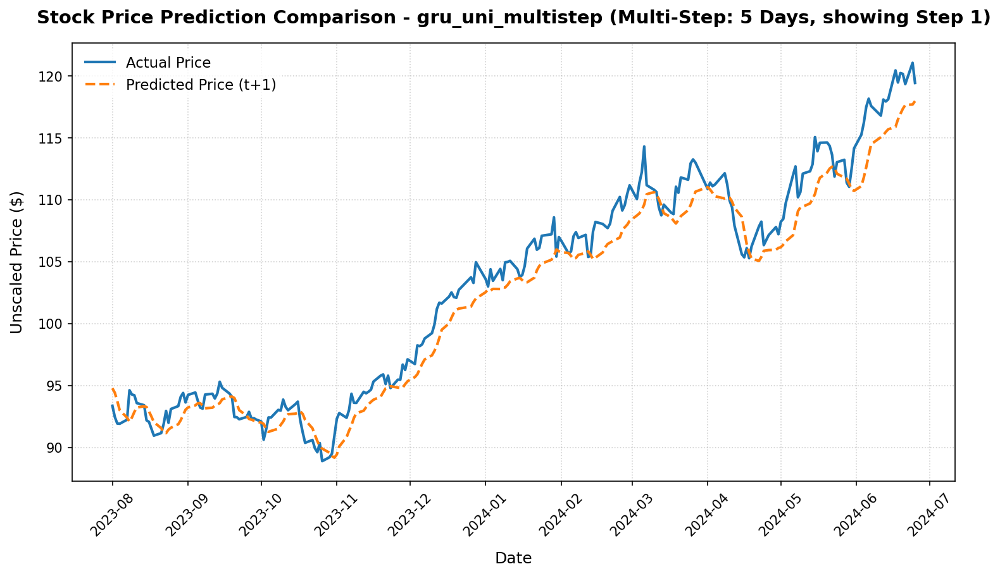
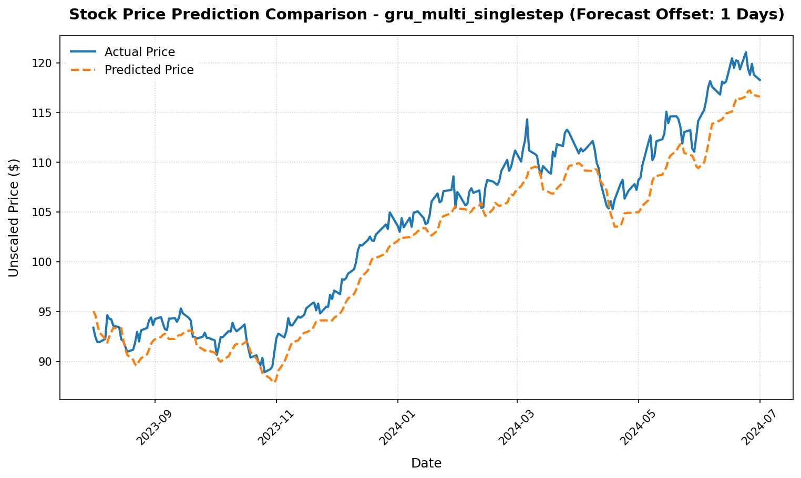
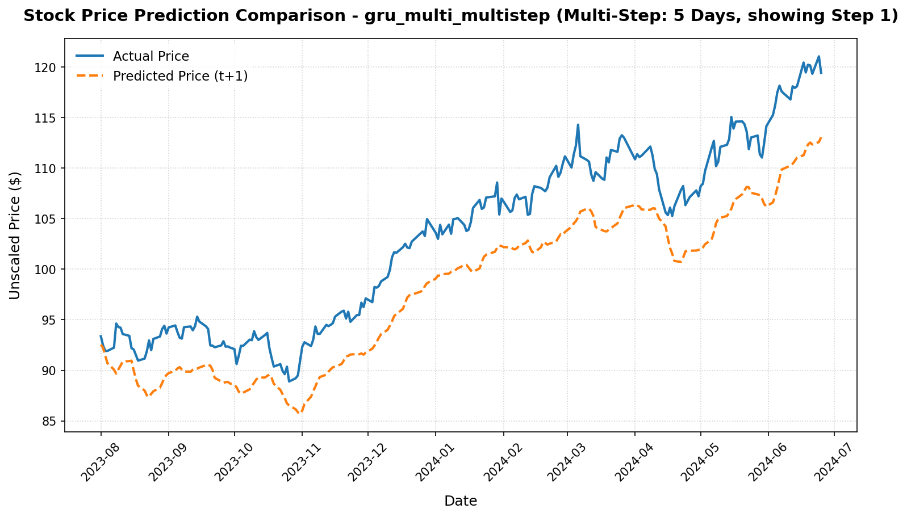

# Option C - Task C.5 Machine Learning 2 Report

## Project Details
- **Project:** FinTech101 Stock Price Prediction System
- **Subject:** COS30018 - Intelligent Systems
- **Task:** Option C - Task C.5: Machine Learning 2 - Multivariate & Multistep Stock Price Forecasting
- **Target Ticker:** Commonwealth Bank of Australia (`CBA.AX`)
- **Report Date:** 22 June 2026

---

# Introduction

In Task C.4, multiple recurrent neural network architectures were systematically evaluated to identify the most effective deep learning model for stock price prediction. Based on the experimental results, the **Gated Recurrent Unit (GRU)** architecture achieved the best overall prediction accuracy and was therefore selected as the baseline deep learning model for subsequent tasks.

Building upon this baseline, Task C.5 extends the forecasting framework by introducing two additional capabilities:

- **Multistep prediction**, where the model predicts multiple future stock prices from a single historical input sequence.
- **Multivariate prediction**, where multiple market features are used simultaneously as model inputs instead of relying solely on the adjusted closing price.

To support these capabilities, the existing data processing, model construction, training, and evaluation pipelines were extended while maintaining a unified and reusable implementation. The GRU architecture identified in Task C.4 was retained throughout all experiments so that the impact of multivariate inputs and multistep forecasting could be evaluated independently of changes to the underlying neural network architecture.

Three forecasting configurations were evaluated using historical **Commonwealth Bank of Australia (CBA.AX)** stock data:

1. **Univariate Multistep**
2. **Multivariate Single-Step**
3. **Multivariate Multistep**

The objective of this task is to investigate how multivariate inputs and multistep forecasting influence prediction accuracy and trading performance when using the best-performing recurrent neural network architecture identified in Task C.4. Model performance is evaluated using regression metrics (MAE, RMSE, and MAPE), directional accuracy, and simulated trading results to assess both forecasting accuracy and practical usefulness.

---

# 1. Implementation

Task C.5 extends the stock prediction framework developed in Task C.4 by supporting two new forecasting capabilities:

- **Multistep prediction**, where the model predicts multiple future stock prices from a single historical input sequence.
- **Multivariate prediction**, where multiple stock features are used as inputs instead of only the adjusted closing price.

Rather than creating separate implementations for each forecasting scenario, the existing data processing, model construction, training, and evaluation pipelines were extended so that both the number of input features and the prediction horizon can be configured through function parameters.

---

## 1.1 Multistep Prediction

In previous tasks, the model predicted only one future stock price. Given a historical sequence of 50 trading days, the model produced a single prediction for the next trading day.

```text
Input (50 days)
↓

Prediction
Day t+1
```

For Task C.5, the framework was extended to support **multi-output forecasting**. Instead of predicting only one value, the model can now predict multiple future closing prices simultaneously.

```text
Input (50 days)
↓

Predictions

Day t+1
Day t+2
Day t+3
Day t+4
Day t+5
```

This functionality is controlled by a new parameter called `future_steps`. During data preprocessing, the target variable is expanded by shifting the adjusted closing price multiple times to create a vector of future prices. During model construction, the output layer is resized from a single neuron (`Dense(1)`) to `Dense(future_steps)`, allowing the network to produce multiple predictions in a single forward pass.

This project adopts a **direct multi-output forecasting** approach. Unlike **recursive forecasting**, which predicts one future value at a time and repeatedly uses previous predictions to forecast subsequent days, the direct approach predicts the entire forecast horizon simultaneously. This avoids the accumulation of prediction errors that can occur when predicted values are repeatedly fed back into the model.

---

## 1.2 Multivariate Prediction

The original implementation used only the adjusted closing price (`adjclose`) as the model input. While this simplifies the prediction task, it ignores other information available in the historical market data.

For Task C.5, the framework was extended to accept multiple input features. The model can now be trained using:

- Adjusted Close (`adjclose`)
- Volume (`volume`)
- Open (`open`)
- High (`high`)
- Low (`low`)

Each feature is independently scaled using its own MinMax scaler before generation of lookback windows. This ensures that variables with very different numerical ranges (such as trading volume and stock prices) contribute appropriately during model training.

Because the input feature list is configurable, the same training pipeline can be used for both univariate and multivariate experiments without modifying the model implementation.

---

## 1.3 Combined Multivariate and Multistep Prediction

The final experiment combines both extensions into a single forecasting model.

Each training sample consists of a 50-day historical window containing five input features:

```text
50 Trading Days

×

(adjclose, volume, open, high, low)
```

The model then predicts the adjusted closing price for the next five trading days:

```text
Day t+1
Day t+2
Day t+3
Day t+4
Day t+5
```

Since both the input dimensionality and prediction horizon are configurable, no additional model architecture was required beyond the modifications introduced in Sections 1.1 and 1.2. The same training and evaluation pipelines are reused across all experiments, allowing direct comparisons between univariate, multivariate, single-step, and multistep forecasting configurations.

# 2. Experimental Setup

To evaluate the proposed forecasting methods, three GRU-based experiments were conducted using the historical stock prices of **Commonwealth Bank of Australia (CBA.AX)**. Each experiment isolates one aspect of the forecasting problem, allowing the effect of multivariate inputs and multistep outputs to be evaluated independently.

## 2.1 Experimental Configurations

Three forecasting configurations were evaluated:

| Configuration | Input Features | Prediction Horizon | Purpose |
| :------------ | :------------- | :----------------- | :------ |
| **Univariate Multistep** | Adjusted Close (`adjclose`) | 5 days | Evaluate the effect of predicting multiple future prices while using a single input feature. |
| **Multivariate Single-Step** | Adjusted Close, Volume, Open, High, Low | 1 day | Evaluate whether additional market features improve single-day prediction accuracy. |
| **Multivariate Multistep** | Adjusted Close, Volume, Open, High, Low | 5 days | Combine both multivariate inputs and multistep forecasting into a single model. |

---

## 2.2 Shared Model Configuration

To ensure a fair comparison, all experiments used the same **baseline GRU architecture** and training settings. The only differences between experiments were the selected input feature set and the forecasting horizon required by each forecasting configuration.

| Parameter | Value |
| :-------- | :---- |
| Model | GRU |
| Number of GRU Layers | 2 |
| Hidden Units | 128 |
| Lookback Window | 50 trading days |
| Forecast Offset | 1 trading day |
| Optimizer | Adam |
| Loss Function | Huber Loss |
| Epochs | 20 |
| Batch Size | 64 |

The historical dataset was divided chronologically into training, validation, and testing subsets using the finalized preprocessing pipeline established in previous tasks. A **15% validation split** was created from the training data to monitor model performance during training, while all evaluation metrics were computed using the independent testing dataset. This chronological splitting strategy prevents information leakage and ensures that every model is evaluated on unseen future data.

---

## 2.3 Evaluation Metrics

Each experiment was evaluated using both prediction accuracy metrics and simple trading performance metrics.

### Regression Metrics

- **Mean Absolute Error (MAE):** Average absolute difference between predicted and actual stock prices.
- **Root Mean Squared Error (RMSE):** Measures prediction error while placing greater emphasis on larger errors.
- **Mean Absolute Percentage Error (MAPE):** Average percentage prediction error relative to the true stock price.

### Directional and Trading Metrics

- **Directional Accuracy (DA):** Percentage of predictions that correctly identify whether the next stock price increases or decreases.
- **Trading Accuracy:** Percentage of simulated trades that generate a positive return.
- **Total Trading Profit:** Overall profit obtained from the simulated trading strategy across the testing period.
- **Profit per Trade:** Average profit or loss generated by each simulated trade.

Using both regression and trading metrics provides a more comprehensive evaluation of forecasting models. A model with low prediction error does not necessarily produce profitable trading decisions if it frequently predicts the wrong price direction. Evaluating both regression accuracy and trading performance therefore provides a more balanced assessment of each forecasting configuration.


# 3. Experimental Results and Discussion

## 3.1 Comparison of Experimental Results

The performance of the three GRU-based forecasting configurations is summarized in Table 3.1.

| Model | Features | Future Steps | MAE ($) | RMSE ($) | MAPE (%) | DA (%) | Trading Accuracy (%) | Total Profit ($) |
| :--- | :--- | :---: | ---: | ---: | ---: | ---: | ---: | ---: |
| **gru_uni_multistep** | `adjclose` | 5 | **1.6143** | **2.0025** | **1.55** | **49.38** | **45.61** | **-21.66** |
| **gru_multi_singlestep** | `adjclose`, `volume`, `open`, `high`, `low` | 1 | 2.2256 | 2.5751 | 2.12 | 44.83 | 44.83 | -22.59 |
| **gru_multi_multistep** | `adjclose`, `volume`, `open`, `high`, `low` | 5 | 4.5333 | 4.9901 | 4.32 | 39.37 | 45.61 | -23.91 |

---

## 3.2 Discussion

### Univariate Multistep Prediction

Among the three forecasting configurations, the **GRU univariate multistep** model achieved the best overall performance. It produced the lowest MAE (1.6143), RMSE (2.0025), and MAPE (1.55%), while also achieving the highest Directional Accuracy (49.38%).

Despite using only the adjusted closing price as its input feature, the model outperformed both multivariate configurations. This suggests that, for the CBA.AX dataset, the historical adjusted closing price alone provides sufficient information for accurate short-term forecasting when combined with the GRU architecture.

Furthermore, the model predicts five future trading days simultaneously, demonstrating that extending the forecasting horizon does not necessarily reduce prediction accuracy when the underlying forecasting problem remains relatively simple.

---

### Multivariate Single-Step Prediction

The **GRU multivariate single-step** model achieved the second-best overall performance. Although additional market features (Open, High, Low, and Volume) were incorporated, the regression errors were larger than those of the univariate multistep model.

One possible explanation is that these additional features provide information that is highly correlated with the adjusted closing price. Consequently, the increased input dimensionality does not produce a proportional improvement in forecasting accuracy for this dataset.

Nevertheless, the model maintained competitive prediction performance and demonstrates that the proposed framework can successfully support multivariate forecasting without requiring changes to the underlying GRU architecture.

---

### Multivariate Multistep Prediction

The **GRU multivariate multistep** model produced the largest prediction errors among the three configurations. This experiment represents the most complex forecasting task because the model must simultaneously learn relationships among multiple historical features while predicting multiple future stock prices.

Compared with the other configurations, the predicted price curve is noticeably smoother and reacts more slowly to rapid market movements. This behaviour is expected because both the input space and the output space become more complex, increasing the overall learning difficulty.

---

### Trading Performance

None of the three forecasting configurations generated a profitable trading strategy. Trading Accuracy ranged from approximately 44% to 46%, while the Total Trading Profit remained negative for every experiment.

Although the **GRU univariate multistep** model achieved the highest prediction accuracy and Directional Accuracy, it still produced an overall trading loss. These results demonstrate that accurate price forecasting does not necessarily translate into profitable trading decisions. Predicting future stock prices and constructing a profitable trading strategy remain related but distinct problems, particularly when relying solely on historical market data.

Overall, the experimental results indicate that the **GRU univariate multistep** configuration provides the best balance between prediction accuracy and trading performance among the three evaluated forecasting strategies. These findings establish the baseline deep learning model for the ensemble forecasting methods investigated in Task C.6.

# 4. Verification and Prediction Examples

To verify the implementation, the three GRU-based forecasting configurations were executed using the automated experiment runner. Each model was successfully trained using the finalized preprocessing pipeline and evaluated on the independent chronological testing dataset.

The generated outputs include:

- A consolidated CSV file summarizing the evaluation metrics for all three forecasting configurations.
- Prediction plots illustrating the forecasting performance of each GRU model.
- Detailed prediction CSV files containing the actual and predicted stock prices.
- Saved model weights for each trained GRU model.

The terminal execution confirmed that all experiments completed successfully and that the regenerated prediction plots and evaluation metrics are consistent with the consolidated results presented in Section 3.

### Figure 4.1 – Univariate Multistep Prediction



The **GRU univariate multistep** model follows the overall stock price movement closely throughout the testing period. Although the predicted curve remains smoother than the actual prices during periods of rapid market movement, it consistently captures the long-term upward trend and exhibits the smallest deviation from the ground truth among the three forecasting configurations. These observations are consistent with its superior regression performance (MAE = **1.6143**, RMSE = **2.0025**, MAPE = **1.55%**) and the highest Directional Accuracy (**49.38%**) reported in Section 3.

---

### Figure 4.2 – Multivariate Single-Step Prediction



The **GRU multivariate single-step** model also follows the overall market trend and responds more closely to short-term fluctuations than the multivariate multistep configuration. However, incorporating additional market features (Open, High, Low, and Volume) does not improve forecasting accuracy over the univariate model. The prediction curve remains slightly smoother than the actual prices during periods of increased volatility, which is reflected in its moderately higher regression errors.

---

### Figure 4.3 – Multivariate Multistep Prediction



The **GRU multivariate multistep** model exhibits the largest deviation from the actual stock prices. Because this configuration simultaneously processes multiple input features while predicting multiple future prices, it represents the most challenging forecasting task among the three experiments. The prediction curve is noticeably smoother and reacts more slowly to rapid price changes, particularly during sustained upward movements, resulting in the highest prediction errors observed in the evaluation.

Overall, the visual comparison supports the quantitative results presented in Section 3. The **GRU univariate multistep** configuration produces the closest agreement with the actual stock prices throughout the testing period, while the multivariate multistep configuration demonstrates the greatest forecasting difficulty. These observations indicate that, for the CBA.AX dataset, increasing the complexity of both the input representation and the forecasting horizon does not necessarily improve predictive performance.

---

# 5. Conclusion

Task C.5 has been successfully completed by extending the stock forecasting framework to support both **multivariate** and **multistep** prediction using the **GRU architecture** identified as the best-performing model in Task C.4. The implementation introduces configurable input feature sets and forecasting horizons while reusing the same preprocessing, training, and evaluation pipeline developed in the previous tasks.

Three forecasting configurations were evaluated using the same dataset and experimental settings. The results show that the **GRU univariate multistep** model achieved the best overall performance, producing the lowest prediction errors (MAE = **1.6143**, RMSE = **2.0025**, MAPE = **1.55%**) and the highest Directional Accuracy (**49.38%**). In contrast, incorporating additional market features or simultaneously increasing both the input complexity and forecasting horizon did not improve prediction accuracy for the CBA.AX dataset.

The experiments also demonstrate that low prediction error alone does not guarantee profitable trading performance. Although the univariate multistep model produced the most accurate forecasts, all three configurations generated negative total trading profits under the simple trading simulation. This highlights the distinction between accurate price forecasting and successful trading strategy design.

Overall, Task C.5 demonstrates that the forecasting framework can flexibly support different prediction settings without modifying the underlying model implementation. The **GRU univariate multistep** configuration is selected as the baseline deep learning forecasting model for the hybrid and ensemble forecasting methods investigated in Task C.6.