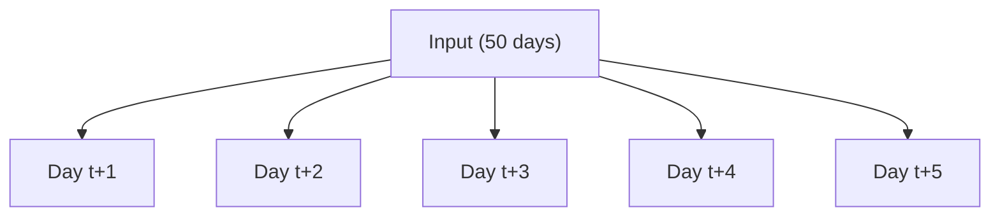
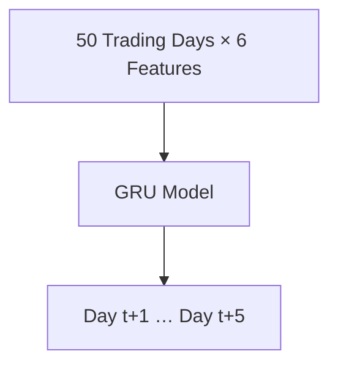

# Option C Weekly Report: Task C.4 - Machine Learning (Phase 2)

## Project Details
- **Project:** FinTech101 Stock Price Prediction System
- **Subject:** COS30018 - Intelligent Systems
- **Task:** Option C - Task C.5: Machine Learning 2 - Multivariate & Multistep Stock Price Forecasting
- **Target Ticker:** Commonwealth Bank of Australia (`CBA.AX`)
- **Report Due:** Week 7

---

# Introduction

In Task C.4, the **Gated Recurrent Unit (GRU)** architecture achieved the best overall prediction accuracy among the recurrent networks evaluated and was selected as the baseline model for subsequent tasks.

Task C.5 extends that baseline with two capabilities:

- **Multistep prediction** — predicting several future prices from one historical input sequence.
- **Multivariate prediction** — using multiple market features as input instead of only the adjusted closing price.

The existing data processing, model construction, training, and evaluation pipelines were extended to support both, through configurable function parameters rather than separate implementations per scenario. The GRU architecture from Task C.4 was retained throughout so the effect of multivariate inputs and multistep forecasting could be isolated from architecture changes.

Three configurations were evaluated on historical **Commonwealth Bank of Australia (CBA.AX)** data:

1. **Univariate Multistep**
2. **Multivariate Single-Step**
3. **Multivariate Multistep**

Each was scored on four metrics, plus simulated trading performance:

1. **Mean Absolute Error (MAE)**
2. **Root Mean Squared Error (RMSE)**
3. **Mean Absolute Percentage Error (MAPE)**
4. **Directional Accuracy (DA)**

---

# 1. Implementation

## 1.1 Multistep Prediction

Previously, the model predicted one future price from a 50-day input window. Task C.5 extends this to **multi-output forecasting**, where the same window produces several future prices at once:



This is controlled by a new parameter, `future_steps`:

- **Preprocessing:** the target is expanded into a vector of future prices by shifting the adjusted closing price multiple times.
- **Model:** the output layer is resized from `Dense(1)` to `Dense(future_steps)`, so one forward pass produces every step.

This is a **direct multi-output** approach, not a **recursive** one: all `future_steps` days are predicted simultaneously in a single pass, rather than predicting one day and feeding that prediction back in to predict the next. This avoids compounding prediction errors across the horizon.

---

## 1.2 Multivariate Prediction

The original implementation used only the adjusted closing price (`adjclose`) as model input. Task C.5 extends this to all six features named in the task brief:

| Feature | Column |
| :--- | :--- |
| Adjusted Close | `adjclose` |
| Close | `close` |
| Volume | `volume` |
| Open | `open` |
| High | `high` |
| Low | `low` |

Each feature is scaled with its own MinMax scaler before lookback windows are built, so features with very different numerical ranges (e.g. volume vs. price) contribute appropriately during training. Because the feature list is configurable, the same pipeline serves both univariate and multivariate experiments without changing the model implementation.

---

## 1.3 Combined Multivariate and Multistep Prediction

The final experiment combines both extensions: a 50-day window of all six features predicts the adjusted closing price for the next five trading days.



No additional model architecture was needed beyond Sections 1.1 and 1.2 — input dimensionality and prediction horizon are both just configuration values, so the same pipeline directly supports this combined case.

---

## 1.4 Less-Straightforward Code Explanation

This section explains the lines of `src/data_processing.py` and `src/test.py` that were not immediately obvious to write for multivariate and multistep forecasting, focusing on those that required research. Sources consulted are cited in text and listed in the References section.

**1. Building multiple future targets with a per-step shift**

```python
for step in range(future_steps):
    shift_amount = forecast_offset + step
    target_col = f"future_{step}"
    df[target_col] = df[TARGET_COLUMN].shift(-shift_amount)
```

`add_future_targets()` in `src/data_processing.py` creates one labelled column per forecast day rather than one column total. Pandas' `Series.shift(-n)` moves each value `n` rows earlier, so `shift(-1)` aligns tomorrow's price with today's row (Pandas Development Team, 2024). Looping `step` from `0` to `future_steps - 1` and adding `forecast_offset` to each shift produces a contiguous block of targets — `future_0` is the price at `t + forecast_offset`, `future_1` is `t + forecast_offset + 1`, and so on — which is what allows `future_steps` to control the forecast horizon as a single configuration value instead of a hardcoded number of label columns.

**2. Checking both ends of the target-date range at the split boundary**

```python
first_target_dates = pd.to_datetime(target_dates[:, 0])
last_target_dates = pd.to_datetime(target_dates[:, -1])

train_mask = last_target_dates < split_timestamp
test_mask = first_target_dates >= split_timestamp
```

When `future_steps > 1`, a single training sample's targets span a *range* of dates (e.g. predicting five consecutive days), not one date. If that range straddles the chronological split boundary — some predicted days before it, some after — the sample would leak future information into training. `split_sequences_by_target_date()` in `src/data_processing.py` checks the **earliest** and **latest** target date of every sample and assigns a sample to training only if its last target is still before the split date, and to testing only if its first target is on or after it. Samples whose horizon crosses the boundary are dropped entirely, which is why the console prints a "Dropped N boundary sample(s)" message when this occurs. This generalises the single-step leakage check to any forecast horizon.

**3. Fitting one scaler per feature, with the target column combining two sources**

```python
for feature_index, column in enumerate(feature_columns):
    historical_values = X_train[:, :, feature_index].reshape(-1, 1)

    if column == TARGET_COLUMN:
        target_values = y_train.reshape(-1, 1)
        fit_values = np.vstack([historical_values, target_values])
    else:
        fit_values = historical_values

    scaler = MinMaxScaler()
    scaler.fit(fit_values)
```

Multivariate inputs mean the model now has six feature channels (`adjclose`, `close`, `volume`, `open`, `high`, `low`) with very different numerical ranges — trading volume is on the order of millions, while prices are two- or three-digit numbers. `fit_training_scalers()` fits a **separate** `MinMaxScaler` per column, using only that column's slice of the 3‑D training window array (`X_train[:, :, feature_index]`). scikit-learn's `MinMaxScaler` expects two-dimensional input, so `.reshape(-1, 1)` flattens each feature's window values into a single column before fitting (scikit-learn Developers, 2024). The `adjclose` scaler is the one exception: because `adjclose` appears both as a historical input and as the multistep prediction target, its scaler is fitted on historical values **and** training labels stacked together with `np.vstack()`, so a future label that exceeds every historical price still falls inside the scaler's learned range.

**4. Resizing the output layer to the forecast horizon**

```python
model.add(Dense(future_steps, activation="linear"))
```

A single-step model needs one output neuron; a multistep model needs one neuron per forecast day. Because `future_steps` is passed straight into `Dense()`, `build_dl_model()` (Task C.4) needed no change to support multistep forecasting — the same function produces a five-output model simply by receiving `future_steps=5` instead of `future_steps=1`. This is the direct multi-output approach described in Section 1.1: all five days are produced by one forward pass through one `Dense` layer, rather than by five separate single-step models or by feeding predictions back into the model recursively.

**5. Reporting only the first forecast step in metrics and plots**

```python
if future_steps > 1:
    y_pred_col = "adjclose_future_0"
    y_true_col = "true_adjclose_future_0"
```

`get_trading_profits()` and `plot_prediction_chart()` in `src/test.py` both need a single predicted price per row to run the trading simulation and draw a two-line chart, but a multistep model produces `future_steps` predictions per row. Rather than averaging across the horizon or picking an arbitrary step, the code consistently uses **step 0** — the nearest-day forecast — for both the trading simulation and the visualised prediction line. This keeps the multistep evaluation directly comparable with the single-step configurations in Table 3.1, since all three experiments are ultimately scored on their next-day forecast.

---

# 2. Experimental Setup

To evaluate the proposed forecasting methods, three GRU-based experiments were conducted using the historical stock prices of **Commonwealth Bank of Australia (CBA.AX)**. Each experiment isolates one aspect of the forecasting problem, allowing the effect of multivariate inputs and multistep outputs to be evaluated independently.

## 2.1 Experimental Configurations

Three forecasting configurations were evaluated:

| Configuration | Input Features | Prediction Horizon | Purpose |
| :------------ | :------------- | :----------------- | :------ |
| **Univariate Multistep** | Adjusted Close (`adjclose`) | 5 days | Evaluate the effect of predicting multiple future prices while using a single input feature. |
| **Multivariate Single-Step** | Adjusted Close, Close, Volume, Open, High, Low | 1 day | Evaluate whether additional market features improve single-day prediction accuracy. |
| **Multivariate Multistep** | Adjusted Close, Close, Volume, Open, High, Low | 5 days | Combine both multivariate inputs and multistep forecasting into a single model. |

---

## 2.2 Shared Model Configuration

To ensure a fair comparison, all experiments used the same **baseline GRU architecture** and training settings. The only differences between experiments were the selected input feature set and the forecasting horizon required by each forecasting configuration.

| Parameter | Value |
| :-------- | :---- |
| Model | GRU |
| Number of GRU Layers | 2 |
| Hidden Units | 128 |
| Lookback Window | 50 trading days |
| Forecast Offset | 1 trading day |
| Optimizer | Adam |
| Loss Function | Huber Loss |
| Epochs | 20 |
| Batch Size | 64 |

The historical dataset was divided chronologically into training, validation, and testing subsets using the finalized preprocessing pipeline established in previous tasks. A **15% validation split** was created from the training data to monitor model performance during training, while all evaluation metrics were computed using the independent testing dataset. This chronological splitting strategy prevents information leakage and ensures that every model is evaluated on unseen future data.

---

## 2.3 Evaluation Metrics

Each experiment is scored on both prediction accuracy and simulated trading performance, since low prediction error does not guarantee a profitable trading signal.

| Metric | Measures |
| :--- | :--- |
| MAE | Average absolute difference between predicted and actual price |
| RMSE | Prediction error, penalising large errors more |
| MAPE | Prediction error as a percentage of actual price |
| DA | How often the predicted price direction (up/down) matches reality |
| Trading Accuracy | Percentage of simulated trades that were profitable |
| Total Trading Profit | Overall profit from the simulated trading strategy |
| Profit per Trade | Average profit or loss per simulated trade |


# 3. Experimental Results and Discussion

## 3.1 Comparison of Experimental Results

The performance of the three GRU-based forecasting configurations is summarized in Table 3.1.

| Model | Features | Future Steps | MAE ($) | RMSE ($) | MAPE (%) | DA (%) | Trading Accuracy (%) | Total Profit ($) |
| :--- | :--- | :---: | ---: | ---: | ---: | ---: | ---: | ---: |
| **gru_uni_multistep** | `adjclose` | 5 | **1.6143** | **2.0025** | **1.55** | **49.43** | **45.61** | **-21.66** |
| **gru_multi_singlestep** | `adjclose`, `close`, `volume`, `open`, `high`, `low` | 1 | 2.7635 | 3.0906 | 2.64 | 44.83 | 44.83 | -25.65 |
| **gru_multi_multistep** | `adjclose`, `close`, `volume`, `open`, `high`, `low` | 5 | 3.9973 | 4.5101 | 3.80 | 39.33 | 45.61 | -23.91 |

---

## 3.2 Discussion

| Configuration | Ranking | Key observation |
| :--- | :---: | :--- |
| Univariate Multistep | 1st (best) | Lowest MAE/RMSE/MAPE and highest DA, despite using only `adjclose`. Suggests the closing price alone carries enough signal for this dataset, and that extending the horizon to 5 days doesn't hurt accuracy when the input stays simple. |
| Multivariate Single-Step | 2nd | Adding 5 features increased error rather than reducing it. `close` is nearly identical to `adjclose` for CBA.AX outside dividend/split events, so the extra features likely added redundant or noisy signal rather than new information. |
| Multivariate Multistep | 3rd (worst) | Largest errors of the three — combines the hardest input (6 features) with the hardest output (5 steps). Predicted curve is visibly smoother and slower to react to rapid price moves (Figure 4.3), consistent with the higher error. |

**Trading performance:** all three configurations produced a **negative** total trading profit, and Trading Accuracy stayed in a narrow 44–46% band regardless of configuration. Even the most accurate model (univariate multistep) lost money — accurate price forecasting did not translate into a profitable trading signal. The univariate multistep configuration is retained as the baseline model for Task C.6.

---

# 4. Verification and Prediction Examples

The three configurations were executed with the automated experiment runner, each training on the finalized preprocessing pipeline and evaluating on the independent chronological test set. This produced:

- A consolidated CSV of evaluation metrics for all three configurations.
- A prediction plot and detailed prediction CSV per configuration.
- Saved model weights per configuration.

| Figure | Configuration | Visual behaviour |
| :--- | :--- | :--- |
| 4.1 | Univariate Multistep | Closely tracks the actual price and the long-term trend; smallest deviation of the three. |
| 4.2 | Multivariate Single-Step | Tracks the trend and short-term moves reasonably well, but slightly smoother than 4.1 during volatile periods. |
| 4.3 | Multivariate Multistep | Noticeably smoother and slower to react, especially during sustained price moves — the largest deviation from actual prices. |


*Figure 4.1 – Univariate Multistep Prediction*


*Figure 4.2 – Multivariate Single-Step Prediction*


*Figure 4.3 – Multivariate Multistep Prediction*

The visual pattern matches Table 3.1: forecasting difficulty rises with input and output complexity, and for CBA.AX, the simplest configuration produced the most accurate forecasts.

---

# Conclusion

Task C.5 is complete: the framework now supports **multistep** prediction (`future_steps`) and **multivariate** prediction (six configurable input features), both reusing the Task C.2–C.4 preprocessing, training, and evaluation pipeline without architectural changes, and both combinable in a single model.

Across the three configurations evaluated (Table 3.1), **univariate multistep** was most accurate; adding features or combining multivariate inputs with a multistep horizon did not improve accuracy for CBA.AX, and no configuration was trading-profitable. This establishes univariate multistep GRU as the baseline for Task C.6.

---

# References

Pandas Development Team. (2024). *pandas.Series.shift*. Pandas documentation. https://pandas.pydata.org/docs/reference/api/pandas.Series.shift.html

scikit-learn Developers. (2024). *sklearn.preprocessing.MinMaxScaler*. scikit-learn documentation. https://scikit-learn.org/stable/modules/generated/sklearn.preprocessing.MinMaxScaler.html