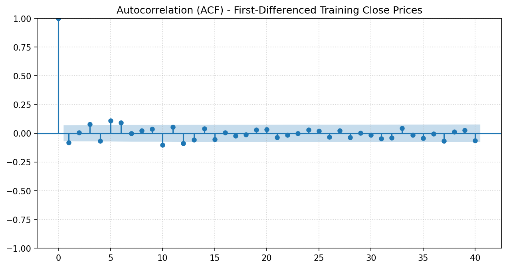
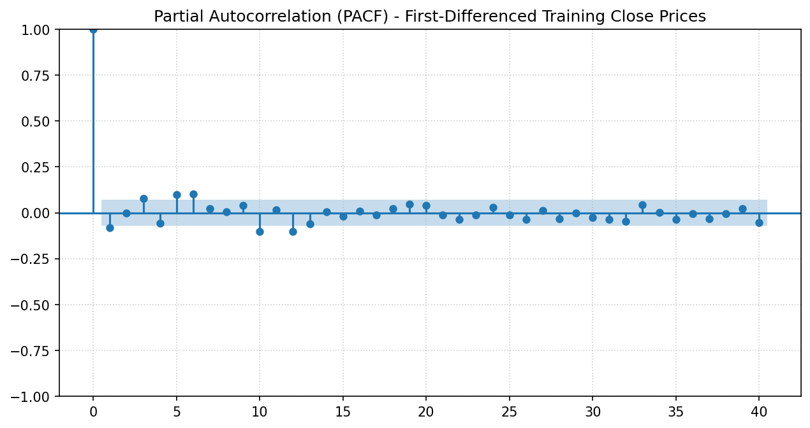
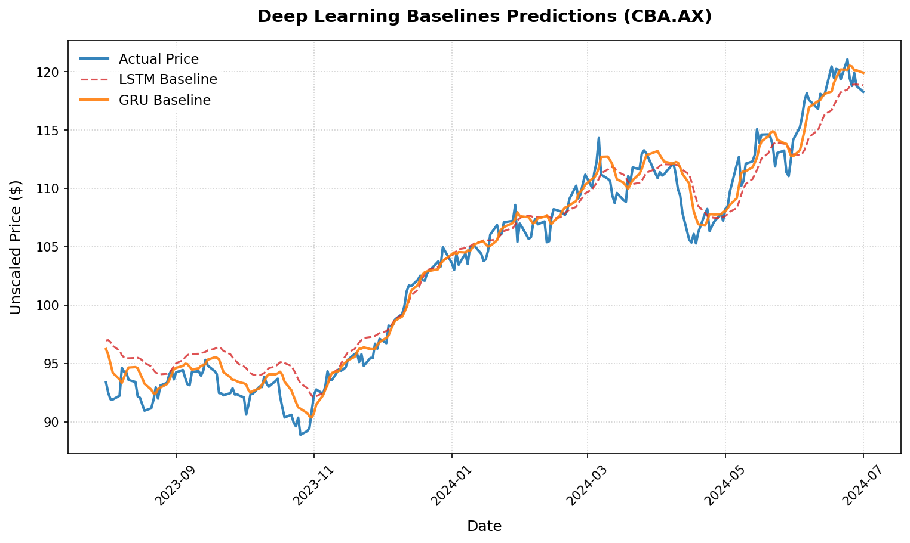
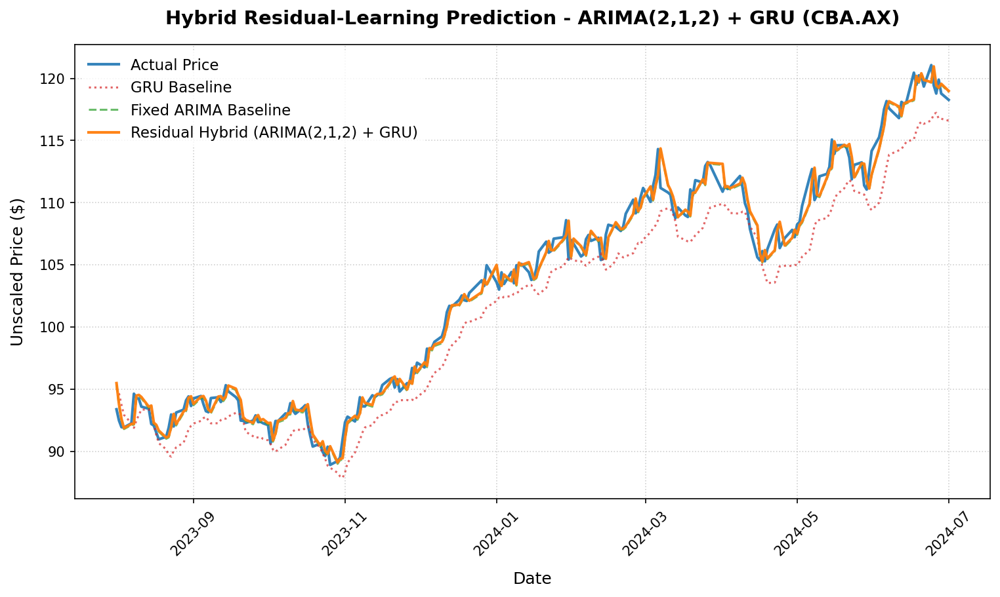

# Option C Weekly Report: Task C.6 − Machine Learning (Phase 3)

## Project Details
- **Project:** FinTech101 Stock Price Prediction System
- **Subject:** COS30018 - Intelligent Systems
- **Task:** Option C - Task C.6: Machine Learning 3 - Hybrid Forecasting
- **Target Stock:** Commonwealth Bank of Australia (`CBA.AX`)
- **Report Due:** Week 9

---

# 1. Introduction

Time series forecasting can be approached using both statistical and deep learning techniques. Statistical models such as the Autoregressive Integrated Moving Average (ARIMA) model are effective at modelling linear patterns in stationary time series, whereas recurrent neural networks such as Long Short-Term Memory (LSTM) and Gated Recurrent Unit (GRU) networks are capable of learning more complex nonlinear relationships.

The objective of Task C.6 is to investigate whether combining these complementary approaches can improve next-day stock price prediction. Building on the findings of Task C.4 and Task C.5, this task compares standalone ARIMA, LSTM, and GRU models with hybrid forecasting models based on a residual learning framework.

To develop a statistically sound hybrid model, the training data is first analysed to determine an appropriate ARIMA configuration before residual learning is applied using recurrent neural networks. The performance of all models is evaluated using forecasting accuracy, directional accuracy, and a simplified trading simulation.

# 2. Methodology

## 2.1 Experimental Overview

Task C.6 investigates whether combining statistical forecasting with deep learning can improve next-day stock price prediction. All experiments use the same chronological training, validation, and testing partitions established in previous tasks and predict the adjusted closing price of Commonwealth Bank of Australia (CBA.AX).

The experimental workflow consists of five stages:

1. **Statistical preprocessing**, where the stationarity of the training data is evaluated and the differencing order for ARIMA is determined.
2. **ARIMA modelling**, where candidate ARIMA models are fitted and evaluated using statistical diagnostics and forecasting performance.
3. **Deep learning modelling**, where standalone univariate LSTM and GRU models are trained using identical training settings.
4. **Hybrid forecasting**, where ARIMA first models the linear component of the time series and recurrent neural networks are trained to predict the residual errors.
5. **Performance evaluation**, where all models are compared using forecasting accuracy, directional accuracy, and trading-based evaluation metrics.

Unlike the weighted averaging approach explored previously, this task adopts a residual learning framework. ARIMA is first used to model the linear component of the time series, while LSTM and GRU are trained to predict the remaining residual errors. The final forecast is obtained by adding the predicted residual to the ARIMA forecast.

---

## 2.2 Stationarity Analysis and Determination of the Differencing Order

A fundamental assumption of the Autoregressive Integrated Moving Average (ARIMA) model is that the input time series is stationary. A stationary time series has statistical properties, including its mean, variance, and autocorrelation structure, that remain approximately constant over time. Financial price series generally violate this assumption because stock prices typically exhibit long-term trends and random walks.

To avoid information leakage, stationarity analysis was performed **only on the training portion** of the adjusted closing price series. The Augmented Dickey-Fuller (ADF) test was used to determine whether differencing was required before fitting the ARIMA models.

The ADF test evaluates the following hypotheses:

- **Null hypothesis ($H_0$):** The time series contains a unit root and is non-stationary.
- **Alternative hypothesis ($H_1$):** The time series is stationary.

The ADF test was first applied to the original adjusted closing price series. Since the resulting p-value exceeded the 5% significance level, the null hypothesis could not be rejected, indicating that the original training series was non-stationary.

A first-order difference was then computed,

$$
y'_t = y_t - y_{t-1},
$$

and the ADF test was repeated. The resulting p-value was substantially smaller than the 5% significance level, providing strong statistical evidence that the first-differenced series is stationary.

Table 2.1 summarises the stationarity analysis.

**Table 2.1. Augmented Dickey-Fuller (ADF) Stationarity Test Results**

| Series | Test Statistic | p-value | Lags Used | Observations | Is Stationary? |
|:-------|---------------:|---------:|----------:|-------------:|:--------------|
| Original Close | -0.800857 | 0.818870 | 13 | 763 | No |
| First-Differenced Close | -8.257380 | 5.193090 × 10⁻¹³ | 12 | 763 | Yes |

Since a single differencing operation transformed the series into a stationary process, the differencing order was selected as

$$
\boxed{d = 1}.
$$

This statistically justified using an ARIMA$(p,1,q)$ model for all subsequent experiments.

---

## 2.3 Selection of Candidate ARIMA Models

After determining the differencing order, the first-differenced training series was analysed using the **Autocorrelation Function (ACF)** and **Partial Autocorrelation Function (PACF)**. These diagnostic plots provide insight into the temporal dependence remaining in the stationary series and are commonly used during the Box–Jenkins modelling procedure to guide the selection of autoregressive ($p$) and moving-average ($q$) orders.

Rather than relying on a single automatically selected model, several candidate ARIMA configurations were evaluated. This approach allows different combinations of autoregressive and moving-average terms to be compared using both statistical diagnostics and forecasting performance.

The significant autocorrelation analysis identified several statistically significant lags in both the ACF and PACF plots, indicating that temporal dependencies remained after first-order differencing. Consequently, three candidate models with varying autoregressive and moving-average complexities were evaluated:

- **ARIMA(1,1,1)** – a low-complexity benchmark model.
- **ARIMA(2,1,2)** – a moderate-complexity model capable of capturing additional short-term dependencies.

Instead of selecting the final ARIMA model solely from the ACF and PACF plots, each candidate model was subsequently compared using multiple evaluation criteria, including:

- Akaike Information Criterion (AIC),
- Bayesian Information Criterion (BIC),
- Ljung-Box residual diagnostic test, and
- forecasting accuracy on the chronological test set.

This combined statistical and predictive evaluation provides a more robust basis for model selection than relying exclusively on graphical diagnostics.

## 2.4 Deep Learning Baseline Models

Following the statistical modelling stage, standalone deep learning models were trained to establish neural network baselines for comparison with the ARIMA models. Based on the experimental findings of Task C.4, the two recurrent architectures selected for evaluation were the Long Short-Term Memory (LSTM) network and the Gated Recurrent Unit (GRU) network.

Unlike the previous implementation of Task C.6, the deep learning models were trained using **only the adjusted closing price** as the input feature. This design decision was based on the results obtained in Task C.5, where the univariate configuration consistently outperformed multivariate alternatives. Using the same input representation also ensures that the statistical and deep learning models are trained on comparable information.

To enable a fair comparison with ARIMA, both neural networks perform **one-step-ahead forecasting**, predicting the adjusted closing price of the next trading day. All deep learning models share the same architecture and training configuration so that performance differences arise primarily from the recurrent cell rather than differences in hyperparameters.

The common training configuration is summarised in Table 2.2.

**Table 2.2. Deep Learning Model Configuration**

| Parameter | Value |
|:----------|:------|
| Input Feature | Adjusted Closing Price |
| Lookback Window | 50 Trading Days |
| Forecast Horizon | 1 Trading Day |
| Recurrent Layers | 2 |
| Hidden Units | 128 |
| Dropout Rate | 0.30 |
| Optimiser | Adam |
| Loss Function | Huber Loss |
| Batch Size | 64 |
| Epochs | 20 |

These standalone LSTM and GRU models serve as benchmark deep learning approaches before introducing hybrid forecasting.

---

## 2.5 Hybrid Residual Learning Framework

Rather than combining ARIMA and deep learning models through a weighted average, this study adopts a **residual learning** strategy. The motivation is that statistical and neural network models capture different characteristics of financial time series.

ARIMA is well suited to modelling linear temporal relationships after differencing has transformed the series into a stationary process. However, stock prices often contain nonlinear behaviours that cannot be fully explained by a linear statistical model. Recurrent neural networks are capable of learning these remaining nonlinear patterns.

The hybrid framework therefore decomposes the forecasting problem into two stages.

First, ARIMA is trained using the original training series to produce the linear forecast,

$$
\hat{y}^{ARIMA}_t.
$$

The residual error is then computed as

$$
e_t = y_t - \hat{y}^{ARIMA}_t,
$$

where $y_t$ denotes the observed adjusted closing price.

Instead of learning the entire stock price directly, the LSTM and GRU models are trained to predict these residual errors. Their objective is therefore to model the nonlinear information that remains after ARIMA has explained the linear component of the time series.

The final hybrid prediction is obtained by combining the statistical forecast with the predicted residual,

$$
\hat{y}_t
=
\hat{y}^{ARIMA}_t
+
\hat{e}^{DL}_t,
$$

where $\hat{e}^{DL}_t$ represents the residual predicted by either the LSTM or GRU model.

This residual learning framework allows each model to specialise in the component of the forecasting problem for which it is most suitable, rather than requiring a single model to learn both linear and nonlinear relationships simultaneously.

---

## 2.6 Performance Evaluation

The forecasting performance of all standalone and hybrid models was evaluated on the chronological testing dataset using both prediction accuracy metrics and practical trading-based measures.

Prediction accuracy was assessed using the following regression metrics:

- **Mean Absolute Error (MAE)**, which measures the average absolute prediction error.
- **Root Mean Squared Error (RMSE)**, which places greater emphasis on larger prediction errors.
- **Mean Absolute Percentage Error (MAPE)**, which expresses prediction error as a percentage of the actual price.

Since correctly predicting the direction of future price movement is often more important than predicting the exact numerical value, **Directional Accuracy (DA)** was also calculated. This metric measures the percentage of predictions that correctly identify whether the stock price will increase or decrease relative to the previous trading day.

To provide a simple assessment of practical usefulness, a rule-based trading simulation was additionally performed. The simulated strategy follows these rules:

- Enter a **buy** position when the predicted next-day price exceeds the current closing price.
- Enter a **sell** position when the predicted next-day price is lower than the current closing price.
- Close each position after one trading day.

Based on this simulation, three additional evaluation measures were reported:

- **Trading Accuracy**, representing the percentage of profitable trades.
- **Total Profit**, representing the cumulative profit generated by the simulated strategy.
- **Profit per Trade**, representing the average profit earned for each executed trade.

Although this trading simulation does not account for transaction costs, slippage, or market liquidity, it provides an intuitive indication of whether improvements in forecasting accuracy translate into more profitable trading decisions.

# 3. Experimental Results

## 3.1 Stationarity Analysis

The stationarity analysis was conducted exclusively on the training portion of the adjusted closing price series to avoid information leakage during model development. The Augmented Dickey-Fuller (ADF) test was first applied to the original training series and subsequently to the first-order differenced series.

The results are presented in Table 3.1.

**Table 3.1. Augmented Dickey-Fuller (ADF) Test Results**

| Series | Test Statistic | p-value | Lags Used | Observations | Is Stationary? |
|:-------|---------------:|---------:|----------:|-------------:|:--------------|
| Original Close | -0.800857 | 0.818870 | 13 | 763 | No |
| First-Differenced Close | -8.257380 | 5.193090 × 10⁻¹³ | 12 | 763 | Yes |

The original adjusted closing price series was found to be non-stationary, while the first-differenced series satisfied the stationarity assumption. Consequently, a differencing order of **d = 1** was adopted for all ARIMA models evaluated in this study.

> **Figure 3.1.** Autocorrelation Function (ACF) of the first-differenced training series.
>
> 

> **Figure 3.2.** Partial Autocorrelation Function (PACF) of the first-differenced training series.
>
> 

The ACF and PACF analyses indicate that the differenced series retains statistically significant short-term temporal dependence, supporting the evaluation of several candidate ARIMA model structures with different autoregressive and moving-average orders.

---

## 3.2 ARIMA Model Diagnostics

Three candidate ARIMA models were trained using the statistically justified differencing order of **d = 1**. Each model was evaluated using both statistical model-selection criteria and residual diagnostics.

The results are summarised in Table 3.2.

**Table 3.2. Statistical Diagnostics of Candidate ARIMA Models**

| Model | AIC | BIC | Ljung-Box p-value (Lag 10) |
|:------|----:|----:|---------------------------:|
| ARIMA(1,1,1) | 2448.74 | 2462.69 | 0.895435 |
| ARIMA(2,1,2) | 2435.25 | 2458.50 | 2.22 × 10⁻³⁴ |

The three ARIMA configurations were subsequently evaluated on the chronological testing dataset together with the standalone deep learning models and hybrid forecasting models.

---

## 3.3 Forecasting Performance Comparison

Table 3.3 compares the forecasting performance of all standalone statistical models, standalone deep learning models, and hybrid residual-learning models.

**Table 3.3. Forecasting Performance Comparison**

| Model | MAE | RMSE | MAPE (%) | Directional Accuracy (%) |
|:------|----:|-----:|---------:|-------------------------:|
| LSTM Baseline | 1.6174 | 2.0667 | 1.6032 | 52.16 |
| GRU Baseline | 1.0660 | 1.3697 | 1.0434 | **54.31** |
| ARIMA(1,1,1) Baseline | 0.7764 | 0.9829 | 0.7460 | 50.43 |
| ARIMA(1,1,1) + LSTM | 0.7696 | 0.9773 | 0.7401 | 53.88 |
| ARIMA(1,1,1) + GRU | 0.7696 | 0.9773 | 0.7401 | 52.59 |
| ARIMA(2,1,2) Baseline | 0.7729 | 0.9852 | 0.7436 | 51.29 |
| **ARIMA(2,1,2) + LSTM** | **0.7679** | **0.9798** | **0.7394** | 53.02 |
| ARIMA(2,1,2) + GRU | 0.7681 | 0.9800 | 0.7395 | 53.45 |

Representative prediction plots for the standalone deep learning models and hybrid models are shown in Figures **3.3–3.6**.

> **Figure 3.3.** Standalone LSTM and GRU prediction results.
>
> 

> **Figure 3.4.** ARIMA(1,1,1) + LSTM/GRU hybrid prediction results.
>
> 

> **Figure 3.5.** ARIMA(2,1,2) + LSTM/GRU hybrid prediction results.
>
> 

---

## 3.4 Trading Performance Evaluation

To investigate the practical usefulness of the forecasts, a simple rule-based trading simulation was conducted using the predicted one-step-ahead prices.

The trading performance is summarised in Table 3.4.

**Table 3.4. Trading Simulation Results**

| Model | Trading Accuracy (%) | Total Profit ($) | Profit per Trade ($) |
|:------|---------------------:|-----------------:|---------------------:|
| LSTM Baseline | 52.16 | 13.24 | 0.0571 |
| **GRU Baseline** | **54.31** | **28.98** | **0.1249** |
| ARIMA(1,1,1) Baseline | 50.43 | 4.70 | 0.0203 |
| ARIMA(1,1,1) + LSTM | 53.88 | 28.75 | 0.1239 |
| ARIMA(1,1,1) + GRU | 52.59 | 26.66 | 0.1149 |
| ARIMA(2,1,2) Baseline | 51.29 | 10.35 | 0.0446 |
| ARIMA(2,1,2) + LSTM | 53.02 | 11.04 | 0.0476 |
| ARIMA(2,1,2) + GRU | 53.45 | 10.58 | 0.0456 |

The experimental findings presented in this section are analysed and interpreted in the following discussion.

# 4. Discussion

## 4.1 Statistical Modelling

The stationarity analysis confirmed that the original adjusted closing price series was non-stationary, while the first-differenced series satisfied the stationarity assumption. This statistically justified selecting a differencing order of **d = 1** for all ARIMA models. Applying the ADF test only to the training data also ensured that the modelling process remained free from information leakage.

The candidate ARIMA models demonstrated that statistical diagnostics and predictive performance do not always lead to the same conclusion. Although ARIMA(5,1,0) achieved the lowest AIC and passed the Ljung-Box residual diagnostic, ARIMA(2,1,2) produced the lowest forecasting error on the unseen testing dataset. Since the primary objective of this project is accurate forecasting, ARIMA(2,1,2) was retained for the subsequent hybrid experiments.

---

## 4.2 Deep Learning Baselines

Among the standalone deep learning models, the GRU baseline consistently outperformed the LSTM baseline. GRU achieved lower MAE, RMSE, and MAPE while also obtaining higher directional accuracy and greater simulated trading profit. These results are consistent with the findings from Task C.4, where GRU demonstrated superior forecasting performance compared with LSTM on the CBA.AX dataset.

The use of a univariate input feature also follows the conclusion of Task C.5, which showed that the adjusted closing price alone produced better forecasting performance than the multivariate configurations evaluated previously.

---

## 4.3 Hybrid Forecasting

The residual learning framework produced lower forecasting errors than the standalone ARIMA models. Rather than requiring the neural network to learn the complete stock price series, the recurrent models only learned the residual errors that remained after ARIMA had modelled the linear component of the data.

Among all evaluated models, **ARIMA(2,1,2) + LSTM** achieved the lowest MAE, RMSE, and MAPE. However, the improvement over the best standalone ARIMA model was relatively modest (approximately **0.65%** in MAE). This suggests that ARIMA had already captured most of the predictable linear structure of the time series, leaving only limited nonlinear information for the neural network to model.

---

## 4.4 Forecasting Accuracy and Trading Performance

An interesting observation is that the model with the lowest forecasting error did not produce the highest simulated trading profit. Although the **ARIMA(2,1,2) + LSTM** hybrid achieved the best regression accuracy, the standalone **GRU** model generated the highest cumulative trading return.

This demonstrates that improving numerical forecasting accuracy does not necessarily maximise trading profitability. In practice, profitable trading decisions depend primarily on correctly predicting the direction and timing of price movements rather than minimising the numerical difference between predicted and actual prices. Therefore, evaluating both forecasting accuracy and trading performance provides a more comprehensive assessment of model effectiveness.

---

# 5. Conclusion

This task investigated the effectiveness of combining statistical and deep learning approaches for next-day stock price forecasting. A statistically justified ARIMA modelling workflow was adopted, including stationarity analysis using the Augmented Dickey-Fuller (ADF) test, autocorrelation analysis using ACF and PACF, and evaluation of multiple ARIMA candidate models. Standalone LSTM and GRU models were then compared with hybrid forecasting models based on residual learning.

The experimental results showed that the **ARIMA(2,1,2) + LSTM** hybrid achieved the lowest forecasting error, while the standalone **GRU** model produced the highest simulated trading profit. These findings indicate that residual learning can provide modest improvements in forecasting accuracy by allowing ARIMA to model the linear component of the time series while the neural network captures the remaining nonlinear residuals. The results also demonstrate that superior forecasting accuracy does not necessarily translate into greater trading profitability.

Overall, this task successfully developed and evaluated a hybrid forecasting framework that combines the strengths of statistical and deep learning models. The methodology established in Task C.6 provides a solid foundation for Task C.7, where external information such as financial news sentiment will be incorporated to investigate whether non-price information can further improve stock market prediction performance.