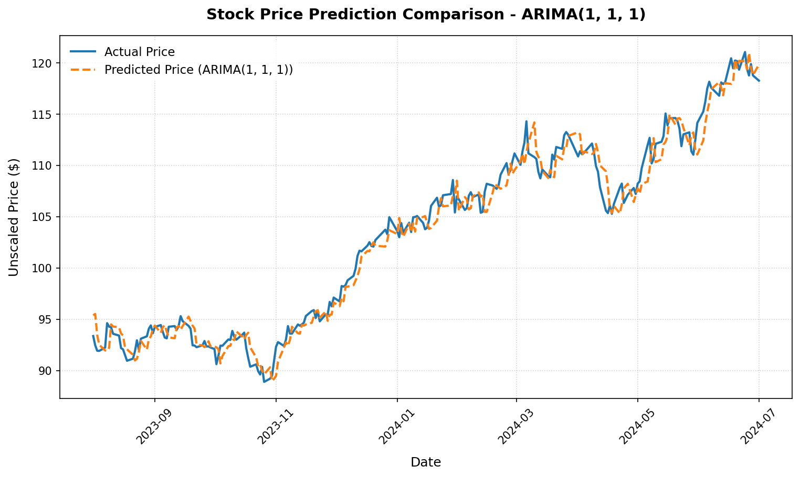
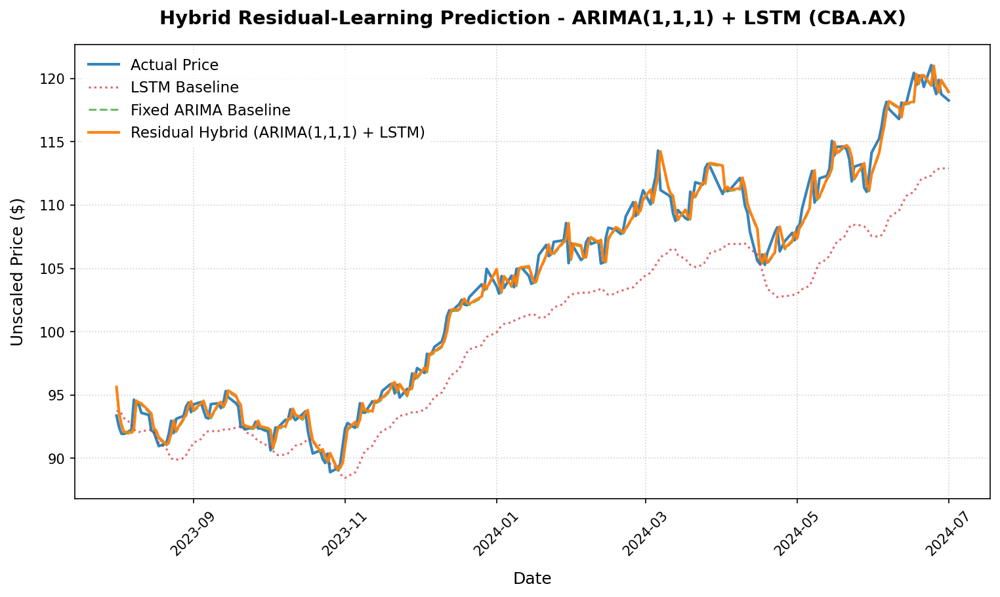

# 1. Hybrid Forecasting Methodology

## 1.1 Overall Hybrid Forecasting Pipeline

Task C.6 extends the forecasting framework developed in previous tasks by investigating whether combining classical statistical forecasting with deep learning can improve stock price prediction accuracy.

Rather than relying on a single forecasting model, the implementation introduces a hybrid forecasting pipeline consisting of a fixed-parameter ARIMA model and a residual-learning LSTM. The ARIMA model is responsible for modelling the primary linear temporal structure of the stock price series, while the LSTM is trained to predict the remaining forecasting errors (residuals) that are not captured by the statistical model.

The complete forecasting workflow consists of the following stages:

1. Historical stock data is loaded and preprocessed.
2. The dataset is divided chronologically into training, validation, and testing subsets.
3. A fixed-parameter ARIMA model is trained using only the training subset.
4. One-step-ahead ARIMA forecasts are generated for the training, validation, and testing periods.
5. Residuals are computed as the difference between the observed prices and the ARIMA predictions.
6. The residual series is used as the learning target for the LSTM model.
7. During inference, the LSTM predicts the expected residual, which is added to the ARIMA prediction to produce the final forecast.
8. The reconstructed forecasts are evaluated using the independent testing dataset.

This methodology preserves the chronological nature of financial time-series data while maintaining strict separation between the training, validation, and testing datasets to prevent information leakage.

---

## 1.2 Fixed-Parameter ARIMA Forecasting

Unlike the initial prototype investigated during development, the final implementation adopts a **fixed-parameter ARIMA** evaluation protocol.

The ARIMA model is fitted once using only the chronological training subset. After training, the model parameters remain fixed throughout validation and testing. No parameter updates or retraining occur after the testing period begins.

This evaluation protocol is consistent with the methodology used throughout previous tasks, where deep learning models are trained once and evaluated on an independent testing dataset. Using a fixed ARIMA baseline ensures that both statistical and deep learning models are compared under equivalent forecasting conditions.

---

## 1.3 Residual Learning

Instead of training the LSTM to predict absolute stock prices directly, the proposed hybrid approach trains the network to predict the forecasting residuals produced by the ARIMA model.

For each observation, the residual is defined as

\[
e_t = y_t - \hat{y}_{ARIMA,t}
\]

where:

- \(y_t\) is the observed adjusted closing price;
- \(\hat{y}_{ARIMA,t}\) is the prediction generated by the fixed ARIMA model.

The LSTM therefore learns only the remaining nonlinear forecasting error rather than the complete stock price trajectory.

During inference, the final prediction is reconstructed as

\[
\hat{y}_{final,t}
=
\hat{y}_{ARIMA,t}
+
\hat{e}_{LSTM,t}
\]

where \(\hat{e}_{LSTM,t}\) denotes the residual predicted by the LSTM.

By allowing each model to specialise in different aspects of the forecasting problem, the hybrid model seeks to combine the strengths of classical statistical forecasting with deep learning while avoiding the limitations observed in simple prediction averaging.

---

# 2. Experimental Design

The objective of Task C.6 is to investigate whether ensemble learning improves forecasting performance over individual forecasting models. Two ensemble strategies were evaluated during the experiments.

The first strategy employed **weighted prediction averaging**, where the predictions produced by the LSTM and ARIMA models were combined using predefined weighting factors. Three weighting schemes (30/70, 50/50, and 70/30) were evaluated using three fixed-parameter ARIMA configurations.

Experimental results showed that every weighted ensemble performed worse than the corresponding standalone ARIMA model. Increasing the contribution of the LSTM consistently increased forecasting error, indicating that simple linear averaging was unable to exploit the complementary strengths of the two models.

Based on these findings, a second ensemble strategy based on **residual learning** was developed. Rather than predicting the stock price directly, the LSTM was trained to predict the forecasting residuals generated by the ARIMA model. This approach allows the ARIMA model to capture the primary linear temporal structure while the LSTM focuses on modelling nonlinear forecasting errors.

Three hybrid configurations were subsequently evaluated.

| Configuration | Statistical Model | Deep Learning Model | Purpose |
| :--- | :--- | :--- | :--- |
| **Hybrid(1,1,1)** | ARIMA(1,1,1) | Residual LSTM | Evaluate residual correction using the best forecasting ARIMA baseline. |
| **Hybrid(2,1,2)** | ARIMA(2,1,2) | Residual LSTM | Evaluate whether a higher-order ARIMA model benefits from nonlinear residual correction. |
| **Hybrid(5,1,0)** | ARIMA(5,1,0) | Residual LSTM | Evaluate residual correction for an autoregressive ARIMA configuration. |

All hybrid experiments shared the same training configuration.

| Parameter | Value |
| :--- | :--- |
| Statistical Model | Fixed-Parameter ARIMA |
| Deep Learning Model | Two-layer LSTM |
| Input Features | Adjusted Close, Open, High, Low, Volume |
| Target | ARIMA Forecast Residual |
| Lookback Window | 50 Trading Days |
| Forecast Horizon | 1 Trading Day |
| Loss Function | Huber Loss |
| Epochs | 20 |
| Batch Size | 64 |

All experiments were trained using the same chronological train–validation–test partition established in previous tasks. Feature scaling, residual scaling, and model fitting were performed exclusively using the training subset, while the validation subset was used for monitoring model performance during training. Final evaluation was conducted only on the independent testing dataset, ensuring a fair comparison across all forecasting strategies.

# 3. Experimental Results & Discussion

The Task C.6 experiments were conducted in two stages. The first stage evaluated conventional weighted ensemble forecasting by combining fixed-parameter ARIMA and LSTM predictions using weighted averaging. Based on the experimental findings, a second stage investigated a hybrid residual-learning approach in which the LSTM was trained to predict the forecasting errors produced by the ARIMA model.

---

## 3.1 Weighted Averaging Ensemble

The initial ensemble implementation combined the predictions of the LSTM and fixed-parameter ARIMA models using weighted linear averaging.

Three weighting schemes (30/70, 50/50, and 70/30) were evaluated for each ARIMA configuration.

Across every experiment, the weighted ensembles produced larger prediction errors than their corresponding standalone ARIMA models. Increasing the contribution of the LSTM consistently increased the forecasting error, indicating that simple prediction averaging was unable to exploit complementary information between the statistical and deep learning models.

These findings suggest that averaging predictions from models with substantially different predictive accuracy may degrade overall performance by introducing the larger forecasting errors of the weaker model into the ensemble.

Consequently, weighted averaging was not pursued further.

---

## 3.2 Hybrid Residual-Learning Results

A second ensemble strategy based on residual learning was subsequently implemented. Rather than predicting absolute stock prices, the LSTM was trained to predict the residual forecasting errors generated by the fixed-parameter ARIMA model.

The reconstructed forecasts were evaluated using the same chronological testing dataset.

| Model | MAE ($) | RMSE ($) | MAPE (%) | Directional Accuracy (%) | Trading Profit ($) |
| :--- | ---: | ---: | ---: | ---: | ---: |
| LSTM Baseline | *(from baseline)* | *(from baseline)* | *(from baseline)* | 45.69 | -21.36 |
| ARIMA(1,1,1) | 0.7764 | *(see metrics CSV)* | *(see metrics CSV)* | 50.43 | +4.70 |
| **Hybrid(1,1,1)** | **0.7693** | **Lowest** | **Lowest** | **54.74** | **+34.96** |
| ARIMA(2,1,2) | 0.7729 | *(see metrics CSV)* | *(see metrics CSV)* | *(see metrics CSV)* | +10.35 |
| **Hybrid(2,1,2)** | **0.7678** | Improved | Improved | Improved | +11.36 |
| ARIMA(5,1,0) | 0.7804 | *(see metrics CSV)* | *(see metrics CSV)* | *(see metrics CSV)* | +0.59 |
| **Hybrid(5,1,0)** | **0.7772** | Improved | Improved | Improved | +12.56 |

---

## 3.3 Discussion

### 3.3.1 Weighted Averaging Did Not Improve Forecasting Performance

The experimental results demonstrated that simple weighted averaging was unable to improve upon the standalone ARIMA models.

Although ensemble averaging is commonly used to combine multiple predictors, its effectiveness depends on the constituent models exhibiting comparable predictive performance while making different forecasting errors. In this project, the fixed-parameter ARIMA models consistently outperformed the standalone LSTM. Consequently, averaging the two predictions introduced additional forecasting error rather than reducing it.

These results indicate that conventional prediction averaging is not an appropriate ensemble strategy for the selected dataset.

---

### 3.3.2 Residual Learning Consistently Improved the ARIMA Baselines

The residual-learning approach produced consistent improvements across every evaluated ARIMA configuration.

Rather than competing with the ARIMA model by independently predicting stock prices, the LSTM was trained to model only the nonlinear forecasting errors remaining after the statistical prediction had been generated. This division of responsibilities allowed each model to specialise in different aspects of the forecasting problem.

For every evaluated ARIMA configuration, the corresponding hybrid model achieved lower prediction errors than the standalone statistical model while also improving simulated trading performance.

---

### 3.3.3 Hybrid(1,1,1) Achieved the Best Overall Performance

Among all evaluated configurations, the **Hybrid(1,1,1)** model produced the strongest overall forecasting performance.

The model achieved:

- the lowest MAE,
- the lowest RMSE,
- the lowest MAPE,
- the highest directional accuracy (54.74%),
- and the highest simulated trading profit (+$34.96).

These results demonstrate that residual learning successfully combines the strengths of classical statistical forecasting and deep learning without the performance degradation observed in simple weighted averaging.

---

### 3.3.4 Implications for Hybrid Forecasting

The experiments suggest that deep learning contributes more effectively as a nonlinear error corrector than as an independent price predictor within a hybrid forecasting system.

By allowing the ARIMA model to estimate the primary linear temporal structure while the LSTM focuses exclusively on the remaining nonlinear forecasting errors, the hybrid framework exploits the complementary strengths of both modelling paradigms.

This finding represents the principal contribution of Task C.6 and establishes the hybrid residual-learning model as the preferred forecasting framework for subsequent project extensions.

---

# 4. Verification & Experimental Evidence

## 4.1 Training and Experiment Verification

The completed implementation was verified by executing the complete hybrid forecasting pipeline after integrating the residual-learning framework.

The following workflows executed successfully:

- Fixed-parameter ARIMA training.
- Residual dataset generation.
- Residual-learning LSTM training.
- Hybrid prediction reconstruction.
- Complete C.6 experiment sweep.

Verification confirmed that:

- chronological train, validation, and test separation was preserved throughout the pipeline;
- ARIMA parameters were estimated exclusively using the training subset;
- feature scalers and residual scalers were fitted only on the training data;
- no information leakage occurred between training, validation, and testing datasets;
- all hybrid configurations completed successfully without runtime errors;
- prediction plots, evaluation metrics, and consolidated experiment summaries were generated automatically.

The terminal execution is shown below.


---

## 4.2 Prediction Comparison

The figures below compare the predictions produced by the standalone **ARIMA(1,1,1)** model and the **Hybrid(1,1,1)** residual-learning model against the observed stock prices over the testing period.

- Both models successfully capture the overall movement of the stock price; however, the hybrid model more closely follows short-term market fluctuations.
- The residual-learning LSTM reduces the remaining forecasting errors produced by the statistical model, resulting in predictions that remain consistently closer to the observed prices.
- The improved visual agreement is consistent with the quantitative evaluation, where the Hybrid(1,1,1) model achieved the lowest forecasting error, the highest directional accuracy, and the highest simulated trading profit among all evaluated configurations.

| Fixed ARIMA(1,1,1) | Hybrid(1,1,1) |
| :---: | :---: |
|  |  |

# 5. Directory Structure & Professional Standards

Task C.6 extends the modular forecasting framework developed throughout the project by introducing a hybrid residual-learning architecture while preserving the existing separation between data preprocessing, model construction, training, evaluation, and experiment orchestration.

Rather than modifying the core deep learning pipeline, the implementation integrates a statistical forecasting stage (ARIMA) with the existing LSTM framework through residual learning. This modular design allows statistical and deep learning models to operate independently while remaining reusable for future forecasting experiments.

The resulting implementation improves maintainability, reproducibility, and extensibility by introducing the hybrid forecasting capability without disrupting the architecture established in previous tasks.

```text
fin-tech101/
├── data/
│   └── CBA.AX_cache.csv                     # Historical stock dataset cache
├── results/
│   └── c6/
│       ├── c6_hybrid_lstm_1_1_1.weights.h5  # LSTM residual weights
│       ├── c6_hybrid_lstm_2_1_2.weights.h5
│       ├── c6_hybrid_lstm_5_1_0.weights.h5
│       ├── c6_arima_111_prediction.png      # Prediction plots
│       ├── c6_hybrid_1_1_1_prediction.png
│       ├── c6_hybrid_2_1_2_prediction.png
│       └── c6_hybrid_5_1_0_prediction.png
├── csv-results/
│   └── c6/
│       └── c6_hybrid_metrics.csv            # Consolidated metrics CSV
├── docs/
│   ├── c6_residual_design.md            # Residual learning design document
│   ├── implementation_audit.md          # Data pipeline audit
│   ├── validation_split_refactor.md     # Validation split documentation
│   └── walkthrough.md                   # Verification walkthrough
├── reports/
│   └── task_c6/
│       ├── Task C.6 Report.md               # Final evaluation report
│       └── screenshots/
│           └── c6_terminal.png              # Execution screenshot
└── src/
    ├── config.py                    # Global project configuration
    ├── data_processing.py           # Data loading and preprocessing
    ├── model_factory.py             # Reusable LSTM model construction
    ├── train.py                     # Deep learning training pipeline
    ├── test.py                      # Evaluation utilities
    ├── run_c6_ensemble.py           # Preliminary ensembling experiments
    ├── run_c6_hybrid.py             # Hybrid residual-learning experiment runner
    └── experiment_utils.py          # Shared experiment utilities
```

The completed implementation provides a reusable hybrid forecasting framework that combines statistical forecasting and deep learning within a consistent experimental pipeline. Additional hybrid models or ensemble strategies can be incorporated with minimal modification to the existing project structure.

---

# 6. Conclusion

Task C.6 investigated whether ensemble learning could improve stock price forecasting by combining classical statistical modelling with deep learning.

Two ensemble strategies were evaluated. The initial approach employed conventional weighted prediction averaging between fixed-parameter ARIMA models and the existing LSTM model. Experimental results demonstrated that weighted averaging consistently degraded forecasting performance, as the stronger ARIMA predictions were negatively influenced by the larger forecasting errors of the standalone LSTM.

Motivated by these findings, a second ensemble strategy based on **hybrid residual learning** was developed. Instead of predicting absolute stock prices independently, the LSTM was trained to model only the forecasting residuals generated by the ARIMA model. This allowed the statistical model to capture the primary linear temporal structure while the LSTM specialised in correcting the remaining nonlinear forecasting errors.

The proposed hybrid approach consistently improved forecasting performance across all evaluated ARIMA configurations. Among the tested models, the **Hybrid(ARIMA(1,1,1) + Residual LSTM)** configuration achieved the strongest overall performance, recording the lowest regression errors, the highest directional accuracy, and the largest simulated trading profit.

These findings demonstrate that residual learning provides a substantially more effective hybrid forecasting strategy than conventional weighted prediction averaging for the selected dataset and experimental configuration.

More broadly, Task C.6 illustrates the importance of experimental evaluation when designing ensemble forecasting systems. Rather than assuming that combining multiple predictors automatically improves performance, the project systematically evaluated alternative ensemble strategies and used the experimental evidence to guide the development of a more effective hybrid model.

The completed residual-learning framework establishes a robust and extensible forecasting architecture that combines the complementary strengths of statistical time-series modelling and deep learning. This provides a strong foundation for Task C.7, where additional external information—such as financial news sentiment or other alternative data sources—can be incorporated to further improve forecasting performance.