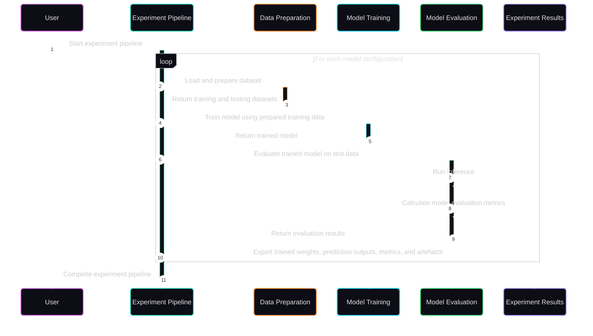

# Experiment Pipeline

## Purpose

FinTech101 uses a single experiment pipeline to run different model configurations through the same data preparation, model training, inference, and model evaluation workflow. This makes experimental results easier to compare because dataset settings, preprocessing steps, trained model weights, prediction outputs, and evaluation metrics are produced through a consistent execution process.

The pipeline has three main objectives:

- **Define the end-to-end experiment workflow:** show how historical market data becomes processed datasets, trained model weights, prediction outputs, model evaluation results, and comparison summaries.
- **Support reproducible experiments:** keep dataset settings, preprocessing steps, model parameters, and output locations consistent across repeated runs.
- **Promote consistent model comparison:** run different model configurations through the same model training and evaluation workflow before comparing their results.

---

## Experiment Lifecycle

Every experiment follows the same execution lifecycle regardless of the selected model architecture or experiment configuration. The workflow remains unchanged across experiments, while the dataset settings, model parameters, and forecasting strategy can vary between runs.

- **Historical market data** provides the input dataset for each experiment.
- **Data preparation** transforms historical data into training and testing datasets suitable for machine learning.
- **Model training** learns forecasting patterns from the prepared training data.
- **Model inference** generates predictions from the trained model.
- **Model evaluation** measures predictive performance using quantitative evaluation metrics.
- **Experiment results** collect trained model weights, prediction outputs, evaluation metrics, and generated artefacts.
- **Model comparison** compares results across different model configurations using a consistent execution workflow.

---

## Experiment Execution Flow

This section shows how the experiment pipeline executes one or more model configurations at runtime. Each configuration follows the same sequence of data preparation, model training, model evaluation, and result export steps.

- The loop represents repeated execution across selected model configurations.
- The pipeline remains the controller of the run; data preparation, model training, and model evaluation act as execution stages.
- Each configuration is trained and evaluated through the same sequence before its outputs are exported.
- Result export occurs after model evaluation so that prediction outputs, evaluation metrics, and generated artefacts correspond to the same trained configuration.

---

## Pipeline Stages

The experiment pipeline is organised into four execution stages. Each stage performs a distinct responsibility while passing its outputs to the next stage.

|             | **Data Preparation**                                      | **Model Training**                                   | **Model Evaluation**                          | **Result Export**                                                                                                 |
| :---------: | :-------------------------------------------------------- | ---------------------------------------------------- | :-------------------------------------------- | :---------------------------------------------------------------------------------------------------------------- |
| **Inputs**  | - Historical market data - Dataset configuration       | - Prepared training dataset - Model configuration | - Trained model - Prepared testing dataset | - Trained model - Prediction outputs - Evaluation metrics                                                   |
| **Outputs** | - Prepared training dataset - Prepared testing dataset | - Trained model - Trained model weights           | - Prediction outputs - Evaluation metrics  | - Saved model weights - Prediction CSV - Prediction plots - Evaluation metrics - Experiment artefacts |

### 1. Data Preparation

Transforms historical market data into datasets suitable for machine learning. This stage loads the input dataset, applies preprocessing, partitions the data into training and testing sets, and prepares the data format required by the selected model architecture.

### 2. Model Training

Builds a machine learning model using the prepared training dataset and the selected model configuration. Once training is complete, the trained model is returned to the experiment pipeline for evaluation.

### 3. Model Evaluation

Measures predictive performance using the testing dataset. This stage runs inference, calculates evaluation metrics, and produces prediction outputs for later analysis.

### 4. Result Export

Collects and stores the artefacts produced during the experiment so that different model configurations can be analysed and compared consistently.

---

## Reproducibility and Consistency

Reliable model comparison depends on more than executing the same workflow. The experiment pipeline applies the following practices so that repeated experiment runs can be reproduced and compared under the same conditions.

### 1. Centralised Configuration

A shared configuration system keeps dataset parameters, model hyperparameters, and output locations consistent across experiment runs, reducing manual configuration differences.

### 2. Standardised Data Preparation

Every experiment applies the same preprocessing workflow and dataset partitioning process before model training, ensuring that different model configurations are evaluated from the same prepared data.

### 3. Reusable Execution Pipeline

All model configurations follow the same data preparation, model training, model evaluation, and result export workflow. This ensures that differences in experimental results reflect model behaviour rather than execution differences.

### 4. Structured Experiment Outputs

Trained model weights, prediction outputs, evaluation metrics, and generated artefacts are exported using a consistent directory structure, making experiment results easier to review, reproduce, and compare.

---

## Pipeline Variations

The experiment pipeline is designed to support multiple experiment types without changing the execution workflow. Different experiments reuse the same data preparation, model training, model evaluation, and result export stages while varying the selected model architecture, dataset configuration, or training parameters.

Common variations include:

1. **Model architectures** — compare different neural network architectures using the same experiment pipeline.
2. **Dataset configurations** — evaluate different input features, sequence lengths, or train-test partitions while keeping the execution workflow unchanged.
3. **Training configurations** — compare different hyperparameter settings such as learning rate, batch size, or training epochs.
4. **Repeated experiment runs** — execute multiple configurations sequentially to generate comparable experiment results under consistent execution conditions.

Because every variation follows the same execution pipeline, experimental differences can be attributed to the selected configuration rather than differences in the workflow itself.

---

## Continue Exploring

The Experiment Pipeline page describes how machine learning experiments are executed. The following Wiki pages provide additional details about the project architecture, implementation, and evaluation workflow.

- **System Architecture** — Understand how the project's components interact to support the experiment pipeline.
- **Repository Structure** — Explore the responsibilities of each directory and source module.
- **Running Individual Components** — Learn how to execute individual scripts and experiment workflows.
- **Evaluation Metrics** — Understand the metrics used to assess model performance and compare experimental results.
