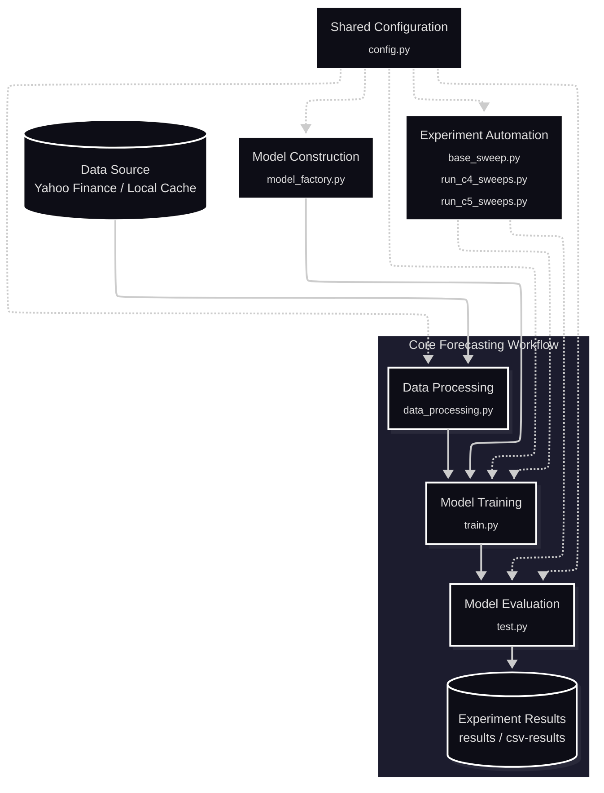
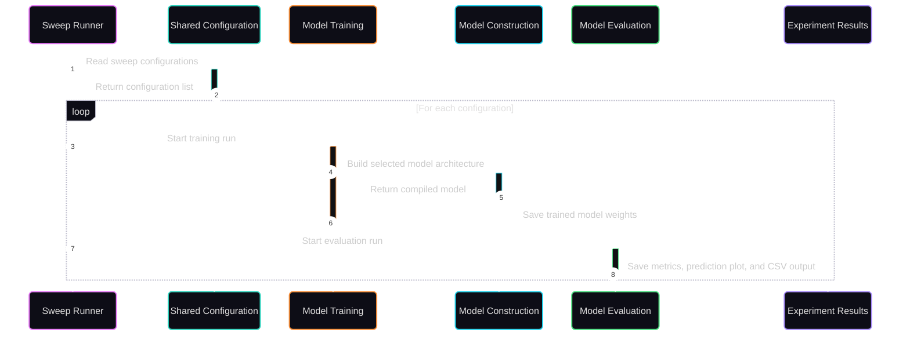
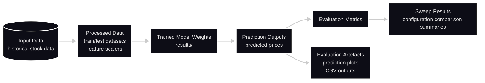

# FinTech101 System Architecture

## Purpose 
FinTech101 is designed to support the progressive implementation of Project Option C through a single, reusable stock forecasting architecture rather than separate implementations for individual tasks. The architecture has three primary objectives: 

- **Objective 1 — Support workflow extension:** Allow new forecasting capabilities to extend the existing workflow instead of introducing separate implementations for individual tasks. 
- **Objective 2 — Promote component reuse:** Reuse common data processing, model training, model evaluation, and experiment execution components across different forecasting experiments. 
- **Objective 3 — Enable consistent experimentation:** Execute different model architectures and forecasting configurations through the same workflow, making experimental results easier to compare and reproduce.

---

## Architectural Overview

FinTech101 is organised as a shared stock forecasting workflow rather than separate workflows for individual tasks completion. The workflow remains stable across experiments, while model architecture, feature settings, and experiment configurations can change between runs.

- Every experiment follows the same overall path from data preparation to model evaluation.
- Model construction supports training by creating the selected recurrent neural network architecture before the model is fitted.
- Experiment automation repeats the same training and evaluation workflow for different configurations.
- Shared configuration keeps dataset settings, model defaults, and sweep configurations consistent across executable components.

**Notation:**
- Solid arrow: primary forecasting workflow or direct training input.
- Dashed arrow: supporting dependency, shared configuration, or experiment orchestration.

---

## Component Responsibilities

### Data Processing

`data_processing.py` prepares datasets for stock price forecasting.

- Loads historical stock data from the local cache or Yahoo Finance.
- Standardises raw market data into the project dataframe format.
- Handles missing values and validates required feature columns.
- Constructs forecasting targets and sliding-window input sequences.
- Performs chronological train/test splitting to reduce data leakage.
- Applies training-only feature scaling and saves fitted feature scalers for reuse.

### Model Construction

`model_factory.py` builds the recurrent neural network used for forecasting.

- Creates LSTM, GRU, and SimpleRNN models from selected hyperparameters.
- Configures recurrent layers, hidden units, dropout, and forecast horizon.
- Compiles the model with the configured optimiser and loss function.
- Returns the compiled model to the training workflow.

### Model Training

`train.py` trains forecasting models from processed training data.

- Loads processed datasets from the data processing pipeline.
- Requests the selected model architecture from `model_factory.py`.
- Fits the model using the configured epochs and batch size.
- Saves trained model weights under `results/`.

### Model Evaluation

`test.py` evaluates trained forecasting models on the test set.

- Loads trained model weights and fitted feature scalers.
- Generates stock price predictions on the test set.
- Calculates evaluation metrics for forecasting performance.
- Exports prediction plots and CSV results for analysis.

### Experiment Automation

The sweep scripts run repeated model comparisons using shared training and evaluation functions.

- `base_sweep.py` defines the common framework for experiment sweeps.
- `run_c4_sweeps.py` compares recurrent model types and hyperparameters.
- `run_c5_sweeps.py` compares univariate, multivariate, and multi-step forecasting experiments.

### Shared Configuration

`config.py` stores settings reused across training, evaluation, and sweep scripts.

- Defines the ticker, date range, and train/test split date.
- Defines feature columns, lookback steps, forecast offset, and future steps.
- Stores C.4 hyperparameter sweep configurations.
- Stores C.5 multivariate and multi-step forecasting configurations.

---

## Architectural Decisions

The following decisions define how the stock forecasting workflow is organised to maximise component reuse, maintainability, and experiment reproducibility.

| No.  | Architectural Decision                              | Reason                                                                                                                                                                                                                                  | Benefit                                                                                                                      |
| :--- | :-------------------------------------------------- | :-------------------------------------------------------------------------------------------------------------------------------------------------------------------------------------------------------------------------------------- | :--------------------------------------------------------------------------------------------------------------------------- |
| 1    | **Separate Data Processing from Model Training**    | Data preparation is shared by model training, model evaluation, and forecasting. Centralising preprocessing avoids duplicated data preparation logic.                                                                                   | All experiments use the same preprocessing pipeline, ensuring consistent datasets throughout the project.                    |
| 2    | **Separate Model Construction from Model Training** | Model architecture selection should remain independent of the training process. Different recurrent neural network architectures should reuse the same training implementation.                                                         | New model architectures can be introduced without modifying the training workflow, simplifying model comparison experiments. |
| 3    | **Separate Model Training from Model Evaluation**   | Model fitting and model evaluation are independent stages of the machine learning workflow. Evaluation should operate on trained model weights rather than retraining the model.                                                        | Trained models can be evaluated repeatedly using different evaluation metrics without repeating the training process.        |
| 4    | **Centralise Shared Configuration**                 | Dataset parameters, model hyperparameters, training parameters, and experiment settings are reused across multiple executable components. Managing them centrally reduces maintenance effort and simplifies experiment reproducibility. | Configuration changes are made in one place and applied consistently across the stock forecasting workflow.                  |
| 5    | **Automate Experiment Execution**                   | Project Option C requires repeated comparisons across multiple model architectures and experiment configurations. Manual execution is repetitive and prone to inconsistency.                                                            | Repeated experiments follow the same execution process, improving consistency and reducing manual effort.                    |

---

## Experiment Automation Flow

Experiment automation runs a list of model configurations through the same training and evaluation process. Each configuration is trained, evaluated, and recorded before the sweep runner moves to the next configuration.

1. The sweep runner reads the sweep configurations from `config.py`.
2. `config.py` returns the configuration list.
3. For each configuration, the sweep runner starts a training run.
4. The training module requests the selected recurrent neural network architecture.
5. The model construction module returns the compiled model.
6. The training module saves trained model weights under `results/`.
7. The sweep runner starts an evaluation run for the trained model.
8. The evaluation module saves metrics, the prediction plot, and CSV output.

---

## Data and Result Flow

This section traces how data and generated artefacts move through FinTech101 after an experiment is executed. It focuses on the main inputs and outputs, not the internal implementation of each script.

- **Input data:** Historical stock data loaded from Yahoo Finance or the local cache.
- **Processed data:** Training and testing datasets, sliding-window input sequences, and fitted feature scalers.
- **Trained model weights:** Saved model weights produced by model training.
- **Prediction outputs:** Predicted stock prices generated from the test set.
- **Evaluation metrics:** Quantitative performance results calculated from actual and predicted prices.
- **Evaluation artefacts:** Prediction plots and detailed CSV outputs generated for result inspection.
- **Sweep results:** Consolidated comparison outputs that aggregate evaluation metrics across model configurations.

---

## Continue Exploring

While the System Architecture page provides a high-level view of how FinTech101 is organised, the following Wiki pages explore individual aspects of the project in greater detail.

- **Experimental Pipeline** — Explains how datasets, models, experiments, and evaluation results are produced throughout the machine learning workflow.
- **Repository Structure** — Describes the purpose and organisation of each directory and source module.
- **Running Individual Components** — Explains how to execute each script independently during development and experimentation.
- **Environment Setup** — Documents the required software environment, dependencies, and project configuration.
